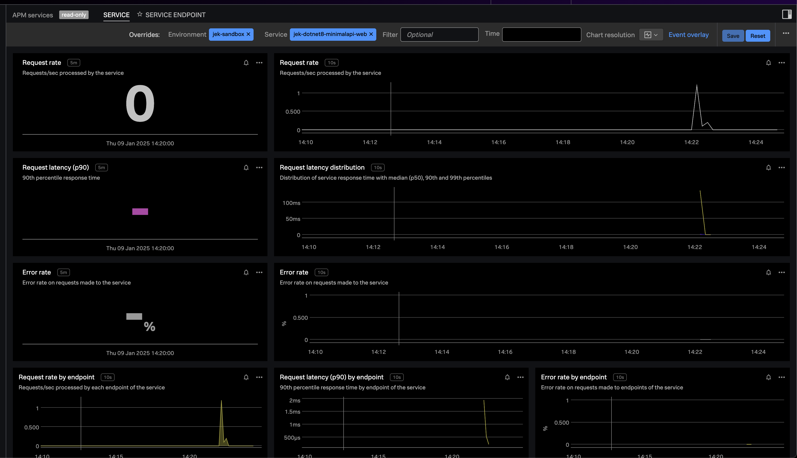

# .NET Development Setup Guide

This guide provides comprehensive instructions for setting up a .NET development environment and creating API projects using different approaches.

## Prerequisites

### .NET SDK Installation

1. Download the .NET SDK:
   - For .NET 8 (recommended): https://dotnet.microsoft.com/en-us/download/dotnet/8.0
   - For .NET 6 (alternative): https://dotnet.microsoft.com/en-us/download/dotnet/6.0

2. Verify your installation by running:
   ```
   dotnet --version
   ```

3. For a complete reference of dotnet commands, visit:
   https://learn.microsoft.com/en-us/dotnet/core/tools/dotnet

### Development Environment Setup

1. Install Visual Studio Code (VSCode)
2. Install the C# extension in VSCode

## Creating a New API Project

For detailed information about available project templates and `dotnet new` commands, visit:
https://learn.microsoft.com/en-us/dotnet/core/tools/dotnet-new

You can choose between two main approaches for building APIs in .NET:

### 1. Minimal APIs

Minimal APIs provide a streamlined approach ideal for microservices and small applications. They offer a simplified architecture with reduced boilerplate code.

**Documentation:** https://learn.microsoft.com/en-us/aspnet/core/tutorials/min-web-api?view=aspnetcore-8.0&tabs=visual-studio-code

> Note: The `webapiaot` template (for .NET 8+) includes Ahead-of-time compilation support and is limited to minimal APIs only.

#### Setup Steps:

1. Create a new project:
   ```
   dotnet new web --output jek-dotnet8-minimalapi-web --verbosity diag --dry-run
   ```
   > Note: The `web` template creates an empty ASP.NET Core project.

   Command line parameters:
   - `--output <OUTPUT_DIRECTORY>`: Specifies the output directory
   - `--verbosity <LEVEL>`: Sets logging detail (available in .NET 7+)

2. Navigate to the project directory:
   ```
   cd jek-dotnet8-minimalapi-web
   ```

3. Configure HTTPS certificate:
   ```
   dotnet dev-certs https --trust
   ```

4. Run the application:
   ```
   dotnet run
   ```

### 2. Controller-based APIs

Controller-based APIs follow a traditional approach with a more structured architecture, making them suitable for larger applications requiring extensive features and organization.

**Documentation:** https://learn.microsoft.com/en-us/aspnet/core/tutorials/first-web-api?view=aspnetcore-8.0&tabs=visual-studio

#### Setup Steps:

1. Create a new project:
   ```
   dotnet new webapi --use-controllers --output jek-dotnet8-controllerbasedapi-webapi --verbosity diag --dry-run
   ```
   > Note: The `webapi` template creates a standard ASP.NET Core Web API.

2. Navigate to the project directory:
   ```
   cd jek-dotnet8-controllerbasedapi-webapi
   ```

3. Add Entity Framework Core In-Memory package:
   ```
   dotnet add package Microsoft.EntityFrameworkCore.InMemory
   ```

4. Open in VSCode:
   ```
   code -r ../jek-dotnet8-controllerbasedapi-webapi
   ```

5. Configure HTTPS certificate:
   ```
   dotnet dev-certs https --trust
   ```

6. Run the application:
   ```
   dotnet run --launch-profile https
   ```

## Common Operations

### Building the Application
```
dotnet build
```

### Publishing and Containerizing the Application

Ensure Docker is running before proceeding. For more information about .NET containerization, visit:
https://learn.microsoft.com/en-us/dotnet/core/docker/introduction#building-container-images

1. Build and publish the container:
   ```
   dotnet publish --framework net8.0 -t:PublishContainer --os linux --arch x64 /p:ContainerImageName=jchoo/jek-dotnet8-minimalapi-web /p:ContainerImageTag=1.0
   ```

2. Run the container:
   ```
   docker run --rm -d -p 8000:8080 jek-dotnet8-minimalapi-web
   ```

3. Test the deployment:
   ```
   curl -s http://localhost:8000
   ```

4. Stop the container:
   ```
   docker ps
   docker kill <container id>
   ```

### Publishing to Docker Hub
```
docker push jchoo/jek-dotnet8-minimalapi-web:1.0
```

## Kubernetes Deployment

### Option 1: Semi-automated Deployment

This approach uses a custom deployment configuration in a YAML file. You can use any Kubernetes cluster (local, EKS, AKS, GKE, etc.).

1. Install the Splunk OTel Collector Chart:
   https://github.com/signalfx/splunk-otel-collector-chart

2. Deploy the application:
   ```
   kubectl apply -f deployment-miniapi.yaml
   ```

3. Set up port forwarding:
   ```
   kubectl port-forward deployment/jek-dotnet8-minimalapi-web 3009:8080
   ```

4. Test the deployment:
   ```
   # Test general endpoint
   curl http://localhost:3009

   # View deployment logs
   kubectl logs deployment/jek-dotnet8-minimalapi-web
   ```

### Option 2: Automated Instrumentation with OTel Operator

```
helm repo add splunk-otel-collector-chart https://signalfx.github.io/splunk-otel-collector-chart
```

```
helm repo update
```

Check if a cert-manager is already installed by looking for cert-manager pods.
```
kubectl get pods -l app=cert-manager --all-namespaces
```

If cert-manager is deployed, make sure to remove certmanager.enabled=true from the list of values to set.
```
helm install splunk-otel-collector --set="cloudProvider=aws,distribution=eks,splunkObservability.accessToken=<REDACTED>,clusterName=jek-eks-operator,splunkObservability.realm=us1,gateway.enabled=false,splunkObservability.profilingEnabled=true,environment=jek-sandbox,operator.enabled=true,certmanager.enabled=true" splunk-otel-collector-chart/splunk-otel-collector
```

Deployment-Wide Annotation For linux-x64:
```
kubectl patch deployment jek-dotnet8-minimalapi-web -p '{"spec":{"template":{"metadata":{"annotations":{"instrumentation.opentelemetry.io/inject-dotnet":"default/splunk-otel-collector","instrumentation.opentelemetry.io/otel-dotnet-auto-runtime":"linux-x64"}}}}}'

```



## Additional Development Tools

### NuGet Package Management in VSCode

1. Install the NuGet Gallery extension by pcislo
2. Access NuGet commands:
   - Press `Command + Shift + P`
   - Search for "NuGet"
