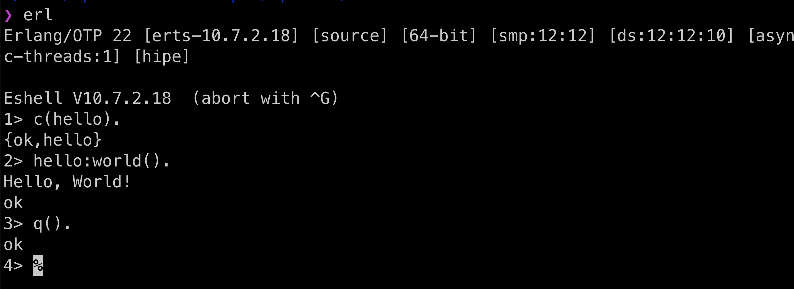
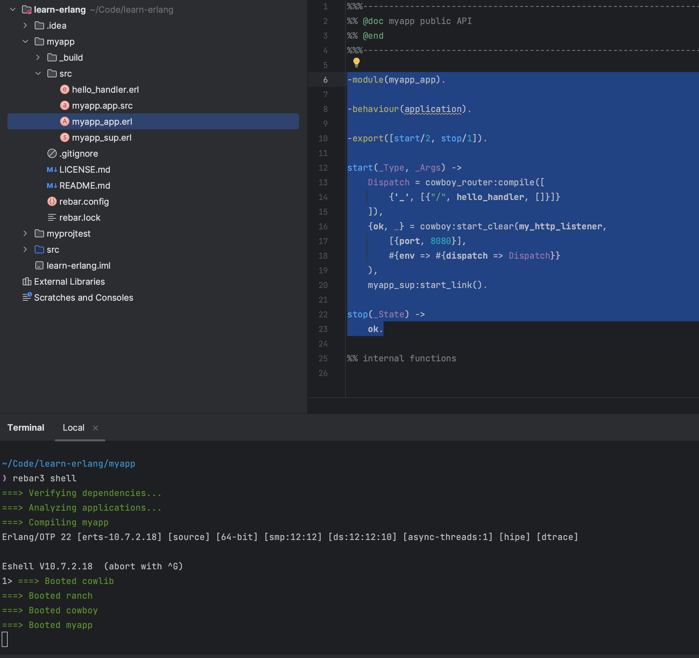
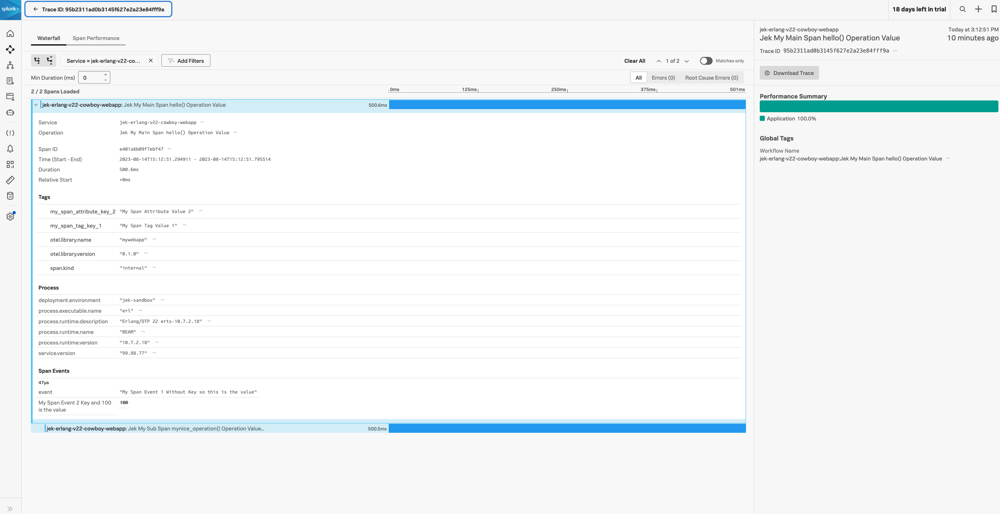

# Setup has two options A & B
## Option A: Setup Directly via Homebrew (easy)
- Following this https://www.udemy.com/course/completeerlang/
- At time of setup OS is MacOS
- https://formulae.brew.sh/formula/erlang `brew install erlang@22`
    - `echo 'export PATH="/usr/local/opt/erlang@22/bin:$PATH"' >> ~/.zshrc`
        - The Erlang SDK should be located in /usr/local/opt/erlang@22 as of time of installation of Erlang
    - `export LDFLAGS="-L/usr/local/opt/erlang@22/lib"`
    - `erl`
    - To quit: 1> `q().`
- https://stackoverflow.com/questions/9560815/how-to-get-erlangs-release-version-number-from-a-shell 

```erl -eval '{ok, Version} = file:read_file(filename:join([code:root_dir(), "releases", erlang:system_info(otp_release), "OTP_VERSION"])), io:fwrite(Version), halt().' -noshell```

- Erlang version is 22.3.4.26

## Option B: Setup With Version Manager called Kerl via Homebrew (more complex)
- Install Erlang Version Manager https://github.com/kerl/kerl `brew install kerl`
- `kerl list releases`
- Pick your choice. Note that named builds allow you to have different builds for the same Erlang/OTP release with different configure options: `kerl build 22.3.4.26 jekBuild22.3.4.26on10Aug2023v1`
- `kerl list builds`
- `kerl install jekBuild22.3.4.26on10Aug2023v1 ~/kerl/jekBuild22dot3dot4dot26on10Aug2023v1`
- `kerl list installations`
- `. /Users/jchoo/kerl/jekBuild22dot3dot4dot26on10Aug2023v1/activate`
    - This setup is stuck to the terminal I am currently in as the export PATH is not permanent. If missing in `echo $PATH`
    - Re run the immediate above
    - Then run `echo $PATH`
- `kerl status`

# Firing it up
- `erl`
- The shell suggests ^G, Ctrl-G, which will bring you to a mysterious (for now) user switch command. (Ctrl-C will bring you to a menu.) The simplest way to quit, allowing everything that might be running in the shell to exit normally, is `q().`:
```
1> q().
ok
```
# Hello World (Real Simple)
- Create a file named hello.erl with the following content:
```
-module(hello).
-export([world/0]).

world() ->
    io:format("Hello, World!~n").
```

Here's what the code does:

- The -module(hello). directive names the module hello.
- The -export([world/0]). directive makes the world/0 function available to other modules.
- The world() function outputs "Hello, World!" to the standard output.
You can compile and run the code by executing the following commands in the Erlang shell:

```
1> c(hello).
{ok,hello}
2> hello:world().
Hello, World!
ok
```
Note that you'll need to have the hello.erl file in the current directory where the Erlang shell is running, or you will need to tell the shell where to find it.



# Hello World (a bit more depth)
- Write a hello world hw.erl in the current folder
```erl
-module(hw).

%% API
-export([helloworld/0, hellomyworld/1]).

helloworld() ->
  "Hello world".

hellomyworld(X) ->
  "Hello " ++ X ++ " world".
```
- Start up erl shell `erl`
- Compile the hw module `c(hw).`
- Run the function in the module `hw:helloworld()`
- Run the function in the module `hw:hellomyworld("Jek")`


# Hello World Web Server. Build a simple web server Erlang and Rebar3 and Cowboy. Rebar3 is a build tool for Erlang. Cowboy is a web framework for Erlang.

## Setup Rebar3
- Go to your preferred folder example Download.
- Installing from Source http://rebar3.org/docs/getting-started/#installing-from-source `git clone https://github.com/erlang/rebar3.git`
- `cd rebar3`
- `./bootstrap`
- `./rebar3 local install`
- `export PATH=$PATH:~/.cache/rebar3/bin`
- Test by running `rebar3 new umbrella myproj`
- This setup is stuck to the terminal I am currently in as the export PATH is not permanent.

## Setup Web server
- Go back to the folder where I want to setup the web server
- Create a New Rebar3 Project
Open a terminal and run the following command to create a new Rebar3 app with the Cowboy dependency: `rebar3 new app mywebapp`
- `cd mywebapp`
- Edit the Configuration
Edit mywebapp.app.src and add Cowboy as a dependency. The file should look something like this:

```erlang
{application, mywebapp,
 [{description, "An OTP application"},
  {vsn, "0.1.0"},
  {registered, []},
  {mod, {mywebapp_app, []}},
  {applications,
   [kernel,
    stdlib,
    cowboy
   ]},
  {env,[]},
  {modules, []},

  {licenses, ["Apache-2.0"]},
  {links, []},
  {build_tools, ["rebar3"]}
]}.
```

- Add Cowboy to rebar.config https://ninenines.eu/docs/en/cowboy/2.9/guide/getting_started/
Edit rebar.config to include the Cowboy dependency: 

```erlang
{erl_opts, [debug_info]}.
{deps, [
    {cowboy, "2.9.0"}
]}.

{shell, [
  % {config, "config/sys.config"},
    {apps, [mywebapp]}
]}.
```

- Compile dependencies `rebar3 compile`

- Write the Hello World Handler
Create a new file under the src directory called hello_handler.erl with the following content:

```erlang
-module(hello_handler).
-behaviour(cowboy_handler).
-export([init/2]).

init(Req0, State) ->
  Req = cowboy_req:reply(200,
    #{<<"content-type">> => <<"text/plain">>},
    <<"Hello Jek!">>,
    Req0),
  {ok, Req, State}.
```

- Start Cowboy in Your Application
Edit the src/mywebapp_app.erl file to start the Cowboy server:

```erlang
-module(mywebapp_app).

-behaviour(application).

-export([start/2, stop/1]).

start(_Type, _Args) ->
    Dispatch = cowboy_router:compile([
        {'_', [{"/", hello_handler, []}]}
    ]),
    {ok, _} = cowboy:start_clear(my_http_listener,
        [{port, 8080}],
        #{env => #{dispatch => Dispatch}}
    ),
    mywebapp_sup:start_link().

stop(_State) ->
    ok.
```

- Build and Run Your Application
From the root directory of your application, run the following commands: 

```bash
rebar3 compile
```

- Runs a shell with project apps and deps in path. Intended for development use only https://rebar3.org/docs/commands/#shell

```bash
rebar3 shell
```

- Test it

```bash
curl http://localhost:8080 
```




# Add OTel Erlang agent to send traces to Splunk Observability Cloud

- Add opentelemetry and sys.config to `rebar.config` file.
```erlang
{erl_opts, [debug_info]}.
{deps, [
    {opentelemetry_api, "1.0.3"},
    {opentelemetry, "1.0.5"},
    {opentelemetry_exporter, "1.0.4"},
    {opentelemetry_cowboy, "0.2.1"},
    {cowboy, "2.9.0"}
]}.

{shell, [
    {config, "config/sys.config"},
    {apps, [mywebapp]}
]}.
```

- Add opentelemetry to `src/mywebapp_app.src` file.
```erlang
{application, mywebapp,
 [{description, "An OTP application"},
  {vsn, "0.1.0"},
  {registered, []},
  {mod, {mywebapp_app, []}},
  {applications,
   [kernel,
    stdlib,
    opentelemetry_api,
    opentelemetry,
    opentelemetry_exporter,
    opentelemetry_cowboy,
    cowboy
   ]},
  {env,[]},
  {modules, []},

  {licenses, ["Apache-2.0"]},
  {links, []},
  {build_tools, ["rebar3"]}
 ]}.
```

- Create sys.config and add config (change the variable realm and access token to your own).

```erlang
[
 {mywebappdirect, 
  [
   {key1, value1},
   {key2, value2}
  ]
 },
 {opentelemetry,
  [
   {span_processor, batch},
   {traces_exporter, otlp},
   {resource, [
     {service, #{name => "jek-erlang-v22-direct-cowboy-webapp", version => "77.88.99"}},
     {deployment, #{environment => "jek-sandbox"}}
   ]},
   {readers, [#{module => otel_metric_reader,
                config => #{export_interval_ms => 1000,
                            exporter => {opentelemetry_exporter, #{}}}}]}
  ]
 },
 {opentelemetry_exporter, 
  [
   {otlp_protocol, grpc},
   {otlp_traces_headers, "x-sf-token=< the ingest access token >"},
   {otlp_endpoint, "https://ingest.< the realm >.signalfx.com"}
  ]
 },
 {kernel,
  [
   {logger_level, debug},
   {logger,
    [
     {handler, default, logger_std_h,
      #{formatter => {logger_formatter, #{}}}
     }
    ]
   }
  ]
}
].
```

- Add spans to `src/hello_handler.erl` file.

```erlang
-module(hello_handler).
-behaviour(cowboy_handler).
-export([init/2]).

-include_lib("opentelemetry_api/include/otel_tracer.hrl").

init(Req, State) ->
    hello(),
    {ok, cowboy_req:reply(200, #{}, <<"Hello, Jek!">>, Req), State}.

hello() ->
    %% start an active span and run a local function
    ?with_span(<<"Jek My Main Span hello() Operation Value">>, #{}, fun mynice_operation/1).

mynice_operation(_SpanCtx) ->
    ?add_event(<<"My Span Event 1 Without Key so this is the value">>, [{<<"My Span Event 2 Key and 100 is the value">>, 100}]),
    ?set_attributes([{my_span_tag_key_1, <<"My Span Tag Value 1">>}]),
    ?set_attributes([{my_span_attribute_key_2, <<"My Span Attribute Value 2">>}]),

    %% start an active span and run an anonymous function
    ?with_span(<<"Jek My Sub Span mynice_operation() Operation Value...">>, #{},
                fun(_ChildSpanCtx) ->
                      timer:sleep(500),
                      ?set_attributes([{my_sub_span_tag_key_1, <<"my sub tag tag valuE 1">>}]),
                      ?add_event(<<"Jek My Sub Span Event Value!">>, []),
                      ok % to indicate that the anonymous function is done
                end).
```
- the include library in the above code is important to include the otel_tracer.hrl file. Without it, the ?with_span macro will not work.

- We can send direct without OTel Collector. We can send through OTel Collector as well. We can also do a debug spans.
    - See mywebapp/config/sys.config and other files in the folder for more details of how to change between the various ways.

- Do a clean build and run the app.

```bash
rm -rf _build && rm -f rebar.lock && rebar3 compile
```

- Run the app.

```bash
rebar3 shell
``` 

- The highest version that work with erlang/otp version 22 is opentelemetry, opentelemetry_api, and opentelemetry_exporter are all 1.0.X that would build without failure at the time of test 14 Aug 2023. 


# Proof



# Reference
- There are two types of Erlang Build Tools.  that can help you organize your code, manage dependencies, build releases, run tests, and more. The two are erlang.mk and rebar3 https://app.pluralsight.com/guides/10-essential-erlang-tools-for-erlang-developers
- https://opentelemetry.io/docs/instrumentation/erlang/exporters/
- https://hex.pm/packages/opentelemetry_cowboy
- https://hex.pm/packages/opentelemetry_exporter/versions
- https://hex.pm/packages/opentelemetry/versions
- https://hex.pm/packages/opentelemetry_api/versions
- https://docs.splunk.com/observability/gdi/get-data-in/application/other-languages.html#apm-instrumentation-other-langs
- An example app from Tristan https://github.com/open-telemetry/opentelemetry-erlang-contrib/tree/4ba1f66ec9a3d8353cc0a892357929422fa20407/examples/roll_dice_elli
- Not Erlang but Phoenix and Ecto https://github.com/open-telemetry/opentelemetry-erlang-contrib/tree/main/examples/basic_phoenix_ecto
- Pair programmed with Michael to resolve exporter and he is using Docker Compose. Another approach to quickly test https://github.com/mcheo/getting-data-in/tree/main/apm/apm-erlang
- 
