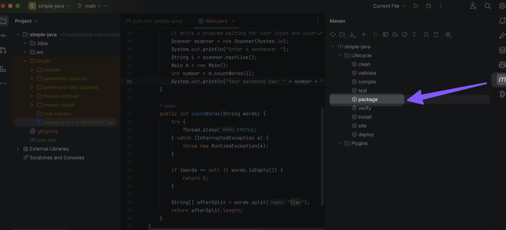

Create an empty project using IntelliJ.

Create a simple java module called `my-simple-java` (folder structure would be `./my-simple-java`) that even after instrumenting splunk-otel-java agent, it should not show any traces in Splunk Observability UI.

Add the following dependency in `pom.xml` file
```xml
...
<build>
        <plugins>
            <plugin>
                <groupId>org.apache.maven.plugins</groupId>
                <artifactId>maven-jar-plugin</artifactId>
                <version>3.3.0</version>
                <configuration>
                    <archive>
                        <manifest>
                            <mainClass>org.learningextension.Main</mainClass>
                        </manifest>
                    </archive>
                </configuration>
            </plugin>
        </plugins>
    </build>
...

```

Package the my simple java program using IntelliJ UI that has Maven support 

## Steps to package and run via command line with otel java extension
```bash

cd my-simple-java

mvn clean package

java -jar target/my-simple-java-1.0-SNAPSHOT.jar

# Download splunk-otel-java.jar
curl -L https://github.com/signalfx/splunk-otel-java/releases/latest/download/splunk-otel-javaagent.jar -o ../splunk-otel-javaagent.jar


java -javaagent:../splunk-otel-javaagent.jar -Dotel.resource.attributes=service.name=jek-simple-java-v1-with-agent-no-auto-instr,deployment.environment=jek-sandbox -Dsplunk.metrics.enabled=true -Dotel.javaagent.debug=true -Dsplunk.realm='your_realm'  -Dsplunk.access.token='your_access_token' -jar target/my-simple-java-1.0-SNAPSHOT.jar


```

Create a custom instrumentation module called `my-opentelemetry-custom-instrumentation` (folder structure would be `./my-opentelemetry-custom-instrumentation`) that will have the following files

Create a `pom.xml` file with the following content
```xml
...
<dependencies>
    <dependency>
        <groupId>junit</groupId>
        <artifactId>junit</artifactId>
        <version>3.8.1</version>
        <scope>test</scope>
    </dependency>
    <dependency>
        <groupId>com.google.auto.service</groupId>
        <artifactId>auto-service</artifactId>
        <version>1.1.0</version>
    </dependency>
    <dependency>
        <groupId>io.opentelemetry</groupId>
        <artifactId>opentelemetry-sdk</artifactId>
        <version>1.26.0</version>
    </dependency>
    <dependency>
        <groupId>io.opentelemetry</groupId>
        <artifactId>opentelemetry-api</artifactId>
        <version>1.26.0</version>
    </dependency>
    <dependency>
        <groupId>io.opentelemetry</groupId>
        <artifactId>opentelemetry-exporter-otlp</artifactId>
        <version>1.26.0</version>
    </dependency>
    <dependency>
        <groupId>io.opentelemetry</groupId>
        <artifactId>opentelemetry-sdk-extension-autoconfigure-spi</artifactId>
        <version>1.26.0</version>
    </dependency>
    <dependency>
        <groupId>io.opentelemetry.instrumentation</groupId>
        <artifactId>opentelemetry-instrumentation-api</artifactId>
        <version>1.24.0</version>
    </dependency>
    <dependency>
        <groupId>io.opentelemetry.javaagent</groupId>
        <artifactId>opentelemetry-javaagent-extension-api</artifactId>
        <version>1.24.0-alpha</version>
    </dependency>
    <dependency>
        <groupId>io.opentelemetry</groupId>
        <artifactId>opentelemetry-semconv</artifactId>
        <version>1.26.0-alpha</version>
    </dependency>
</dependencies>

<properties>
    <maven.compiler.source>17</maven.compiler.source>
    <maven.compiler.target>17</maven.compiler.target>
    <project.build.sourceEncoding>UTF-8</project.build.sourceEncoding>
</properties>
...
```

Create a WordCountInstrumentation.java file with the following content
```java


// Import necessary libraries.
// ElementMatchers helps to define custom matchers for Byte Buddy's ElementMatcher interface.
import static net.bytebuddy.matcher.ElementMatchers.namedOneOf;

// OpenTelemetry libraries for tracing capabilities
import io.opentelemetry.api.GlobalOpenTelemetry;
import io.opentelemetry.api.trace.Span;
import io.opentelemetry.api.trace.StatusCode;
import io.opentelemetry.api.trace.Tracer;
import io.opentelemetry.context.Scope;

// Libraries for Java agent instrumentation
import io.opentelemetry.javaagent.extension.instrumentation.TypeInstrumentation;
import io.opentelemetry.javaagent.extension.instrumentation.TypeTransformer;

// Byte Buddy libraries for method intercepting
import net.bytebuddy.asm.Advice;
import net.bytebuddy.description.type.TypeDescription;
import net.bytebuddy.matcher.ElementMatcher;
import net.bytebuddy.matcher.ElementMatchers;

// Java logging library
import java.util.logging.Logger;

public class WordCountInstrumentation implements TypeInstrumentation {

    private static final Logger logger = Logger.getLogger(WordCountInstrumentation.class.getName());

    @Override
    public ElementMatcher<TypeDescription> typeMatcher() {
        logger.info("TEST typeMatcher");
        return ElementMatchers.named("org.mysimplejava.Main");
    }

    @Override
    public void transform(TypeTransformer typeTransformer) {
        logger.info("TEST transform");
        typeTransformer.applyAdviceToMethod(namedOneOf("countWords"),this.getClass().getName() + "$WordCountAdvice");
    }

    public static class WordCountAdvice {

//        public static final Logger logger = Logger.getLogger(WordCountInstrumentation.class.getName()); // no use because can't use logger.info...

        @Advice.OnMethodEnter(suppress = Throwable.class)
        public static Scope onEnter(@Advice.Argument(value = 0) String myUserInput, @Advice.Local("otelSpan") Span span) {
//            logger.info("TEST onEnter"); // having this would crash
            // Create a new span.
            Tracer tracer = GlobalOpenTelemetry.getTracer("my-instrumentation-library-name", "semver:1.0.1");
            System.out.print("my-instrumentation-library-name is entering the method");
            span = tracer.spanBuilder("mySpanName").startSpan();
            // Set some attributes on the span.
            span.setAttribute("thisIsMyUserInput", myUserInput);
            // Make the span active.
            // Return the Scope instance. This will be used in the exit advice to end the span's scope.
            return span.makeCurrent();
        }

        @Advice.OnMethodExit(onThrowable = Throwable.class, suppress = Throwable.class)
        public static void onExit(@Advice.Return(readOnly = false) int userWordCount,
                                  @Advice.Thrown Throwable throwable,
                                  @Advice.Local("otelSpan") Span span,
                                  @Advice.Enter Scope scope) {
//            logger.info("TEST onExit"); // having this would crash
            // Close the scope to end it.
            scope.close();
            // If the method threw an exception, set the span's status to error.
            if (throwable != null) {
                span.setStatus(StatusCode.ERROR, "Exception thrown in method");
            } else {
                // If no exception was thrown, set a custom attribute "wordCount" on the span.
                span.setAttribute("myUserInputWordCount", userWordCount);
            }

            // End the span. This makes it ready to be exported to the configured exporter (e.g., Jaeger, Zipkin).
            span.end();

            System.out.print("ByteBuddy Advice is exiting the method");
        }

    }


}
```

Create a WordCountInstrumentationModule

```java

// Import necessary libraries.
import static java.util.Collections.singletonList;

import com.google.auto.service.AutoService;
import io.opentelemetry.javaagent.extension.instrumentation.InstrumentationModule;
import io.opentelemetry.javaagent.extension.instrumentation.TypeInstrumentation;
import io.opentelemetry.javaagent.extension.matcher.AgentElementMatchers;
import java.util.List;
import net.bytebuddy.matcher.ElementMatcher;

/**
 * This is a demo instrumentation which hooks into servlet invocation and modifies the http
 * response.
 */
@AutoService(InstrumentationModule.class)
public final class WordCountInstrumentationModule extends InstrumentationModule {

    public WordCountInstrumentationModule() {
        super("my-wordcount-demo", "mywordcount");
    }

    @Override
    public int order() {
        return 1;
    }

    @Override
    public List<String> getAdditionalHelperClassNames() {
        return List.of(WordCountInstrumentation.class.getName(),"io.opentelemetry.javaagent.extension.instrumentation.TypeInstrumentation");
    }

    @Override
    public ElementMatcher.Junction<ClassLoader> classLoaderMatcher() {
        return AgentElementMatchers.hasClassesNamed("org.mysimplejava.Main");
    }

    @Override
    public List<TypeInstrumentation> typeInstrumentations() {
        return singletonList(new WordCountInstrumentation());
    }

}

```

Build the project using IntelliJ UI or command line `mvn clean package`

## Steps to run package with otel java extension
```bash

# be in root folder of extension-starter

# Download splunk-otel-java.jar
curl -L https://github.com/signalfx/splunk-otel-java/releases/latest/download/splunk-otel-javaagent.jar -o ../splunk-otel-javaagent.jar

java -javaagent:../splunk-otel-javaagent.jar -Dotel.resource.attributes=service.name=jek-simple-java-v2-with-agent-with-auto-instr,deployment.environment=jek-sandbox -Dsplunk.metrics.enabled=true -Dotel.javaagent.debug=true -Dotel.javaagent.extensions=./my-opentelemetry-custom-instrumentation/target/my-opentelemetry-custom-instrumentation-1.0-SNAPSHOT.jar
 -Dsplunk.realm='your_realm' -Dsplunk.access.token='your_access_token' -jar ./my-simple-java/target/my-simple-java-1.0-SNAPSHOT.jar


```

# Proof


# Reference
- https://opentelemetry.io/docs/instrumentation/java/automatic/extensions/
- https://gethelios.dev/blog/deploy-opentelemetry-java-guide-getting-started/
-  https://github.com/open-telemetry/opentelemetry-java-instrumentation/blob/main/docs/contributing/writing-instrumentation-module.md
- https://github.com/open-telemetry/opentelemetry-java-instrumentation/tree/main/examples/extension
- https://github.com/open-telemetry/opentelemetry-java-instrumentation/blob/main/instrumentation/rabbitmq-2.7/javaagent/src/main/java/io/opentelemetry/javaagent/instrumentation/rabbitmq/RabbitChannelInstrumentation.java
- https://www.youtube.com/watch?v=hXTlV_RnELc and https://github.com/davidgeorgehope/custom-instrumentation-examples/tree/main and https://www.elastic.co/blog/how-extensions-opentelemetry-java-agent-and-how-apm-works
- https://www.baeldung.com/byte-buddy
- https://github.com/open-telemetry/opentelemetry-java-instrumentation/tree/main/instrumentation/kafka/kafka-clients/kafka-clients-0.11/javaagent/src/main/java/io/opentelemetry/javaagent/instrumentation/kafkaclients/v0_11
- https://alexey-anufriev.com/blog/advanced-instrumentation-with-bytebuddy-agent/
- https://blogs.oracle.com/javamagazine/post/runtime-code-generation-with-byte-buddy
- https://medium.com/@nishada/introduction-to-byte-buddy-advice-annotations-48ac7dae6a94
- https://sergiomartinrubio.com/articles/java-code-manipulation-with-byte-buddy/

# Optional Reference
- https://bytebuddy.net/#/
   https://github.com/open-telemetry/opentelemetry-java-instrumentation/blob/main/docs/contributing/writing-instrumentation.md

  
