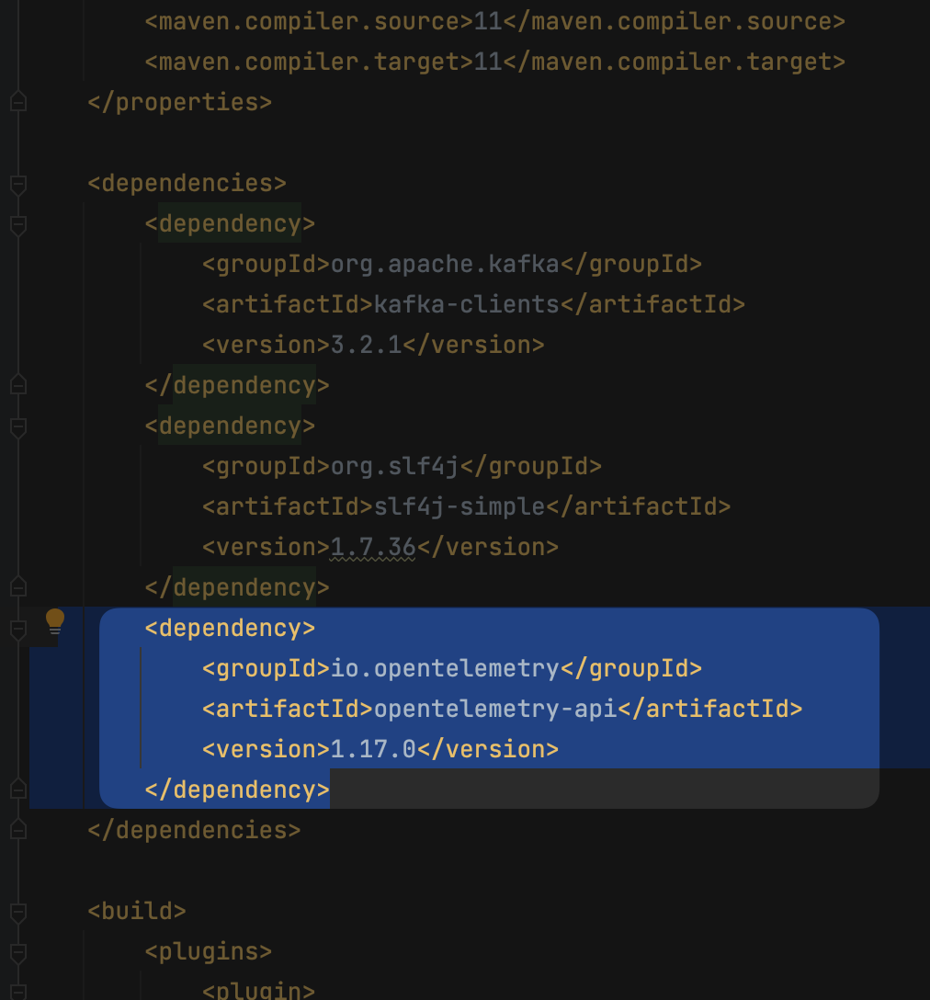

# This is a continuation of apm-java/kafka-maven-auto-instr
Objective: Add manual instrumentation for span attributes (beyond auto instrumentation)

# Option 1 - No Span Annotation
Add to pom.xml of producer project

```xml
    <dependencies>
        <dependency>
            <groupId>org.apache.kafka</groupId>
            <artifactId>kafka-clients</artifactId>
            <version>3.2.1</version>
        </dependency>
        <dependency>
            <groupId>org.slf4j</groupId>
            <artifactId>slf4j-simple</artifactId>
            <version>1.7.36</version>
        </dependency>
        <dependency>
            <groupId>io.opentelemetry</groupId>
            <artifactId>opentelemetry-api</artifactId>
            <version>1.17.0</version>
        </dependency>
    </dependencies>
```
Remember to find the relevant version from:
- https://mvnrepository.com/artifact/io.opentelemetry/opentelemetry-api and matching to Splunk-otel-java version that we are using
- https://github.com/signalfx/splunk-otel-java/releases

Add the necessary import code to Producer.java
```java
import io.opentelemetry.api.GlobalOpenTelemetry;
import io.opentelemetry.api.trace.Span;
import io.opentelemetry.api.trace.Tracer;
import io.opentelemetry.context.Scope;
```

Add the span codes
```java
 // Add tracer and span
        Tracer s_tracer = GlobalOpenTelemetry.getTracer("instrumentation-library-name-eg-splunk-otel-java", "eg-1.15.0");
        Span span = s_tracer.spanBuilder("Jek_changing-span-operation-name-here").startSpan();

        // Set span attributes
        span.setAttribute("key-jek", "value-hello-world");

        // Make the span the current span - optional to setting span attributes
        try (Scope ss = span.makeCurrent()) {
            // In this scope, the span is the current/active span

        } finally {
            span.end();
        }
        // It will show that producer tries 90 times.
```

All in all, the Kafka Producer code will be like this
```java
package org.example;

import org.apache.kafka.clients.producer.KafkaProducer;
import org.apache.kafka.clients.producer.ProducerRecord;

import java.util.Properties;

import io.opentelemetry.api.GlobalOpenTelemetry;
import io.opentelemetry.api.trace.Span;
import io.opentelemetry.api.trace.Tracer;
import io.opentelemetry.context.Scope;

public class Producer {
    public static void main(String[] args) {
        Properties props = new Properties();
        props.put("bootstrap.servers", "localhost:9092");
        props.put("linger.ms", 1);
        props.put("key.serializer", "org.apache.kafka.common.serialization.StringSerializer");
        props.put("value.serializer", "org.apache.kafka.common.serialization.StringSerializer");

        // Add tracer and span
        Tracer s_tracer = GlobalOpenTelemetry.getTracer("instrumentation-library-name-eg-splunk-otel-java", "eg-1.15.0");
        Span span = s_tracer.spanBuilder("Jek_changing-span-operation-name-here").startSpan();

        // Set span attributes
        span.setAttribute("key-jek", "value-hello-world");

        // Make the span the current span - optional to setting span attributes
        try (Scope ss = span.makeCurrent()) {
            // In this scope, the span is the current/active span

            KafkaProducer<String, String> producer = new KafkaProducer<>(props);
            for (int i = 0; i < 90; i++) {
                span.setAttribute("kafka-message-value", i); // this will prove that it set the last value to the span attribute
                System.out.println("Messages: " + i);
                producer.send(new ProducerRecord<String, String>("my-topic", Integer.toString(i), Integer.toString(i)));
            }

            producer.close();

        } finally {
            span.end();
        }
        // It will show that producer tries 90 times.

    }
}
```

After this, use Maven to Clean and Package. Then run the app like e.g. `java -javaagent:./splunk-otel-javaagent.jar -jar target/Jek-Kafka-Java-Producer-22Aug2022-1.0-SNAPSHOT-jar-with-dependencies.jar
`. The command are in apm-java/kafka-maven-auto-instr/README.md

Proof


# Option 2 - With Span Annotation
Add to pom.xml of consumer project
- 