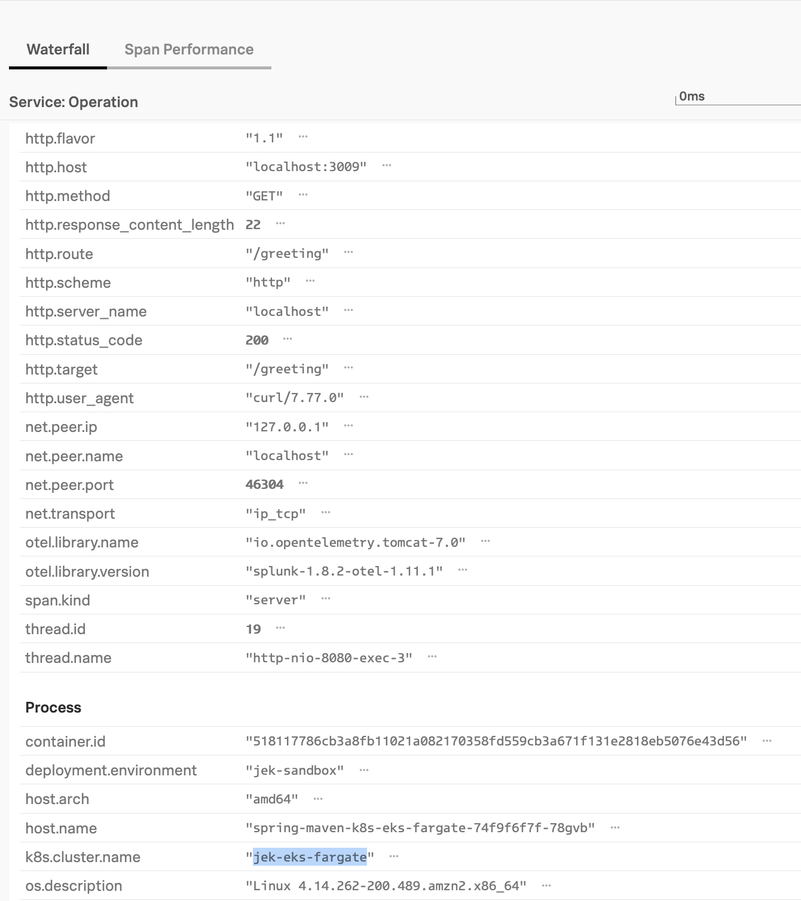

This is a continuation of spring-maven-docker-auto-instr; should have completed the spring-maven-docker-auto-instr setup before doing this.
The spring-maven-docker-auto-instr setup sends directly to Splunk O11y backend.
This setup sends traces to Splunk OTel Collector which then send to Splunk O11y backend.

1. Install Splunk OTel Collector in EKS Fargate cluster.
Remember to use the Gateway mode. This is important.
Verify that Splunk OTel Collector Gateway is installed. 
```bash
kubectl get all -A
```

```bash
helm ls -A
```
Ensure that there is  Splunk OTel Collector

2. Get the image from Dockerhub https://hub.docker.com/repository/docker/jekbao/jekspringwebapp
For example `jekbao/jekspringwebapp:v1`

3. Get the Splunk OTel Collector Service name and namespace e.g. splunk-otel-collector-xxx and default is the namespace
```bash
kubectl get svc -A
```
---
For example `splunk-otel-collector-1646814262.default.svc`

4. Deploy the yaml file
- Update image in spring-maven-k8s-eks-fargate-deployment.yaml to latest image (e.g. v1) after which create the deployment 
- Update the OTLP_ENDPOINT name with the service name and namespace with port 4317 e.g. `splunk-otel-collector-1646814262.default.svc:4317`
- After that run with the following  command in terminal CLI
```bash
kubectl apply -f spring-maven-k8s-eks-fargate-deployment.yaml

# or if repo is updated
kubectl apply -f https://raw.githubusercontent.com/jek-bao-choo/splunk-otel-example/main/apm-java/spring-maven-k8s-eks-fargate-auto-instr/spring-maven-k8s-eks-fargate-deployment.yaml
```
IMPORTANT: The service name in the yaml file needs to http://splunk-otel-collector-1646020911.default.svc:4317 where is the service name from kubectl get svc and .default is the namespace of where the service is.
Reference: https://kubernetes.io/docs/concepts/services-networking/dns-pod-service/
If have difficulty resolving <svc>.<namespace>... see: 
- https://stackoverflow.com/questions/68515198/how-can-pod-make-http-request-to-other-service-in-k8s
- https://stackoverflow.com/questions/66760610/kubernetes-pod-unable-to-communicate-with-another-pod-using-a-service
- https://stackoverflow.com/questions/71234933/how-to-make-inter-container-calls-within-a-pod-in-elastic-kubernetes-service 
- https://kubernetes.io/docs/tasks/administer-cluster/dns-debugging-resolution/ 
- 
NOTE: For Java it needs to have http:// 
without http:// it would throw invalid OTLP endpoint
- http://splunk-otel-collector-1646814262.default.svc:4317 --> This works
- splunk-otel-collector-1646814262.default.svc:4317 --> This doesn't work (without http://)

5. Use port forwarding to test
```bash
kubectl port-forward deployment/spring-maven-k8s-eks-fargate 3009:<containerPort>

# i.e. kubectl port-forward deployment/spring-maven-k8s-eks-fargate 3009:8080

# Invoke success
curl http://localhost:3009/greeting

# Invoke general
curl http://localhost:3009
```

6. View the logs to verify
```bash
kubectl logs deployment/spring-maven-k8s-eks-fargate
```
---

#Misc
- Ref: https://github.com/signalfx/splunk-otel-java
- Proof: 
- - Proof: 
- Last updated: 12 Mar 2022
