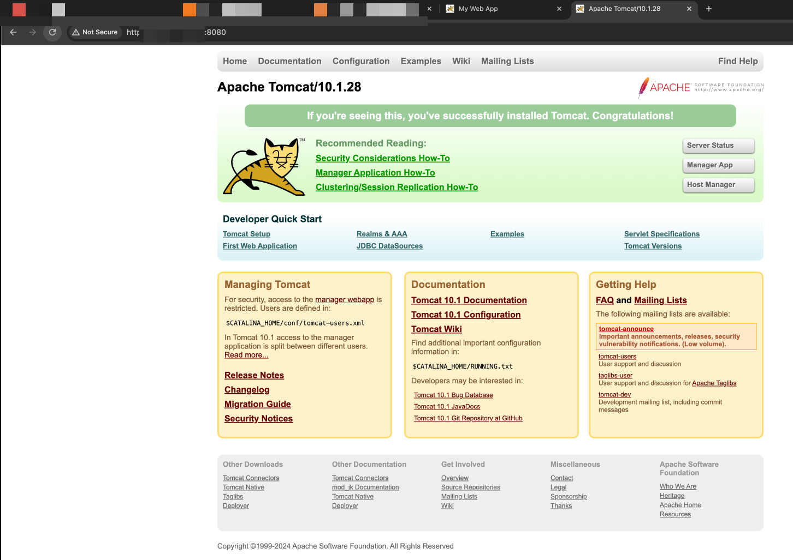
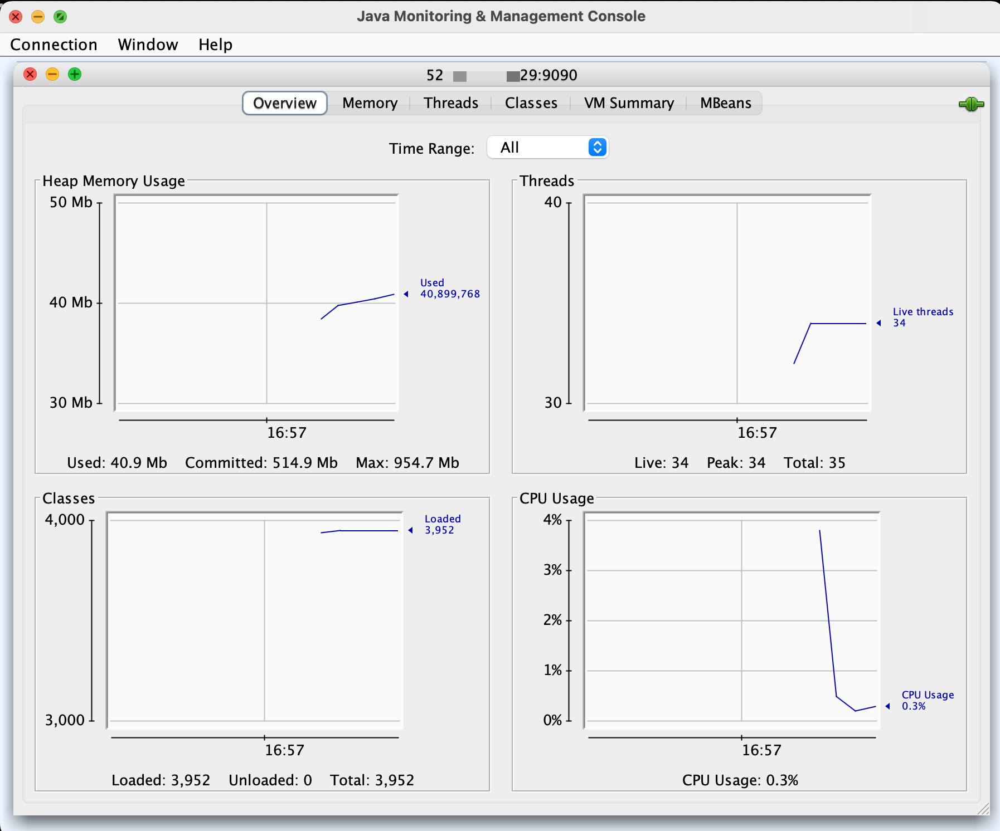
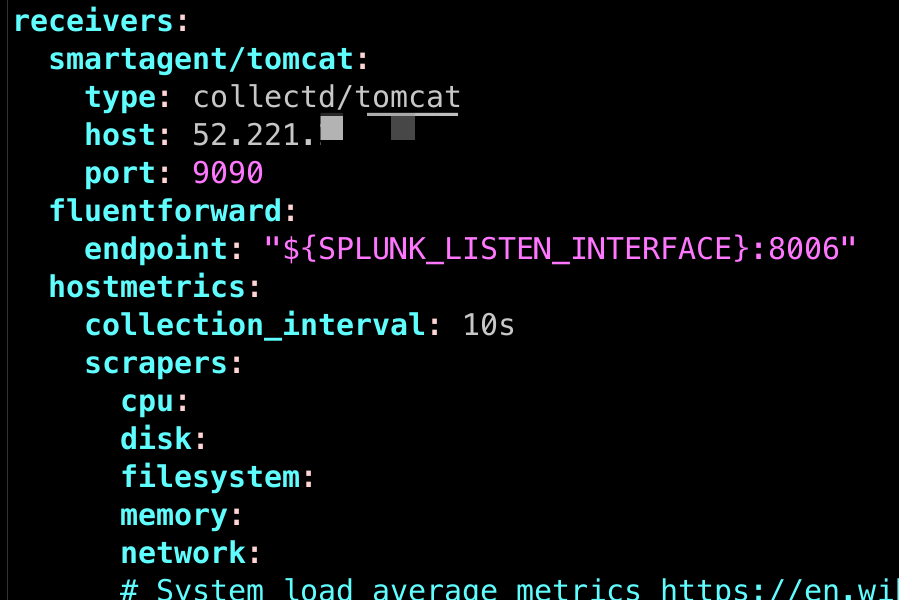
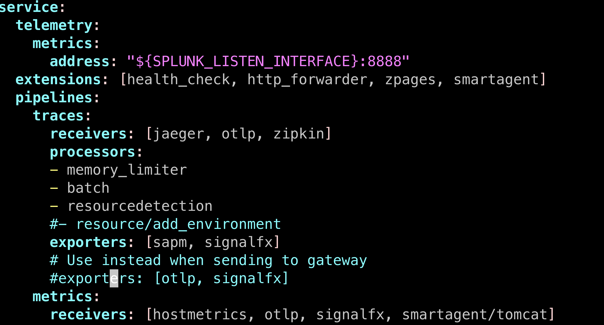
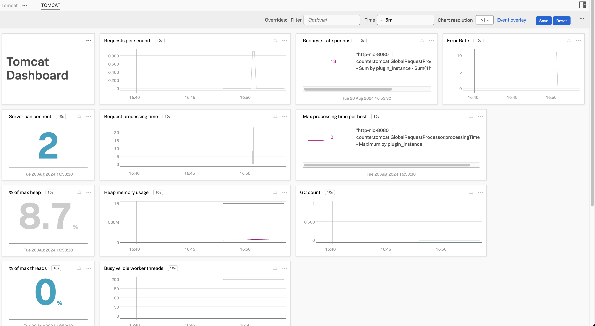

Must read https://www.digitalocean.com/community/tutorials/how-to-install-apache-tomcat-10-on-ubuntu-20-04



Follow the steps to install Tomcat 10 on Ubuntu 20.04.

Next add a Java appplication to Tomcat.

Go to `cd MyWebApp` and run `mvn clean package`. This will create a MyWebApp.war file in the target/ directory.

    This simple application allows users to enter their name, which is then displayed on the page. It demonstrates the basic structure of a Java web application with a frontend (JSP and CSS) and backend (Servlet).
    To enhance this application with OpenTelemetry:
        Add the OpenTelemetry dependencies to your pom.xml.
        Configure a TracerProvider in your application.
        Instrument your Servlet using OpenTelemetry annotations or manual instrumentation.

Transfer the WAR file: Use SCP or SFTP to transfer your WAR file to the Ubuntu server where Tomcat is running:

`scp -i ~/.ssh/my-ec2-key.pem ~/MyWebApp.war ubuntu@ec2-xx-xx-xx-xx.compute-1.amazonaws.com:~`

Check that the WAR file is in the correct location: ~/MyWebApp.war

After which, `sudo cp ~/MyWebApp.war /opt/tomcat/webapps/`

Ensure Tomcat has the right permissions to read and execute your application:
`sudo chown tomcat:tomcat /opt/tomcat/webapps/MyWebApp.war`
`sudo chmod 644 /opt/tomcat/webapps/MyWebApp.war`

Check Tomcat logs for any errors:
`sudo journalctl -u tomcat`
`sudo tail -f /opt/tomcat/logs/catalina.out`

Restart the Tomcat service to deploy your application:
`sudo systemctl restart tomcat`
`sudo systemctl status tomcat`

Access your application through a web browser:
http://your-server-ip:8080/MyWebApp


---

Configure Tomcat for remote JMX access:
Edit the Tomcat startup script (create a setenv.sh)

Add the following lines:
```bash
export CATALINA_OPTS="$CATALINA_OPTS -Dcom.sun.management.jmxremote -Dcom.sun.management.jmxremote.port=9090 -Dcom.sun.management.jmxremote.rmi.port=9091 -Dcom.sun.management.jmxremote.ssl=false -Dcom.sun.management.jmxremote.authenticate=false -Djava.rmi.server.hostname=<your_server_ip e.g. public ip or 127.0.0.1>"
```


To verify the JMX connection:

Restart Tomcat after making these changes.
`sudo systemctl restart tomcat`

`sudo systemctl status tomcat`

Verify Process Arguments:
Check if the JMX arguments are actually being passed to the Java process:

`ps aux | grep tomcat | grep jmxremote`

Check Tomcat Logs:
After enabling JMX and restarting Tomcat, check the Tomcat logs for any JMX-related messages:

`sudo tail -f /opt/tomcat/logs/catalina.out`

Use lsof (List Open Files):
On Unix-like systems, you can use lsof to check if Java (Tomcat) has the JMX port open:

`sudo lsof -i :9090`

`sudo lsof -i :9091`

Firewall Settings:
Make sure your firewall allows connections on port 9090 9091:

`sudo ufw status`

If UFW is active, you might need to add a rule:

`sudo ufw allow 9090/tcp`

`sudo ufw allow 9091/tcp`

Use netstat to Check Open Ports:
You can use netstat to verify that Tomcat is listening on the JMX port:

`sudo apt update`

`sudo apt install net-tools`

`netstat --version`

`sudo netstat -tulpn | grep 9090`

`sudo netstat -tulpn | grep 9091`

Security Group (if on EC2):
If you're on EC2, ensure that the security group allows inbound traffic on port 9090 9091.

Test Local Connection:
Try connecting to JMX locally on the server:

`telnet localhost 9090`

`telnet localhost 9091`

In my Mac terminal `jconsole <the ec2 public ip>:9090`



---

# Install OpenTelemetry Collector

```bash
curl -sSL https://dl.signalfx.com/splunk-otel-collector.sh > /tmp/splunk-otel-collector.sh && \
sudo sh /tmp/splunk-otel-collector.sh --realm us1 -- < ACCESS TOKEN HERE > --mode agent --without-instrumentation --discovery

```

`sudo systemctl restart splunk-otel-collector`

`sudo systemctl status splunk-otel-collector`

`sudo journalctl -u splunk-otel-collector -f`

`sudo vim /etc/otel/collector/agent_config.yaml`

Add to the receiver. https://docs.splunk.com/observability/en/gdi/monitors-hosts/apache-tomcat.html 


In short, it is a pair config. If setenv.sh is using 127.0.0.1, then OTel Collector config should use 127.0.0.1. However, if it is JMX remote access then need to use the public ip and both setenv.sh and OTel Collector config should use the public ip.





---

# Install OpenTelemetry Java Agent

Modify the Tomcat startup script (usually /etc/systemd/system/tomcat.service) to include the agent:
`Environment="CATALINA_OPTS=-javaagent:/path/to/opentelemetry-javaagent.jar"`

Add the environment variable to the Tomcat startup script at setenv.sh:
```bash
export OTEL_SERVICE_NAME='jek-tomcat-java'
export OTEL_RESOURCE_ATTRIBUTES='deployment.environment=jek-sandbox,service.version=1.2.3'
export OTEL_EXPORTER_OTLP_ENDPOINT='http://localhost:4317'
```

Reload the systemd configuration and restart Tomcat:
`sudo systemctl daemon-reload`
`sudo systemctl start tomcat`
`sudo systemctl status tomcat`