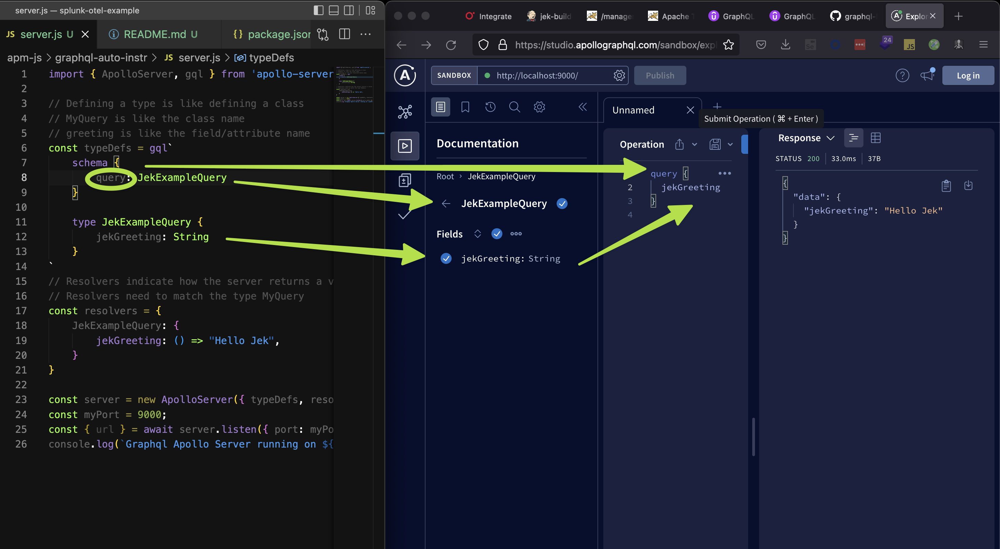
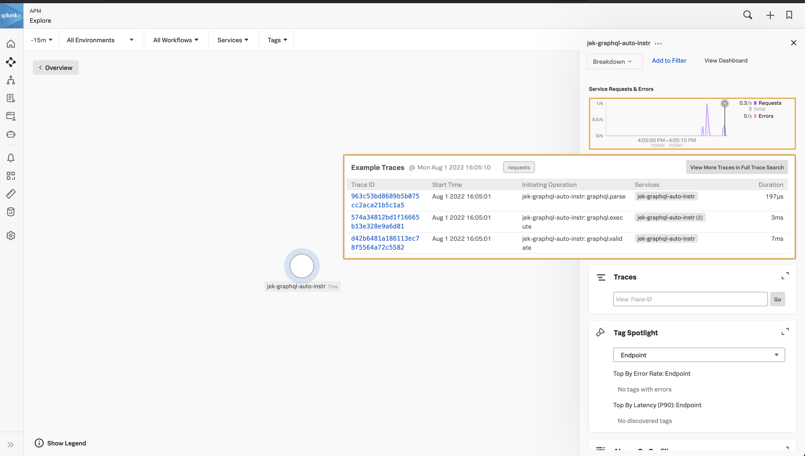
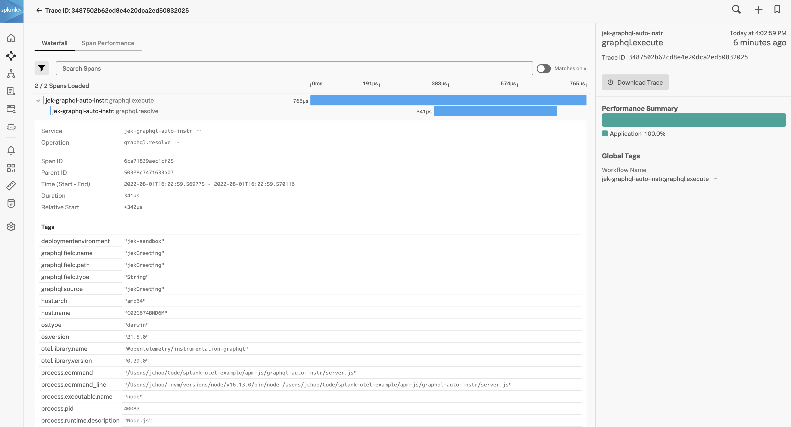
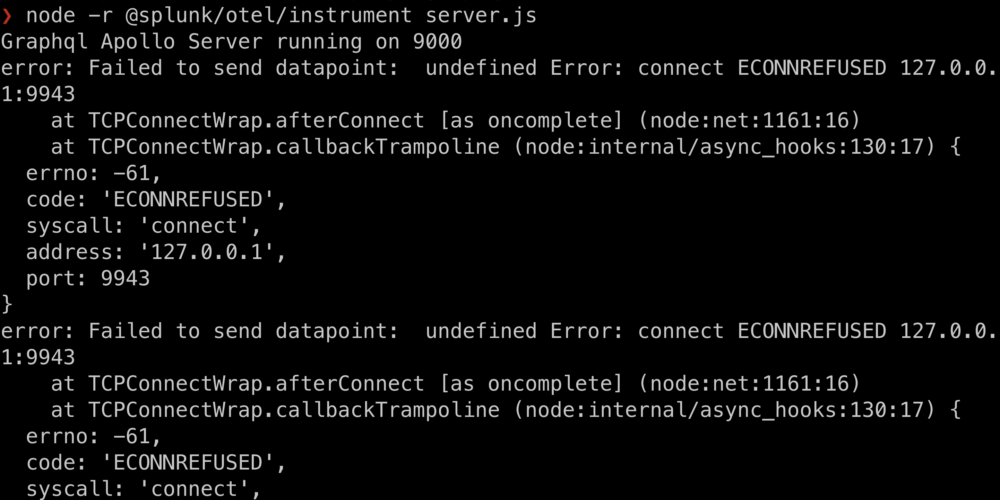

Node.js version is v16.13.0

# Set up server.js with package.json
- Create server.js
- `npm init`
- Install Apollo Server https://www.npmjs.com/package/apollo-server `npm i apollo-server --save`
- Install GraphQL https://www.npmjs.com/package/graphql `npm i graphql --save`
- Add `type: module` to package.json
```json
{
  "name": "graphql-auto-instr",
  "type": "module",
  "dependencies": {
    "apollo-server": "^3.10.0",
    "graphql": "^16.5.0"
  }
}
```
- Add code to server.js
```javascript
import { ApolloServer, gql } from 'apollo-server';

// Defining a type is like defining a class
// MyQuery is like the class name
// greeting is like the field/attribute name
const typeDefs = gql`
    schema {
        query: JekExampleQuery
    }

    type JekExampleQuery {
        jekGreeting: String
    }
`
// Resolvers indicate how the server returns a value
// Resolvers need to match the type MyQuery
const resolvers = {
    JekExampleQuery: {
        jekGreeting: () => "Hello Jek",
    }
}

const server = new ApolloServer({ typeDefs, resolvers})
const myPort = 9000;
const { url } = await server.listen({ port: myPort })
console.log(`Graphql Apollo Server running on ${myPort}`)
```

- Run `node server.js`
- Go to localhost:<the port number> e.g. localhost:9000

# Set up client.js with client.html 
- Create client.js with
```javascript
const GRAPHQL_SERVER = "http://localhost:9000/" // change the port accordingly

async function fetchJekGreeting() {
    const response = await fetch(GRAPHQL_SERVER, {
        method: 'POST',
        headers: {
          'Content-Type': 'application/json',
        },
        body: JSON.stringify({
            query: `
                query {
                    jekGreeting
                }
            `
        }),
    })

    const { data } = await response.json()

    return data
}

const element = document.getElementById('greeting');
element.textContent = 'Loading...';
fetchJekGreeting().then(({ jekGreeting }) => {
  element.textContent = jekGreeting;
});
```
- Create client.html
```html
<!DOCTYPE html>
<html lang="en">
<head>
  <meta charset="UTF-8">
  <meta http-equiv="X-UA-Compatible" content="IE=edge">
  <meta name="viewport" content="width=device-width, initial-scale=1.0">
  <title>GraphQL Client</title>
</head>
<body>
  <h1>GraphQL Client</h1>
  <p>
    The server says:
    <strong id="greeting">
      <!-- dynamically inserted content -->
    </strong>
  </p>
  <script src="client.js"></script>
</body>
</html>
```
- Open client.html in a browser

# Instrument server.js with splunk-otel-js plus otel graphql library
- `npm install @splunk/otel --save`
- `npm install @opentelemetry/instrumentation-graphql --save`
- `export OTEL_SERVICE_NAME='jek-graphql-auto-instr'`
- `export OTEL_TRACES_EXPORTER="jaeger-thrift-splunk"`
- `export SPLUNK_PROFILER_ENABLED='true'`
- `export SPLUNK_METRICS_ENABLED='true'`
- `export OTEL_EXPORTER_JAEGER_ENDPOINT=https://ingest.<realm from splunk o11y>.signalfx.com/v2/trace`
- `export SPLUNK_ACCESS_TOKEN=<ingest token from splunk o11y cloud>`
- `export OTEL_RESOURCE_ATTRIBUTES='deploymentenvironment=jek-sandbox'`
- View variables are added with `printenv`
- `node -r @splunk/otel/instrument server.js`
- Open client.html and refresh a few times

# Proof 



# Note


# Learning Ref
- https://www.udemy.com/course/graphql-by-example/ 