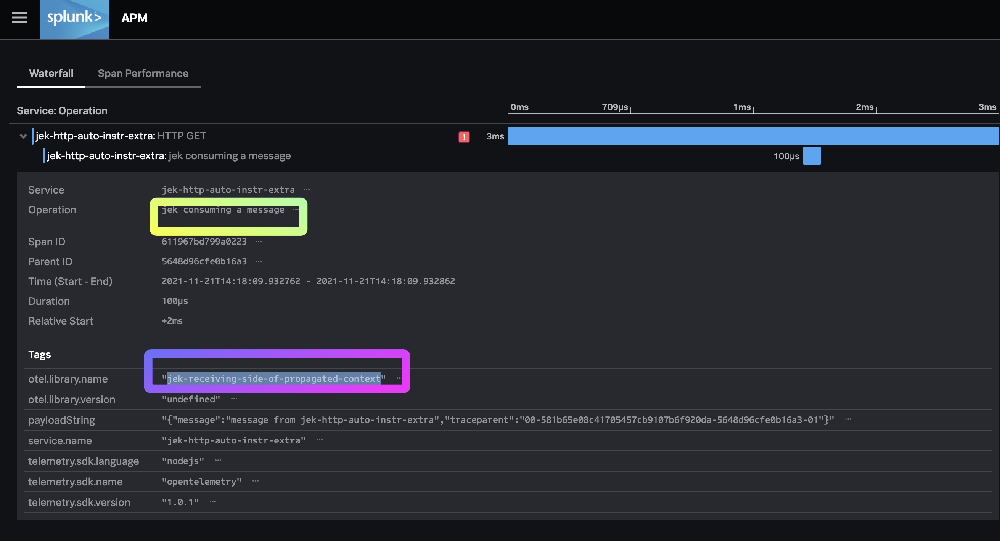

#My setup
- node v16.13.0
- npm v8.1.0

#14 Steps
1. `npm init`

2. `npm install @splunk/otel --save`

3. `npm install @opentelemetry/instrumentation-http --save`

4. `npm install axios --save`

5. `export OTEL_SERVICE_NAME=jek-http-auto-instr-extra`

6. `export OTEL_TRACES_EXPORTER="jaeger-thrift-splunk"`

7. `export OTEL_EXPORTER_JAEGER_ENDPOINT=https://ingest.<realm from splunk o11y>.signalfx.com/v2/trace`

8. `export SPLUNK_ACCESS_TOKEN=<ingest token from splunk o11y cloud>`

9. `printenv` to view variables are added

10. Create index.js file

11. Add the code from the index.js in this Github repo.

12. `node -r @splunk/otel/instrument index.js`

13. Invoke request http://localhost:5000/api

14. Invoke error http://localhost:5000

#Misc

- Ref: https://github.com/signalfx/splunk-otel-js
- Proof: 
- Last updated: 21 Nov 2021
