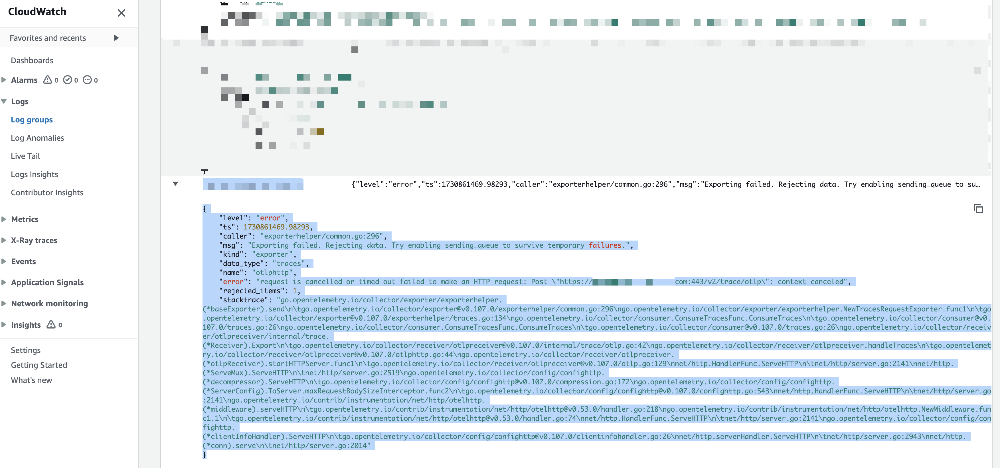
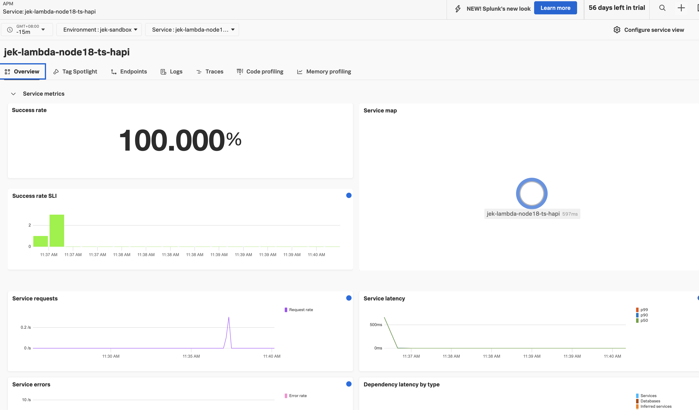

This is a continuation of https://github.com/jek-bao-choo/splunk-otel-example/tree/main/apm-js/lambda-sam-nodejs18-ts-v2

In this code, add Hapi.js stuff to app.ts and optionally create a StaticServePlugin.ts

Update the template.yaml 

```
#      Events:
#        HelloWorld:
#          Type: Api # More info about API Event Source: https://github.com/awslabs/serverless-application-model/blob/master/versions/2016-10-31.md#api
#          Properties:
#            Path: /hello
#            Method: get
      Events:
        ProxyApiRoot:
          Type: Api
          Properties:
            Path: /
            Method: ANY
        ProxyApiGreedy:
          Type: Api
          Properties:
            Path: /{proxy+}
            Method: ANY
```

If you get a timeout error of otel collector e.g.

``` 
THE ERROR MESSAGE.  If you get a timeout error of otel collector e.g.
{
    "level": "error",
    "ts": 1730861469.98293,
    "caller": "exporterhelper/common.go:296",
    "msg": "Exporting failed. Rejecting data. Try enabling sending_queue to survive temporary failures.",
    "kind": "exporter",
    "data_type": "traces",
    "name": "otlphttp",
    "error": "request is cancelled or timed out failed to make an HTTP request: Post \"https://ingest.XXXXXXXXXXX.XXXXXXXXXXXXXX.com:443/v2/trace/otlp\": context canceled",
    "rejected_items": 1,
    "stacktrace": "go.opentelemetry.io/collector/exporter/exporterhelper.(*baseExporter).send\n\tgo.opentelemetry.io/collector/exporter@v0.107.0/exporterhelper/common.go:296\ngo.opentelemetry.io/collector/exporter/exporterhelper.NewTracesRequestExporter.func1\n\tgo.opentelemetry.io/collector/exporter@v0.107.0/exporterhelper/traces.go:134\ngo.opentelemetry.io/collector/consumer.ConsumeTracesFunc.ConsumeTraces\n\tgo.opentelemetry.io/collector/consumer@v0.107.0/traces.go:26\ngo.opentelemetry.io/collector/consumer.ConsumeTracesFunc.ConsumeTraces\n\tgo.opentelemetry.io/collector/consumer@v0.107.0/traces.go:26\ngo.opentelemetry.io/collector/receiver/otlpreceiver/internal/trace.(*Receiver).Export\n\tgo.opentelemetry.io/collector/receiver/otlpreceiver@v0.107.0/internal/trace/otlp.go:42\ngo.opentelemetry.io/collector/receiver/otlpreceiver.handleTraces\n\tgo.opentelemetry.io/collector/receiver/otlpreceiver@v0.107.0/otlphttp.go:44\ngo.opentelemetry.io/collector/receiver/otlpreceiver.(*otlpReceiver).startHTTPServer.func1\n\tgo.opentelemetry.io/collector/receiver/otlpreceiver@v0.107.0/otlp.go:129\nnet/http.HandlerFunc.ServeHTTP\n\tnet/http/server.go:2141\nnet/http.(*ServeMux).ServeHTTP\n\tnet/http/server.go:2519\ngo.opentelemetry.io/collector/config/confighttp.(*decompressor).ServeHTTP\n\tgo.opentelemetry.io/collector/config/confighttp@v0.107.0/compression.go:172\ngo.opentelemetry.io/collector/config/confighttp.(*ServerConfig).ToServer.maxRequestBodySizeInterceptor.func2\n\tgo.opentelemetry.io/collector/config/confighttp@v0.107.0/confighttp.go:543\nnet/http.HandlerFunc.ServeHTTP\n\tnet/http/server.go:2141\ngo.opentelemetry.io/contrib/instrumentation/net/http/otelhttp.(*middleware).serveHTTP\n\tgo.opentelemetry.io/contrib/instrumentation/net/http/otelhttp@v0.53.0/handler.go:218\ngo.opentelemetry.io/contrib/instrumentation/net/http/otelhttp.NewMiddleware.func1.1\n\tgo.opentelemetry.io/contrib/instrumentation/net/http/otelhttp@v0.53.0/handler.go:74\nnet/http.HandlerFunc.ServeHTTP\n\tnet/http/server.go:2141\ngo.opentelemetry.io/collector/config/confighttp.(*clientInfoHandler).ServeHTTP\n\tgo.opentelemetry.io/collector/config/confighttp@v0.107.0/clientinfohandler.go:26\nnet/http.serverHandler.ServeHTTP\n\tnet/http/server.go:2943\nnet/http.(*conn).serve\n\tnet/http/server.go:2014"
}
If you get a timeout error of otel collector as above then...
```


Then increase the timeout and memory in template.yaml

``` 
Globals:
  Function:
#    Timeout: 3
    Timeout: 29  # Increased timeout
    MemorySize: 256  # Increased memory
```


Remember to change the token and realm

```
      Layers:
      - !Sub arn:aws:lambda:ap-southeast-1:254067382080:layer:splunk-apm:107  # Replace with your layer ARN
       # Add Environment variables here
      Environment:
        Variables:
          AWS_LAMBDA_EXEC_WRAPPER: /opt/nodejs-otel-handler #/opt/otel-handler
          OTEL_SERVICE_NAME: jek-lambda-node18-ts-hapi
          OTEL_RESOURCE_ATTRIBUTES: deployment.environment=jek-sandbox
          SPLUNK_REALM: <REDACTED>
          SPLUNK_ACCESS_TOKEN: <REDACTED>
```


Build it

```
sam build
sam local invoke
sam deploy
```

Test it

``` 
# Test root endpoint
curl https://your-api-id.execute-api.region.amazonaws.com/Prod/

# Test hello endpoint
curl https://your-api-id.execute-api.region.amazonaws.com/Prod/hello

# Test static endpoint
curl https://your-api-id.execute-api.region.amazonaws.com/Prod/static/test

```

# Proof

