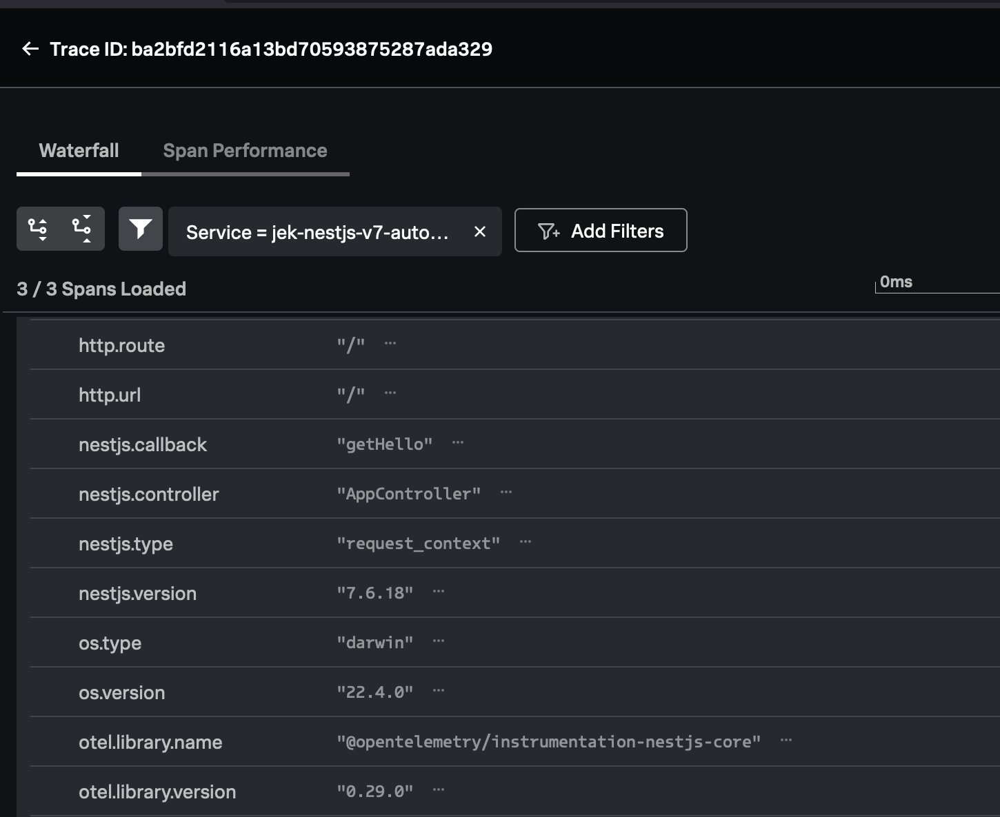
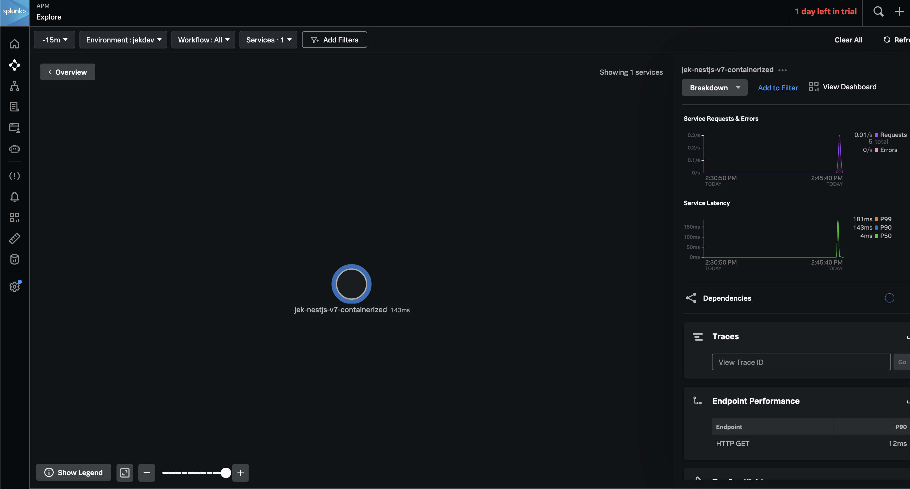
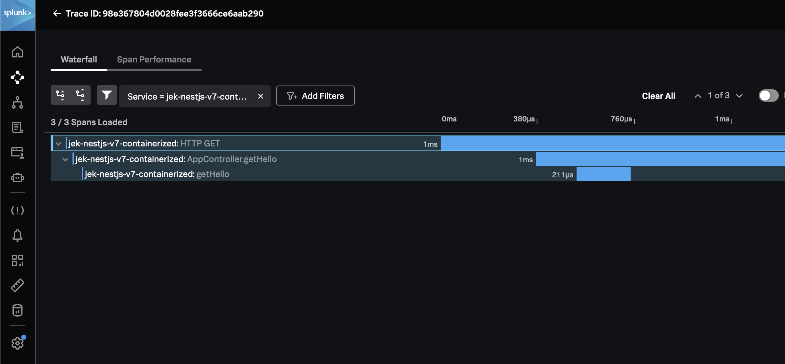

# Purpose
Validate Nest.js v7 with Node.js v12.12 using splunk-otel-js v1.4.1

# Steps
- `nest new nestjs-v7-auto-instr`.
- Change package.json to use nestjs v7
- `rm -rf node_modules`
- `npm install`
- `npm run build`
- `npm run start:prod`
- Go to localhost:3000 to verify there is Hello World
- `node --version` if it is not node v12.12 then use nvm to lower to 
  - `nvm use 12.12`
  - `node --version`
- With Node v12.12 rerun 
- - `npm run build`
  - `npm run start:prod`
  - Go to localhost:3000 to verify there is Hello World
- `export OTEL_SERVICE_NAME=jek-nestjs-v7-auto-instr`
- `export OTEL_RESOURCE_ATTRIBUTES='deployment.environment=jekdev'`
- `export SPLUNK_ACCESS_TOKEN=redacted`
- `export SPLUNK_REALM=redacted`
- `printenv` to view variables are added
- `node --version`
- `npm run build`
- `node -r @splunk/otel/instrument dist/main`
- Add `node -r @splunk/otel/instrument dist/main` to package.json as `start:prodotel`
- `npm run start:prodotel`
- Invoke request http://localhost:3000

# Proof





# Optional: Containerise this
```Dockerfile
FROM node:12-alpine

EXPOSE 4003 5003 6003

RUN mkdir /app
WORKDIR /app
ADD package.json /app
ADD package-lock.json /app
ADD . /app
RUN npm install
RUN npm run build

CMD ["npm", "run", "start:prodotel"]
```
- Create a Dockerfile
- `docker build -t jchoo/nestjsv7autoinstr:v1.0.2 . --no-cache`
- `docker run -p 3000:3000 -e OTEL_SERVICE_NAME=jek-nestjs-v7-containerized -e OTEL_RESOURCE_ATTRIBUTES='deployment.environment=jekdev' -e SPLUNK_ACCESS_TOKEN=redacted -e SPLUNK_REALM=redacted --name jek-nestjs-v7-auto-instr jchoo/nestjsv7autoinstr:v1.0.2`
- `curl localhost:3000`
- if successful, `docker push jchoo/nestjsv7autoinstr:v1.0.2`



# Optional: Kubernise this
```yaml
apiVersion: apps/v1
kind: Deployment
metadata:
  name: jek-nestjs-v7-kubernized
  labels:
    app: jeknestjsv7kubernized
spec:
  replicas: 1
  selector:
    matchLabels:
      app: jeknestjsv7kubernized
  template:
    metadata:
      labels:
        app: jeknestjsv7kubernized
    spec:
      containers:
      - name: jeknestjsv7kubernized
        image: jchoo/nestjsv7autoinstr:v1.0.2
        ports:
        - containerPort: 3000
        env:
          - name: SPLUNK_OTEL_AGENT
            valueFrom:
              fieldRef:
                fieldPath: status.hostIP
          - name: OTEL_RESOURCE_ATTRIBUTES
            value: deployment.environment=jekdev
          - name: OTEL_SERVICE_NAME
            value: jek-nestjs-v7-kubernized
          - name: OTEL_EXPORTER_OTLP_ENDPOINT
            value: http://$(SPLUNK_OTEL_AGENT):4317
```
- Create deployment.yaml file
