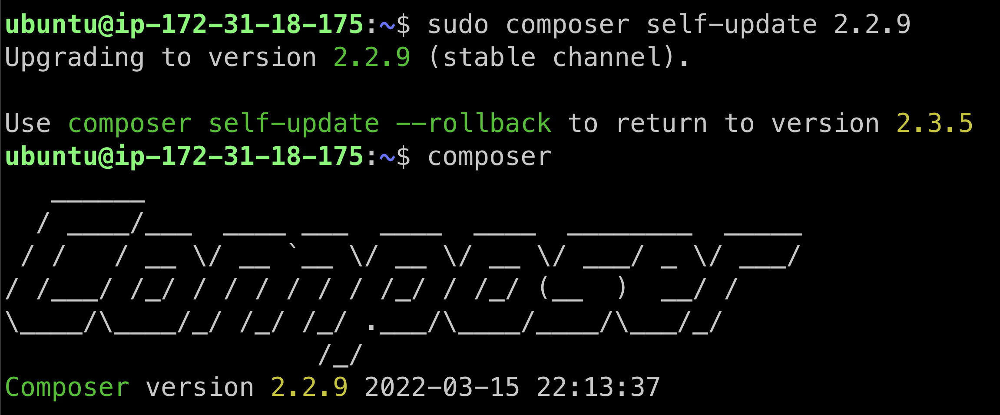
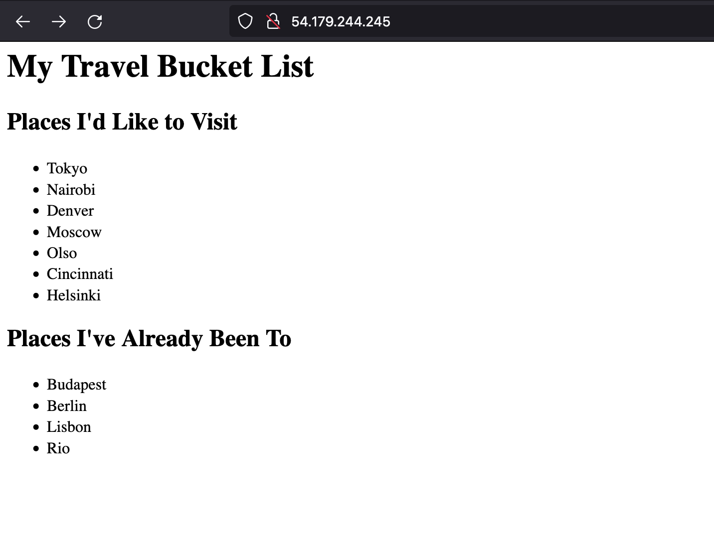
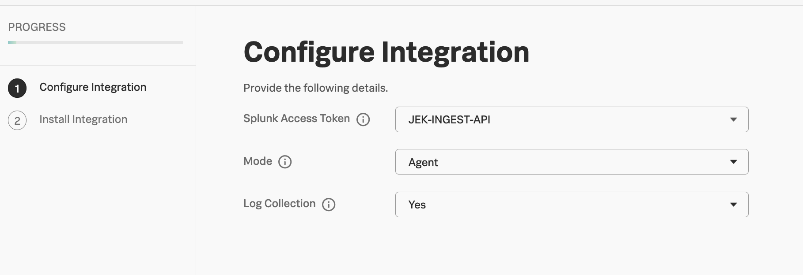
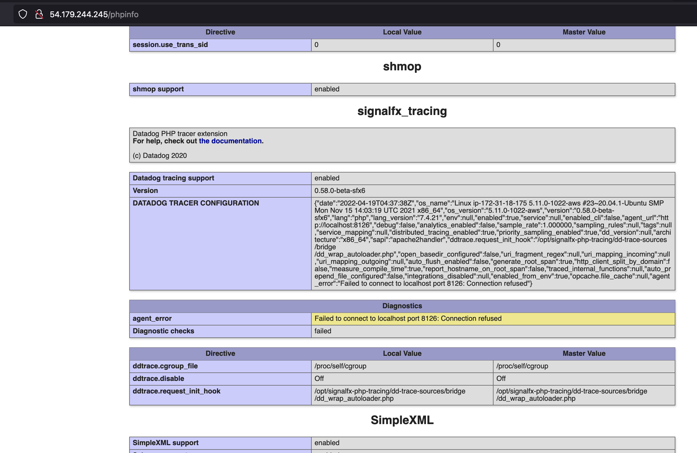
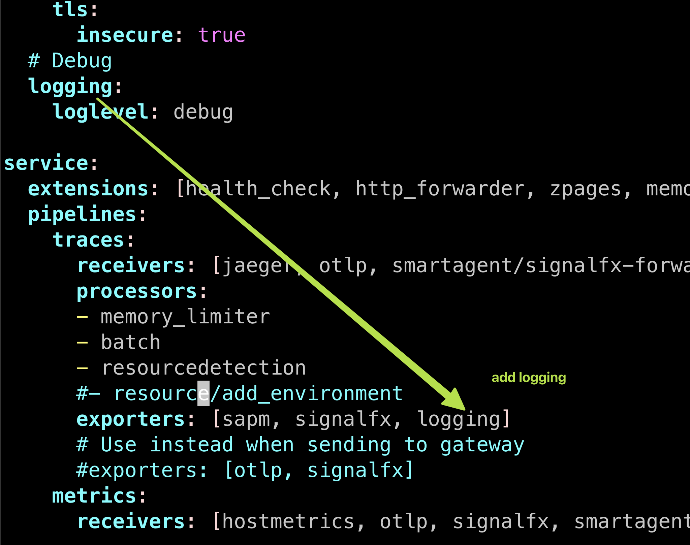
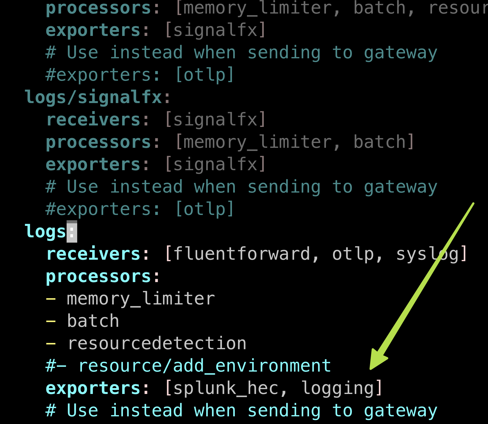
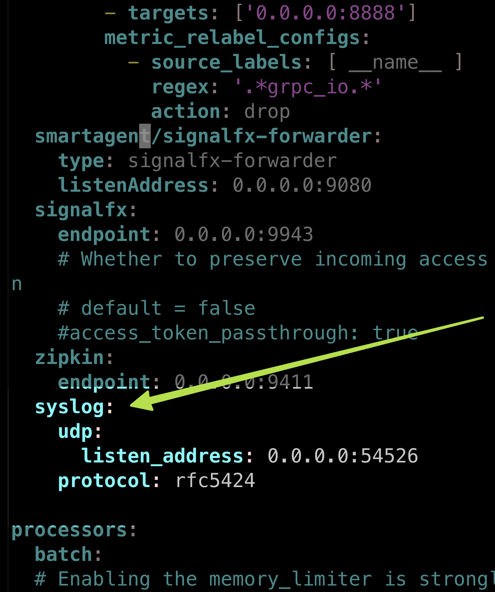
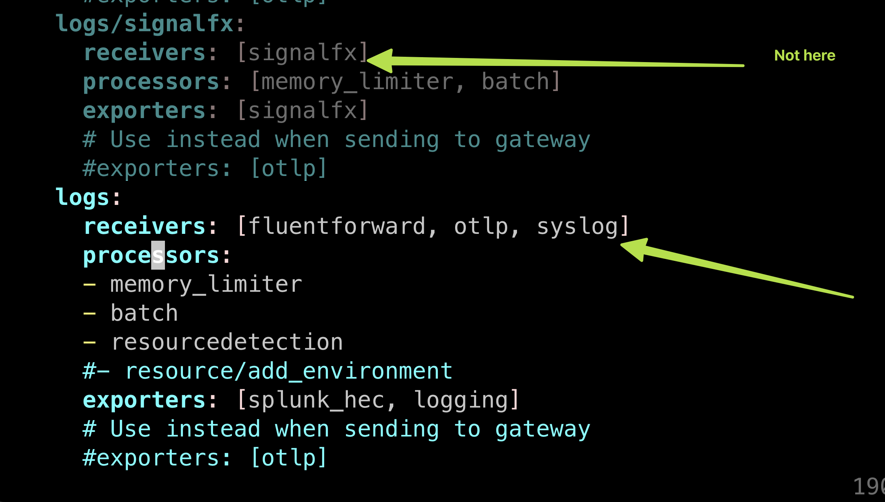

This guide is specifically for Laravel v8, Apache2, and Ubuntu 20.04

# 1. Create a Ubuntu 20.04 EC2 Instance with 30 GB storage

# 2. Do initial Server Setup with Ubuntu 20.04
https://www.digitalocean.com/community/tutorials/initial-server-setup-with-ubuntu-20-04 
- Step 4

# 3. Install the Apache Web Server on Ubuntu 20.04
https://www.digitalocean.com/community/tutorials/how-to-install-the-apache-web-server-on-ubuntu-20-04 

# 4. Install and Use Composer on Ubuntu 20.04
https://www.digitalocean.com/community/tutorials/how-to-install-and-use-composer-on-ubuntu-20-04
Perform
- Step 1
- Step 2
- Before Step 3 do the below checks and update
```bash
php -v

sudo composer self-update 2.2.9

composer
```
- Step 3
- Step 4
- Step 5

## 4a. Ensure `php -v` is 7.4.3


## 4b. Ensure `composer` version is 2.2.9


# 5. Install (excluding Nginx) MySQL, PHP (LEMP stack) on Ubuntu 20.04
https://www.digitalocean.com/community/tutorials/how-to-install-linux-nginx-mysql-php-lemp-stack-on-ubuntu-20-04
Do:
- step 2
- step 3
- Before step 5 do this:

Install Apache2 Mod PHP
https://askubuntu.com/a/1402316
```bash
sudo apt install libapache2-mod-php

sudo systemctl restart apache2
```

- step 5 (but do it with Apache instead)
- step 6

# 7. Install PHP curl
```bash
sudo apt install php-curl
```

```bash
# Restarted apache
sudo systemctl restart apache2
```

# 7. Install and Configure Laravel (excluding Nginx) on Ubuntu 20.04 (LEMP) 
https://www.digitalocean.com/community/tutorials/how-to-install-and-configure-laravel-with-nginx-on-ubuntu-20-04
Do:
- Step 1
- Step 2
- Step 3
- Step 4
- Don't do Step 5 instead do these:

Move travellist to /var/www/html/ https://www.hostinger.com/tutorials/how-to-install-laravel-on-ubuntu-18-04-with-apache-and-php/ 
however this guide is for ubuntu 18.04 so reference only specific section.
```bash
cd ~

sudo mv travellist /var/www/html/

# After that, set the necessary permissions to ensure the project runs smoothly:

sudo chgrp -R www-data /var/www/html/travellist/

sudo chown -R www-data:www-data /var/www/html/travellist/

sudo chown -R www-data:www-data /var/www/html/travellist/

sudo chown -R www-data:www-data /var/www/html/travellist/storage/

sudo chmod -R 775 /var/www/html/travellist/storage/

sudo chmod -R 777 /var/www/html/travellist/storage/logs
```

Create a new virtual host for the project
```bash
sudo nano /etc/apache2/sites-available/travellist-project.conf
```

Add this config
```xml
<VirtualHost *:80>
   ServerAdmin webmaster@localhost
   DocumentRoot /var/www/html/travellist/public

   <Directory /var/www/html/travellist/public>
       Options Indexes FollowSymlinks MultiViews
       AllowOverride All
       Order allow,deny
       allow from all
       Require all granted
   </Directory>
   ErrorLog ${APACHE_LOG_DIR}/error.log
   CustomLog ${APACHE_LOG_DIR}/access.log combined
</VirtualHost>
```

---

```bash
cd /var/www/html/travellist/
```

Continue to Step 6
- Step 6

After Step 6 do this

Disable and enable the relevant Apache conf
```bash
sudo a2dissite 000-default.conf

sudo a2dissite your_domain.conf

sudo a2ensite travellist-project.conf

# test for configuration error
sudo apache2ctl configtest
```

Enable the Apache rewrite module, and finally, restart the Apache service
```bash
sudo a2enmod rewrite

sudo systemctl restart apache2

# Test by going to the url
# e.g. http://ip-address/
```


Outcome after completing Step 6 and the extra steps


## 7a. Ensure laravel version is 8.83.8
```bash
php artisan --version
```


# 12. Install Splunk OTel Collector
Follow the steps here


Select `Agent` and `Log Collection Yes`


Check that splunk-otel-collector is installed
```bash
sudo apt list --installed | grep splunk
```

# 13. Install Signalfx PHP Tracing
Follow the steps here


Check that signalfx-php-tracing is installed
```bash
sudo apt list --installed | grep signalfx
```

# 14. Make debugging easier by adding these
Modify `travellist/routes/web.php` to display PHP info page - you can view it when navigating to `/phpinfo` Useful to see the env vars and so on.

```bash
sudo vim /var/www/html/travellist/routes/web.php
```

Find the differences and add it.

```php
<?php

use Illuminate\Support\Facades\Route;
use Illuminate\Support\Facades\DB;

/*
|--------------------------------------------------------------------------
| Web Routes
|--------------------------------------------------------------------------
|
| Here is where you can register web routes for your application. These
| routes are loaded by the RouteServiceProvider within a group which
| contains the "web" middleware group. Now create something great!
|
*/

Route::get('/', function () {
  $visited = DB::select('select * from places where visited = ?', [1]);
  $togo = DB::select('select * from places where visited = ?', [0]);

  return view('travellist', ['visited' => $visited, 'togo' => $togo ] );
});

Route::get('phpinfo', function () {
    phpinfo();
})->name('phpinfo');
```

The part to add is:
```php
Route::get('phpinfo', function () {
    phpinfo();
})->name('phpinfo');
```

After that access to http://ip-address/phpinfo and ensure that signalfx-tracing is enabled as below image


 
# 15. Set the environment variables
Apache passes environment variables to the app via SetEnv directive, you can see the environment variables I set at `sudo nano /etc/apache2/sites-available/000-default.conf` or `sudo nano /etc/apache2/sites-available/travellist-project.conf`  Modifying this config requires a config `reload/restart` for apache

```bash
sudo nano /etc/apache2/sites-available/travellist-project.conf
```

Add the SetEnv and the LogLevel debug
```xml
<VirtualHost *:80>
   ServerAdmin webmaster@localhost
   DocumentRoot /var/www/html/travellist/public

   SetEnv SIGNALFX_SERVICE_NAME "jek-php-laravel-8"
   SetEnv SIGNALFX_TRACE_GLOBAL_TAGS "deployment.environment:jek-sandbox"
   SetEnv SIGNALFX_ENDPOINT_URL "http://localhost:9411/api/v2/traces"
   SetEnv SIGNALFX_TRACE_DEBUG "true"

   <Directory /var/www/html/travellist/public/>
       Options Indexes FollowSymlinks MultiViews
       AllowOverride All
       Order allow,deny
       allow from all
       Require all granted
   </Directory>
   LogLevel debug
   ErrorLog ${APACHE_LOG_DIR}/error.log
   CustomLog ${APACHE_LOG_DIR}/access.log combined
</VirtualHost>
```
Ref: https://stackoverflow.com/a/10902492/3073280 & https://stackoverflow.com/a/48701463/3073280 

We are setting it as `SetEnv SIGNALFX_ENDPOINT_URL "http://localhost:9411/api/v2/traces"` because we sending it to Spunk OTel Collector's zipkin receiver

---
These might not be important:
Or set it in .env ref: https://stackoverflow.com/a/34844105/3073280 for example
 These maybe optional in the .env. Will need to test it further.
---

Once done the setup via SetEnv, we need to restart
```bash

# test for configuration error
sudo apache2ctl configtest

sudo systemctl restart apache2
```

# 16. Configure Splunk OTel Collector to add debug traces logging
```bash
sudo vim /etc/otel/collector/agent_config.yaml
```


# 17. Configure Splunk OTel Collector to add debub logs logging

and also add to


# 18. Configure Splunk OTel Collector to logging to Log Observer

After that add Syslog UDP https://github.com/open-telemetry/opentelemetry-collector-contrib/tree/main/receiver/syslogreceiver 
```yml
receivers:
  syslog:
    udp:
      listen_address: "0.0.0.0:54526"
    protocol: rfc5424

service:
  pipelines:
    logs/signalfx::    
      receivers: [signalfx syslog]
    logs:    
      receivers: [fluentforward, otlp, syslog]
```




```bash
# Restart Splunk OTel Collector

sudo systemctl restart splunk-otel-collector
```

We can view the debug logged traces and the debug logged logs via
```bash
# Trigger some traffic

journalctl -u splunk-otel-collector.service -e
```

```bash
journalctl -u splunk-otel-collector.service -f
```

# 19. Configure PHP logging
Modified `/var/www/html/travellist/config/logging.php` by adding `otel` channel to `channels` section.
```bash
sudo vim /var/www/html/travellist/config/logging.php
```

Append the following to the list of channels.
```php
'otel' => [
  'driver' => 'monolog',
  'level' => env('LOG_LEVEL', 'debug'),
  'tap' => [App\Logging\InjectTraceContext::class],
  'handler' => SyslogUdpHandler::class,
  'handler_with' => [
      'host' => env('OTEL_COLLECTOR_HOST', '127.0.0.1'),
      'port' => env('OTEL_COLLECTOR_SYSLOG_PORT', '54526'),
    ],
],
```

# 20. Importantly, modify the default `LOG_CHANNEL` to use `otel` 
So instead of stack or etc use `otel`. This is very important.


# 21. Add trace_id and span_id to application logs using InjectTraceContext.php config file
The above setting `App\Logging\InjectTraceContext::class` refers to the config `/var/www/html/travellist/app/Logging/InjectTraceContext.php` file added separately.
So let us add this config file now. 
```bash
sudo mkdir /var/www/html/travellist/app/Logging
```

```bash
sudo vim /var/www/html/travellist/app/Logging/InjectTraceContext.php
```
Then add the below code.
```php
<?php

namespace App\Logging;

class InjectTraceContext
{
  public function __invoke($logger)
  {
    $logger->pushProcessor(function ($record) {
      $record['extra']['trace_id'] = \DDTrace\Util\HexConversion::idToHex(\DDTrace\trace_id());
      $record['extra']['span_id'] = \DDTrace\Util\HexConversion::idToHex(dd_trace_peek_span_id());
      return $record;
    });
  }
}
```

---

# Troubleshooting
- View Apache logs in `/var/log/apache2/error.log`
- View Splunk OTel Collector logs `journalctl -u splunk-otel-collector.service -e` or `journalctl -u splunk-otel-collector.service -f`

# To Do
- Could document about SSH Tunneling
- Rearrange the materials here

# Misc

Ref: https://github.com/signalfx/signalfx-php-tracing

Proof: 

Last updated: 19 Apr 2022
