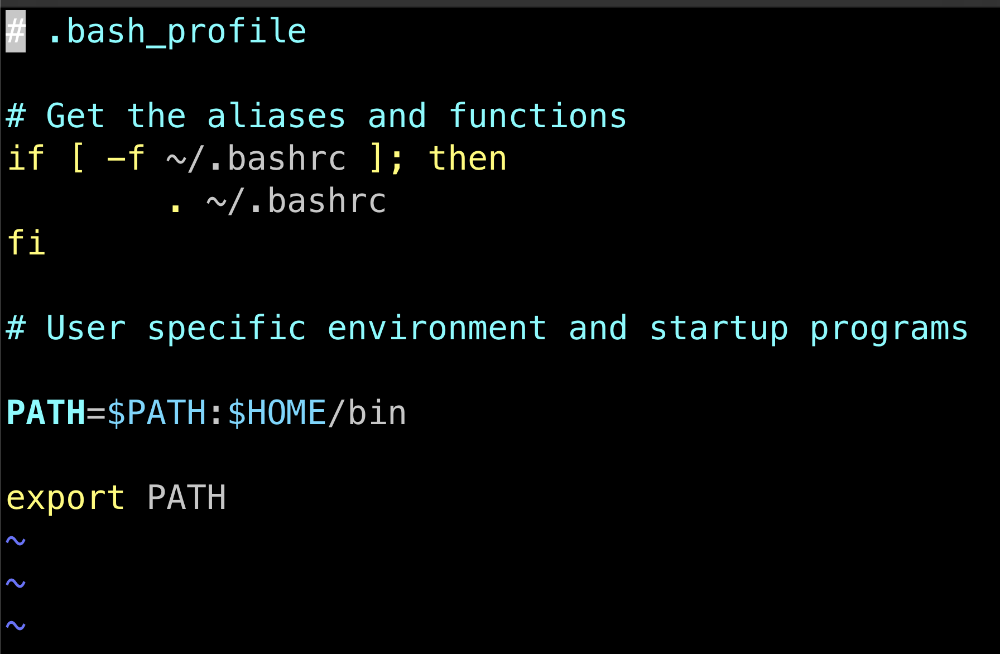
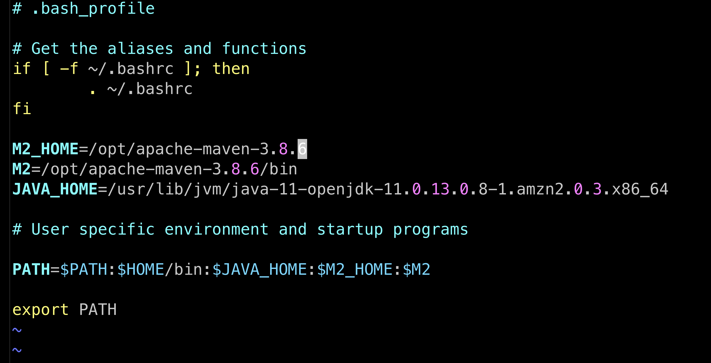
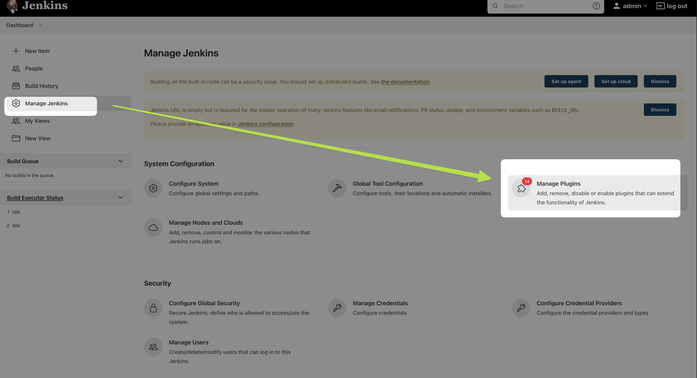
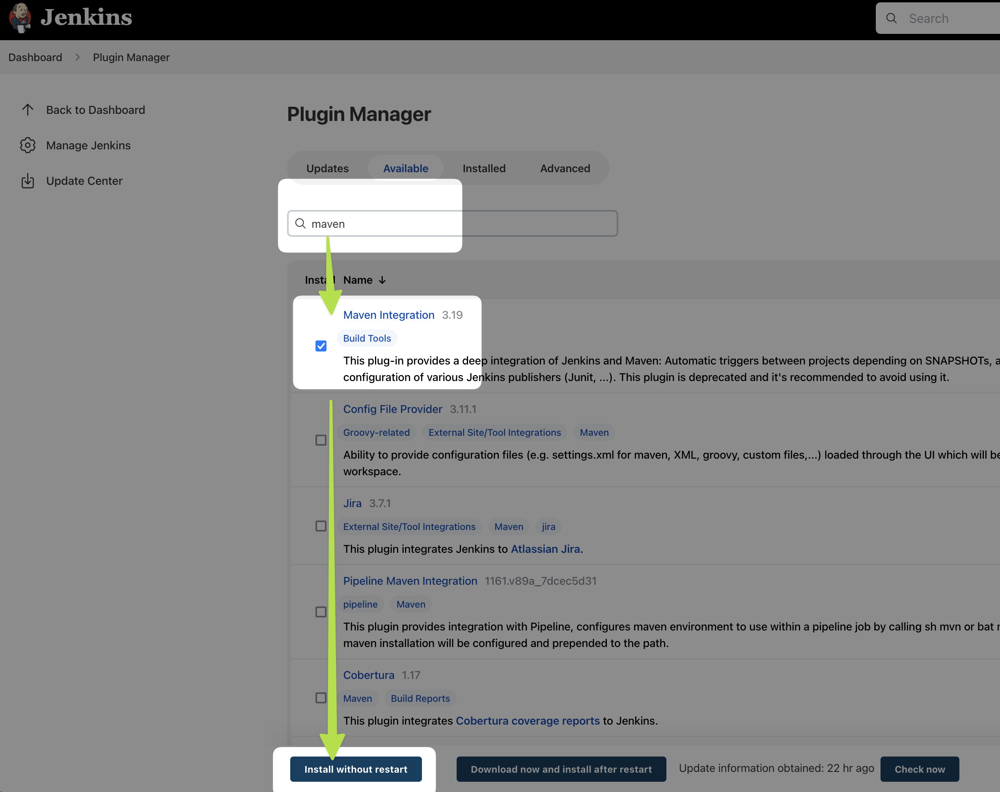
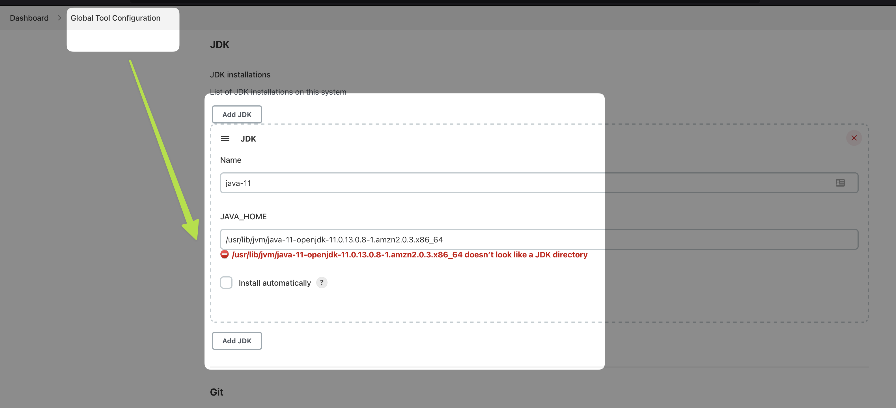
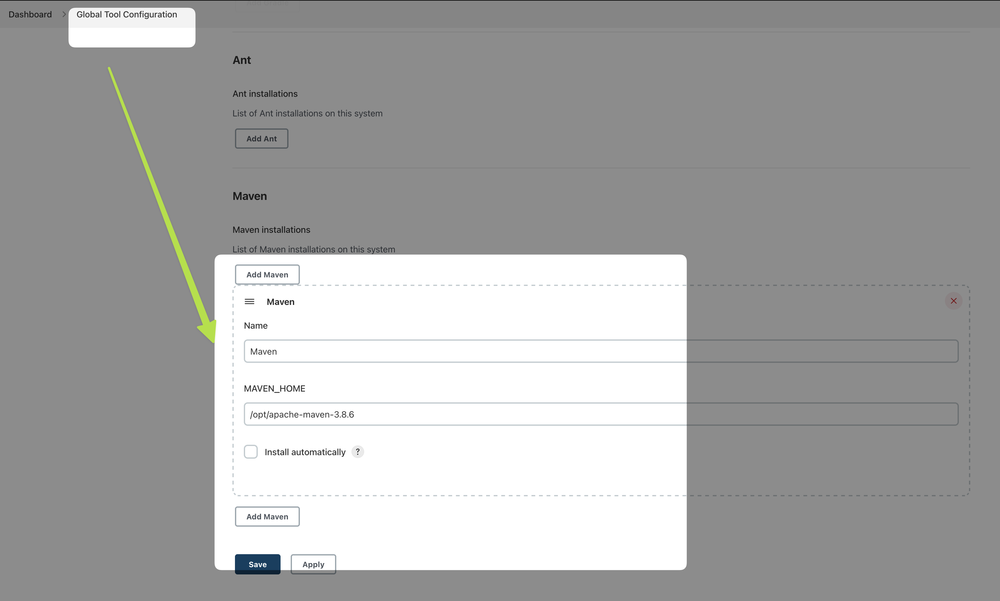
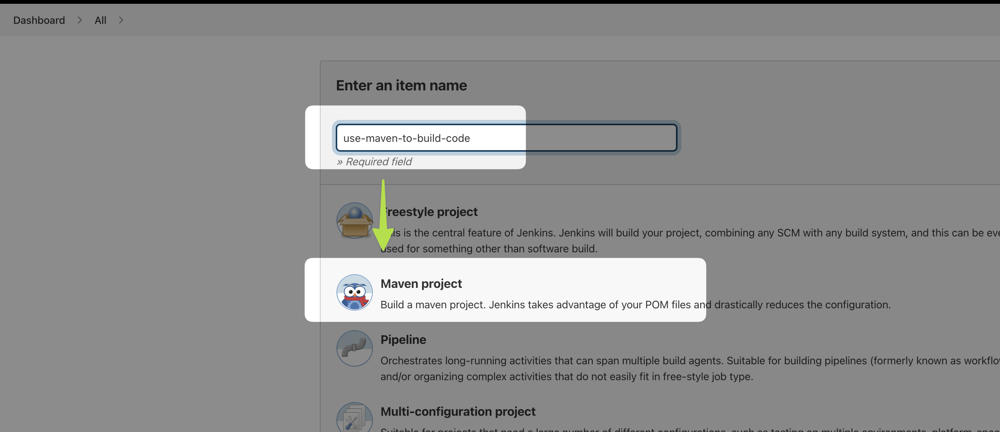

This is a continuation of 
1. infrastructure-ci-cd/jenkins-metrics and
2. infrastructure-ci-cd/git-with-jenkins-to-pull-code

# Setup Maven on Jenkins Server
- $ `sudo su -`
- $ `cd /opt`
- Download from https://maven.apache.org/download.html 
    - e.g. `wget https://dlcdn.apache.org/maven/maven-3/3.8.6/binaries/apache-maven-3.8.6-bin.tar.gz`
- Install using https://maven.apache.org/install.html
    - e.g. `tar xzvf apache-maven-3.8.6-bin.tar.gz`
    - e.g. `cd apache-maven-3.8.6/bin`
    - Check maven installed version `./mvn --version`
    

# Setup environment variables i.e. `JAVA_HOME`, `M2`, `M2_HOME`
- Find JAVA_HOME path `find / -name java-11*`
    - 
    - We need `/usr/lib/jvm/java-11-openjdk-11.0.13.0.8-1.amzn2.0.3.x86_64`
- Add JAVA_HOME, M2, and M2_HOME to PATH environment variable $ `cd ~`
- $ `ls -a`
- $ `vim .bash_profile`
Before

After

- Restart $ `source .bash_profile`
- Validate $ `echo $PATH`
- Test that path is working with $ `mvn --version`

# Install Maven Plugin via Jenkins GUI

# Configure Maven and Java via Jenkins GUI
- e.g. `/usr/lib/jvm/java-11-openjdk-11.0.13.0.8-1.amzn2.0.3.x86_64`
    - 
- e.g. `/opt/apache-maven-3.8.6`
    - 

# Build the Java Project using Maven

# Proof