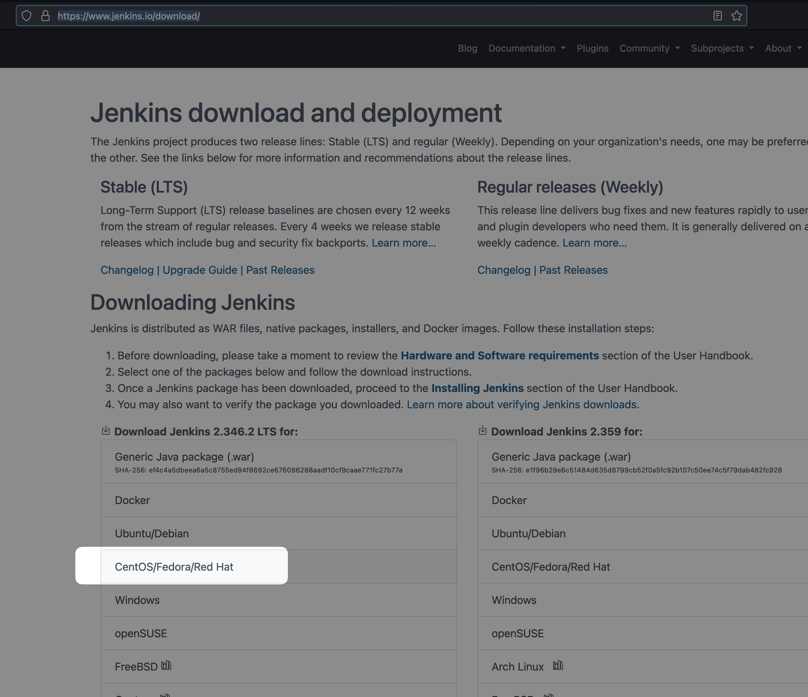
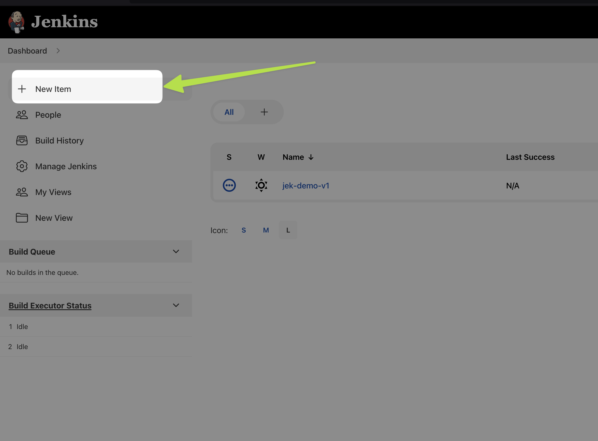
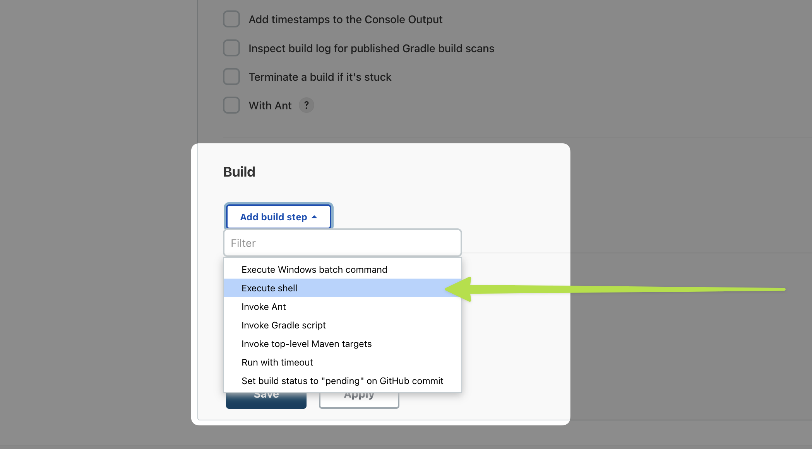
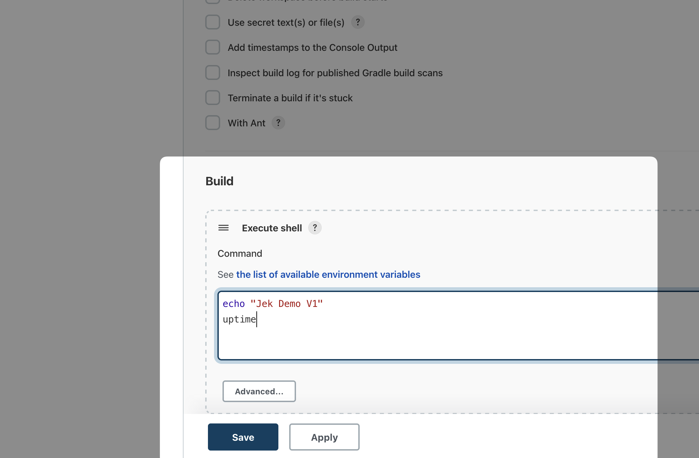

# Setup a Amazon Linux EC2 Instance
- Note that it is not Ubuntu EC2 instance. It is Amazon Linux EC2.
- Launch a new Amazon Linux EC2 Instance
- Choose something with at least 2 vCPU and 8 GB Memory
- Choose 20 GB storage instead of 8 GB storage.
- Add a second security group of TCP port 8080 
- Connect to the newly created Amazon Linux EC2 instance
- Use root user privilege `sudo su -`

# Install Epel & Java
- `amazon-linux-extras`
- `amazon-linux-extras install epel`
- `amazon-linux-extras install java-openjdk11`
- Check Java version `java -version`

# Install Jenkins
- Search in Google for Jenkins download https://www.jenkins.io/download/ 
- Follow the steps after clicking CentOS/Fedora/Red Hat
- Install Jenkins

# Start Jenkins
- See post-installation status `service jenkins status` 
- Start jenkins `service jenkins start`.

# Access Jenkins Web UI on port 8080
- `curl http://checkip.amazonaws.com`
- Open browser go to http://<ip address>:8080
- Get password `cat /var/lib/jenkins/secrets/initialAdminPassword`
- Copy the password and paste in the browser to login.
- 

# Install OTel Collector
- Install Splunk OTel Collector https://docs.splunk.com/Observability/gdi/opentelemetry/opentelemetry.html

# Add Jenkins Receiver in OTel Collector Config
- Add Jenkins receiver to agent_config.yaml file https://docs.splunk.com/Observability/gdi/jenkins/jenkins.html

# Run First Jenkins Job

# See the metrics in Splunk Observability chart or metric finder
WIP

# Prove
WIP

# Jek learned setup from:
- OReilly DevOps Project - 2022: CI/CD with Jenkins Ansible Kubernetes by Valaxy Technologies