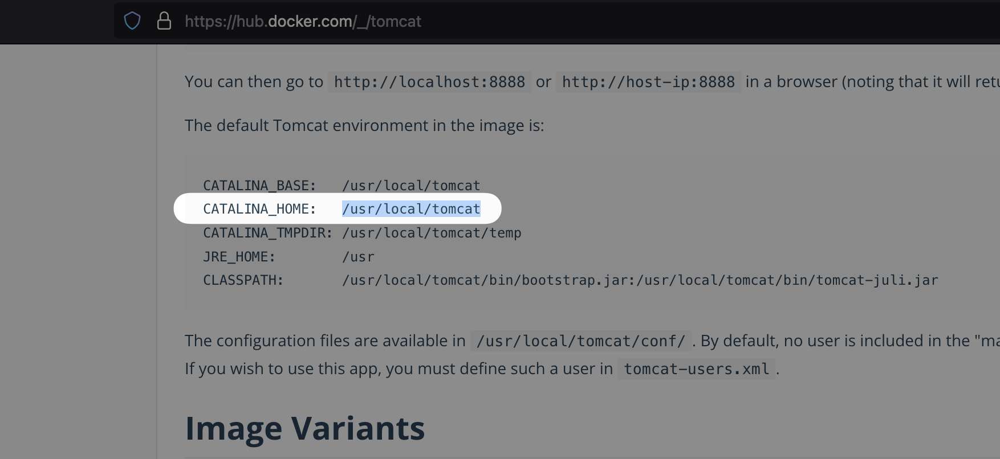
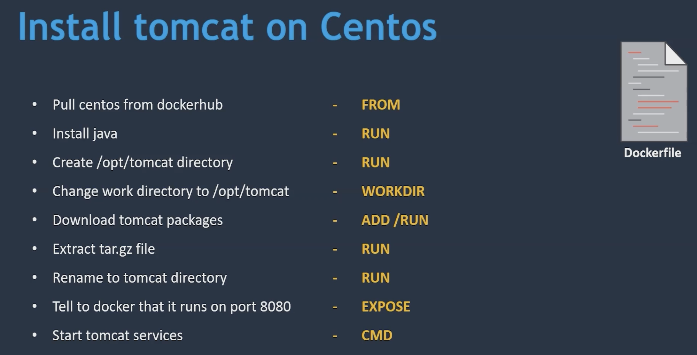

This is a step by step continuation of 
1. infrastructure-ci-cd/jenkins-metrics and
2. infrastructure-ci-cd/jenkins-with-git-to-pull-code-then-rollback-with-webhook
3. infrastructure-ci-cd/jenkins-build-java-code-using-maven
4. infrastructure-ci-cd/tomcat-metrics
5. infrastructure-ci-cd/jenkins-with-tomcat-server-for-deploying-artifacts-from-maven-build
6. infrastructure-ci-cd/docker-metrics


# Create a Tomcat container
- `sudo su -`
- `docker pull tomcat`
- `docker run -d --name tomcat-container -p 8081:8080 tomcat`
    - Give the container name called tomcat-container
    - Tomcat exposes port 8080
    - We map it to external call 8081.
        - This means we can access tomcat port 8080 from external port 8081
    - We use the tomcat image
- `curl http://checkip.amazonaws.com`
- Open browser go to http://<ip address>:8080

# Fix Tomcat container Not Found
- `docker exec -it tomcat-container /bin/bash`
- `cp -r webapps webapps-backup`
- `cp -r webapps.dist/* webapps`
- This video explains why we need to fix it https://learning.oreilly.com/videos/devops-project/9781803248196/9781803248196-video4_3/
- So we could bake the above fixing steps into a Dockerfile
- See the Dockerfile in this folder.
    - 
```dockerfile
FROM tomcat:latest
RUN cp -R /usr/local/tomcat/webapps.dist/* /usr/local/tomcat/webapps
```
- `docker build -t demo-tomcat-image .`
- `docker run -d --name demo-tomcat-container -p 8085:8080 demo-tomcat-image` 


# Optional (for learning Dockerfile): Create a Tomcat fully customised Dockerfile instead of using existing image from Dockerhub then modifying it.
- 
- 
- Learning from https://learning.oreilly.com/videos/devops-project/9781803248196/9781803248196-video4_4/


# Integrate Tomcat container with Jenkins: Install "Publish Over SSH plugin"
- 
- 
- 

# Integrate Tomcat container with Jenkins: Add Dockerhost to Jenkins "configure systems"
- 
- 
- 

# 

