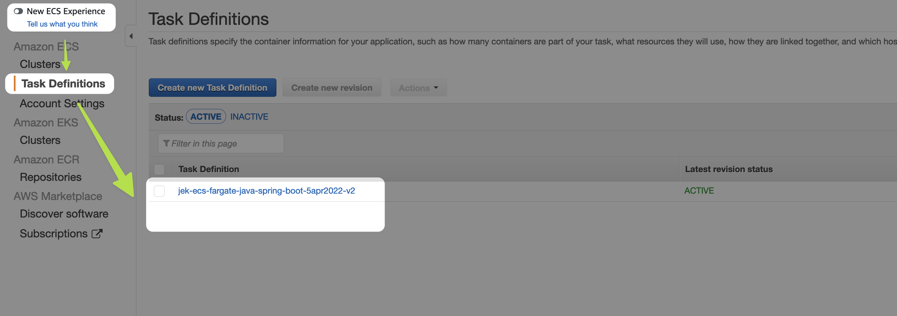
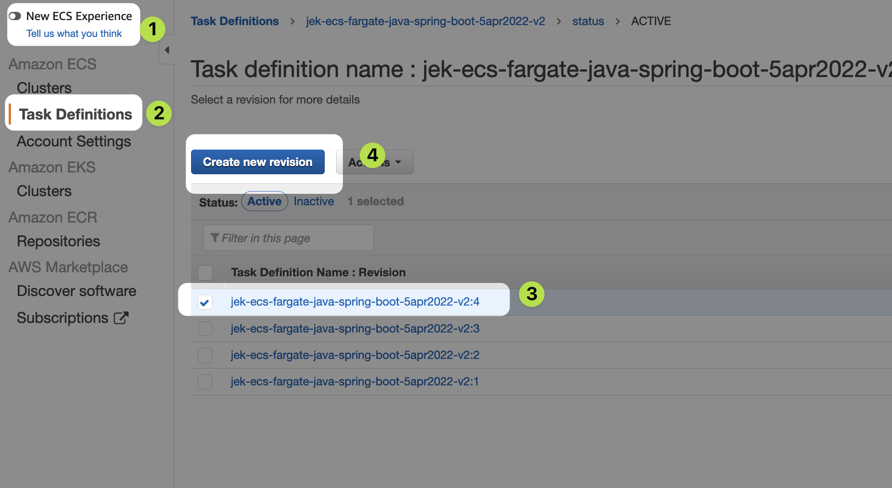
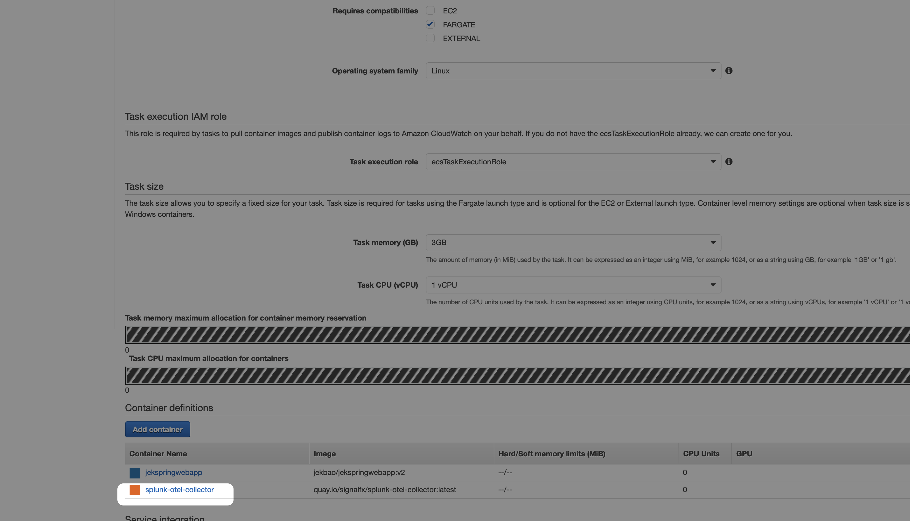
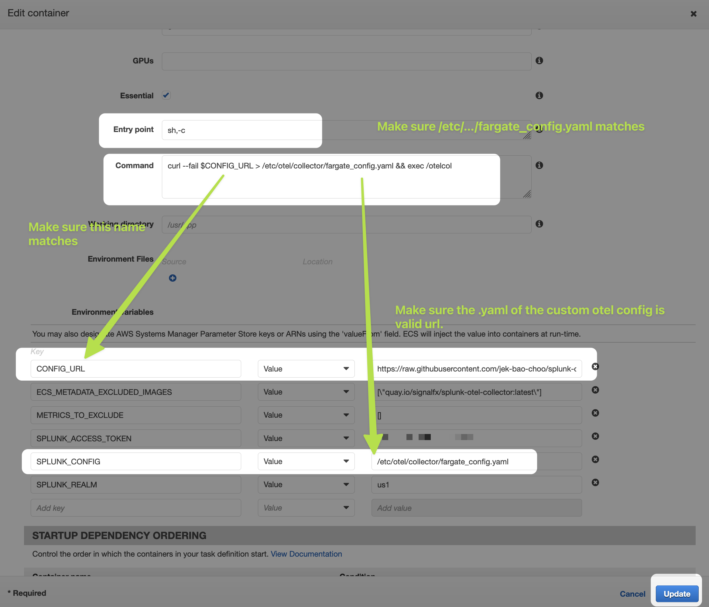
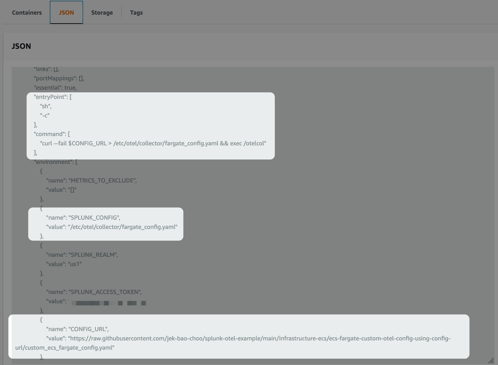
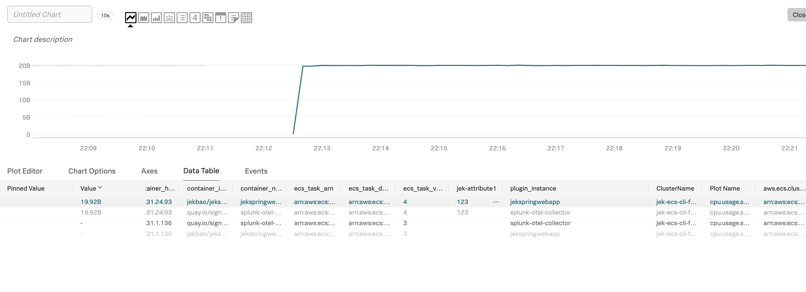

This is a continuation of ecs-fargate-default-otel-config setup.

The purpose of this guide is to use custom otel configuration instead of default otel configuration file.

# 1. Create the custom OTel config .yaml based on the default OTel config. yaml
You can find the default OTel config .yaml at https://github.com/signalfx/splunk-otel-collector/tree/main/cmd/otelcol/config/collector 

For this illustration, we have it in this folder called `custom_ecs_fargate_config.yaml` a snippet of our addition is below.

```yml
  attributes/jek-insert:
    actions:
      - key: "jek-attribute1"
        value: 123
        action: insert
      - key: "jek string key"
        value: "jek hello world"
        action: insert
```
---

```yml
    metrics:
      receivers: [signalfx, smartagent/signalfx-forwarder, smartagent/ecs-metadata, prometheus/internal]
      processors: [memory_limiter, batch, resourcedetection, attributes/jek-insert]
      exporters: [signalfx]
```

Copy the hosted URL of the raw [custom_ecs_fargate_config.yaml](https://raw.githubusercontent.com/jek-bao-choo/splunk-otel-example/main/infrastructure-ecs/ecs-fargate-custom-otel-config-using-config-url/custom_ecs_fargate_config.yaml), we will need it for the next step.

*Make sure that the hosted url ends with .yaml

# 2. Create new Task Definitions revision
Use the Former ECS experience instead of the New ECS Experience --> Select Task Definitions --> Click on the Task Definitions



Create new revision


Select splunk-otel-collector container


Add entry point, command, and config url


Verify that the Task Definitions .json has these lines.

There is a `reference-sample-task-definitions.json` in this folder.


# 4. Create new Task or Service using the new Task Definitions revision

# 5. Trigger traffic to the app and verify that the metric has a new dimension starting name jek...
If you have following the guide it would be `http://<public url>:8080/greeting`

# Misc.
- Proof: 
- Updated 7 April 2022