# 1. Check aws cli version
```bash
aws --version
```

# 2. Check ecs-cli version
```bash
ecs-cli --version
```

# 3. List all ecs clusters
```bash
aws ecs list-clusters
```

# 4. Create ECS cluster with launch-type FARGATE
```bash
ecs-cli up --launch-type FARGATE --cluster jek-ecs-cli-fargate-cluster-<today date>
```

# 5. Take note of the VPC and subnets that the ECS cluster created in.
Take note of the name of the VPC because when creating the ECS Task (not ECS Task Definitions), we need to select the correct VPC.

# 6. Create ECS task definitions for launch-type FARGATE
We can use the AWS Web GUI to create a task definition.


After which, we create Task, Service, or both.
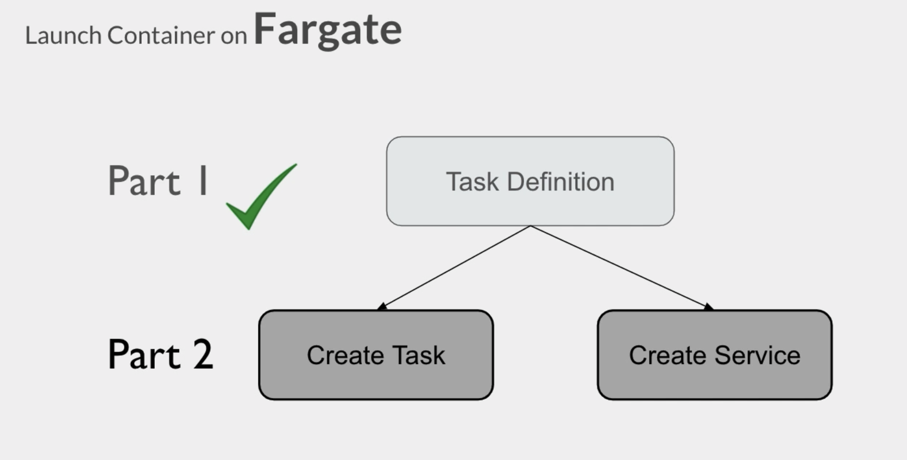
source courtesy: https://www.udemy.com/course/aws-ecs-fargate/

# 7. Create a Security Group opening the TCP port required
Search for the Security Group.
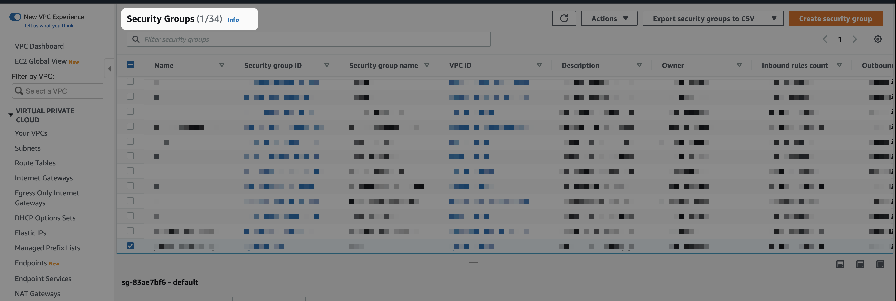
Add the necessary inbound rules e.g. HTTP, TCP, and the PORT with source Custom.
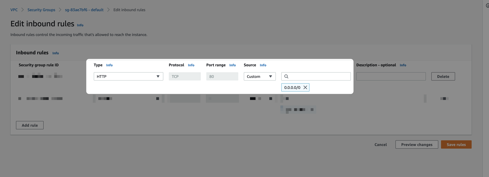

# 8a Either create ECS task OR create ECS service
This example creates a ECS task.
Select the ECS cluster to create the task.
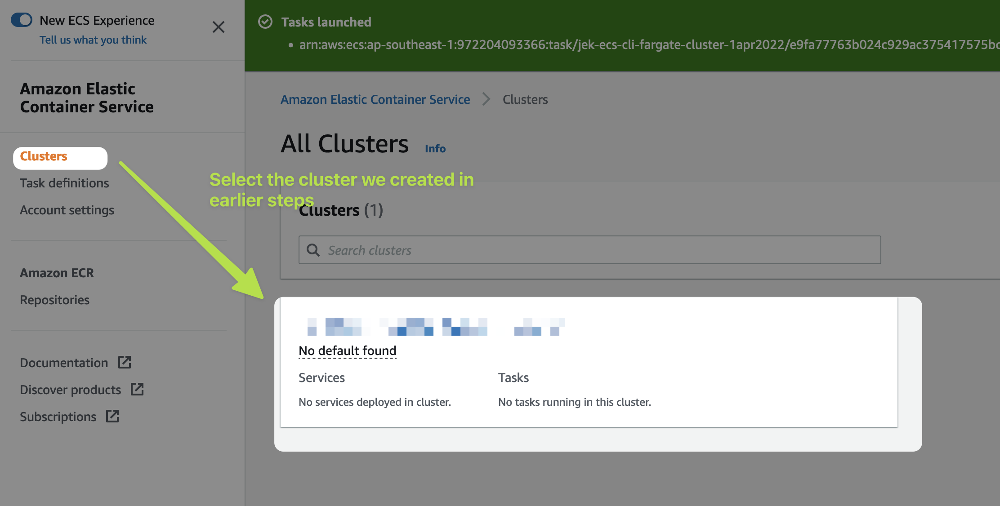

Click the create button


Select the task definitions created in above steps.
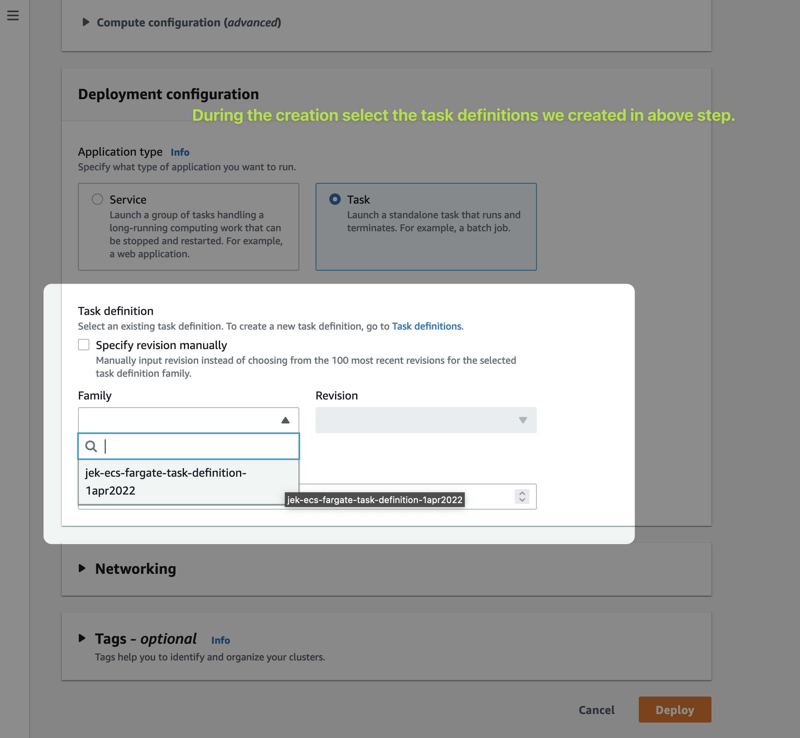

Make sure to select the right VPC, Subnets (as created above), and the Security Group should allow inbound traffic from the right port and IP address.
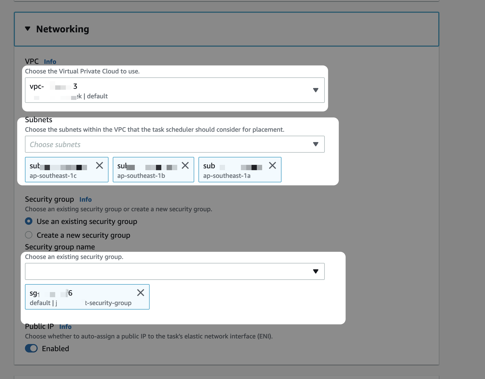

# 8b. Either create ECS task OR create ECS service
This example creates a ECS service
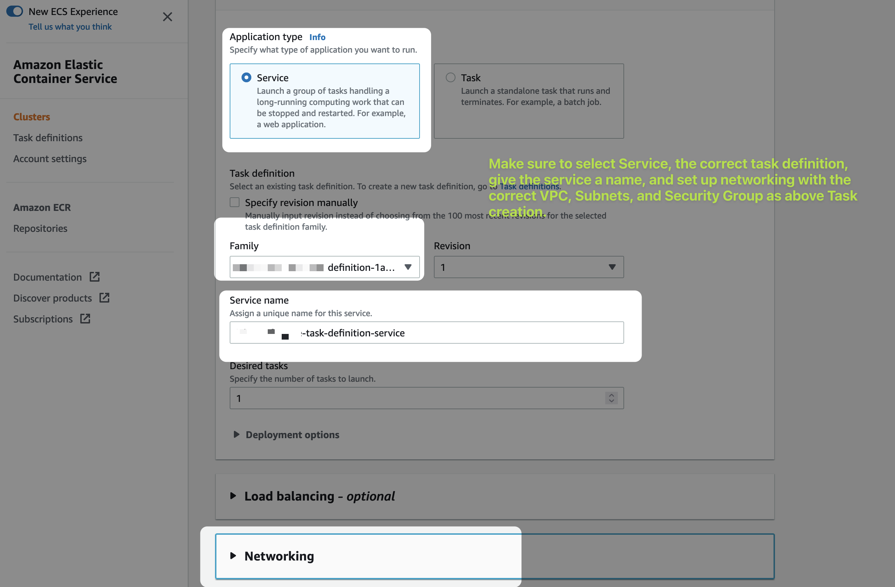

# 9. Send traffic to the endpoint.
Retrieve the public IP address from the ECS task
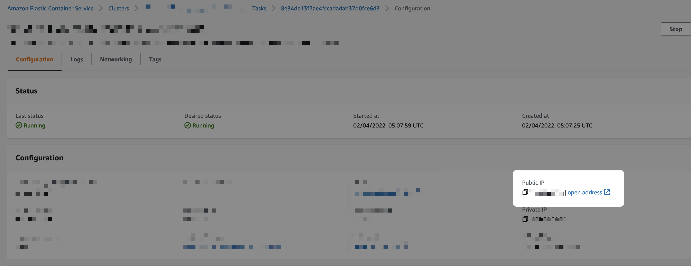

# 10. Add OTel Collector as sidecar to ECS Task Defintions.
Go to Splunk O11y portal and use Data Setup
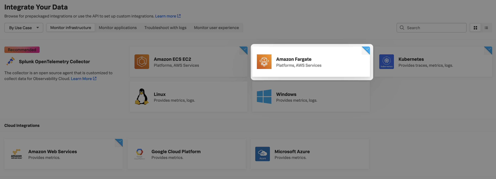

Revise ECS Task Definitions
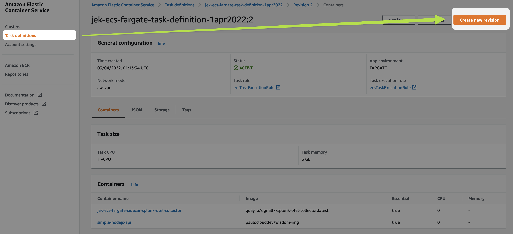

Create a second ECS Task from the revised Task Definitions
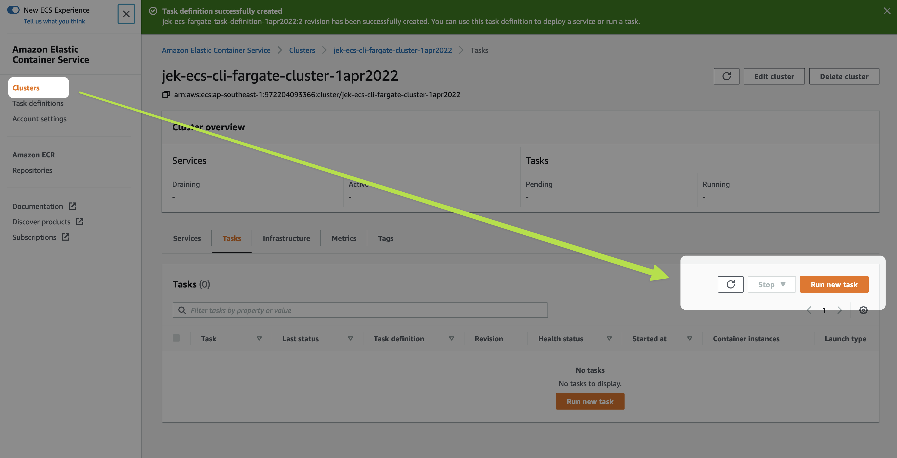

Select the latest revision
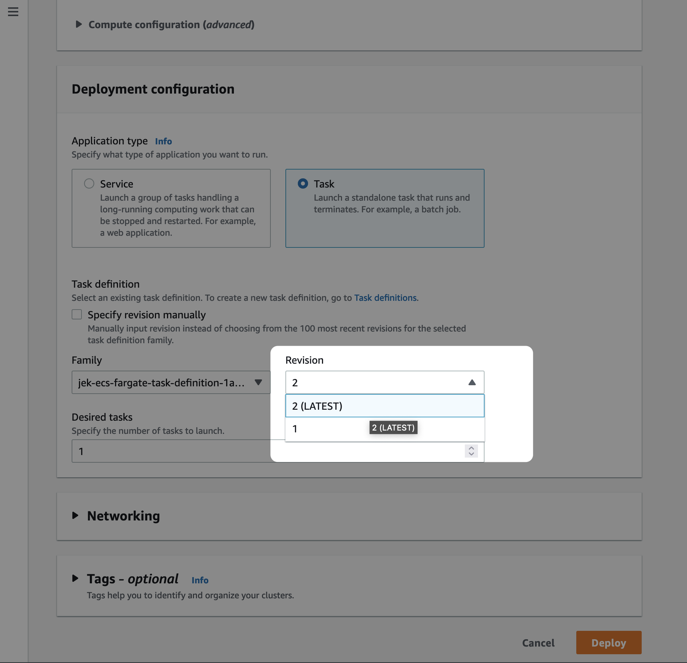

# 11. Verify that the metrics are in Splunk Observability O11y Dashboard

Go to Dashboard Group ECS


Select a Dashboard
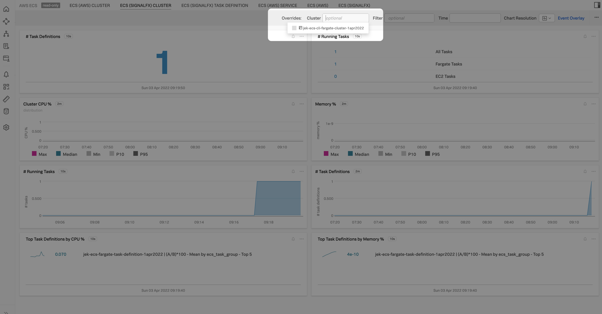

# 12. Container Logs from ECS is enabled via ECS setup
When creating Task Defintions, we can select the following options:
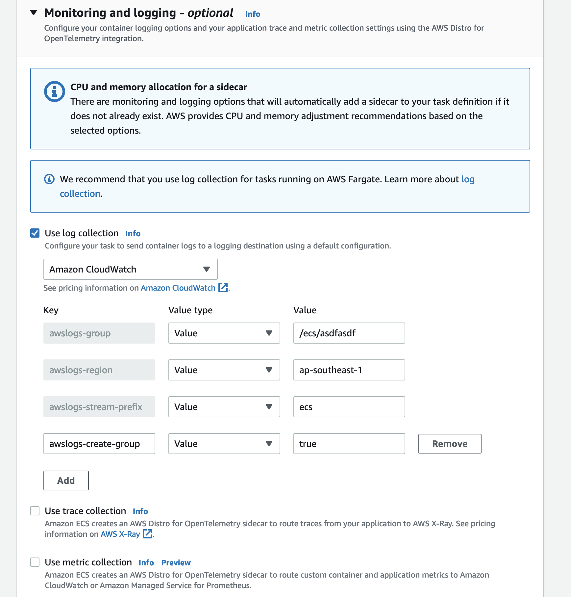

# 13. Clean up ECS Task, ECS Service, or both.

# 14. Remove the addition port to the Security Group.

# 15. Remove the Task Definitions

# 16. List all ecs clusters
```bash
aws ecs list-clusters
```

# 17. Delete the ECS cluster
```bash
ecs-cli down --cluster jek-ecs-cli-fargate-cluster-<today date>
```

# 18.  Check that the cluster is delete
```bash
aws ecs list-clusters
```
