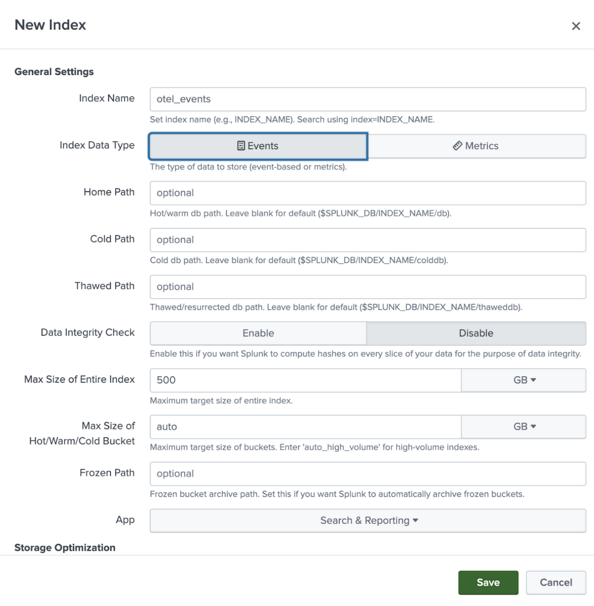

# Create a Splunk Cloud or Splunk Enterprise instance
- Create 1 events index called `otel_events`

- Create a HEC token and save it.

# Setup AKS
- Install Azure CLI on macOS  https://learn.microsoft.com/en-us/cli/azure/install-azure-cli-macos `brew update && brew install azure-cli`
- Login to your azure account `az login`
    - Set the cluster subscription `az account set --subscription XXXXX-XXXX-XXXX-XXXX`
- List all Azure Resource Groups https://learn.microsoft.com/en-us/cli/azure/group?view=azure-cli-latest `az group list`
    - Or create Azure Resource Group `export AZURE_RESOURCE_GROUP="JekAKSResource"`
    - Followed by `az group create --location southeastasia --name "${AZURE_RESOURCE_GROUP}" --tags Criticality=Low Env=Test Owner=email@email.com`

# Create and connect to AKS Cluster
- `export AKS_CLUSTER_NAME="JekAKSCluster"`
- Create AKS cluster https://learn.microsoft.com/en-us/cli/azure/aks?view=azure-cli-latest#az-aks-create `az aks create --resource-group "${AZURE_RESOURCE_GROUP}" --name "${AKS_CLUSTER_NAME}" --node-count 2`
- `az aks list`
- `az aks get-credentials --resource-group "${AZURE_RESOURCE_GROUP}" --name "${AKS_CLUSTER_NAME}"` 

# Install OTel Collector Daemonset
- `helm repo add splunk-otel-collector-chart https://signalfx.github.io/splunk-otel-collector-chart`
- Create a v1-values.yaml
```yml
clusterName: "< your cluster name >"
logsEngine: otel
cloudProvider: "azure"
distribution: "aks"
splunkPlatform:
  endpoint: "https://< your instance id >.splunk.show:8088/services/collector"
  token: "< your hec token >"
  index: "otel_events"
  insecureSkipVerify: true
logsCollection:
  containers: 
    containerRuntime: "containerd"
    excludeAgentLogs: false
```
- `helm install jektestv1 -f v1-values.yaml splunk-otel-collector-chart/splunk-otel-collector`
- `kubectl logs ds/jektestv1-splunk-otel-collector-agent -f`
- Search for the log events using `index=otel_events` in Splunk Enterprise or Splunk Cloud

# Create nginx-http app and load-http app
- View the metrics server that is been setup in kube-system `kubectl get pod -A | grep -i metrics`
- `kubectl apply -f loadtest-v1.yaml`
- `kubectl describe pod nginx-http`
- `kubectl logs deploy/nginx-http`
    - Optionally, scale up load test `kubectl scale deploy/load-http --replicas 10`
- `kubectl describe load-http`
- `kubectl logs deploy/load-http`
- Scale down load test `kubectl scale deploy/load-http --replicas 0`
- Search for nginx-http logs using `index=otel_events sourcetype="kube:container:nginx-http" | reverse` in Splunk.


# Collect Logs from Kubernetes Host Machines/Volumes using EmptyDir
Sometimes there will be a need to collect logs that are not emitted from pods via stdout/stderr, directly from the Kubernetes nodes. Common examples of this are collecting Kubernetes Audit logs off of customer managed Kubernetes nodes running the K8s API server, collecting common “/var/log” linux files for security teams, or grabbing logs that come from pods that dont write to stdouot/stderr and have mounted a hostPath, or emptyDir volume. 

The OTel Collector Helm chart provides an easy way to configure custom file paths using the extraFilelogs option.
- Add Volume to loadtest-v1.yaml, making it loadtest-v2.yaml
- `kubectl apply -f loadtest-v2.yaml`
- `kubectl logs deploy/nginx-http`


* * * IMPORTANT pt 1 of 2 --> Volume's EmptyDir mounts a special location on the node reserved for ephemeral storage. You can find this location on the node by navigating to `/var/lib/kubelet/pods` on the node as root. In this folder you will see each Pod’s uid. 


Remember that uid and find it in the node folder of `/var/lib/kubelet/pods`

< insert proof here >

In order to monitor this directory with the OTel collector, we will need to use the extraVolumes and extraVolumeMounts settings in the Helm chart to wire up this path into our agent daemonset. 

- Add `extraVolumes` and `extraVolumeMounts` to v1-values.yaml, making it v2-values.yaml
```yml
agent:
  # Extra volumes to be mounted to the agent daemonset.
  # The volumes will be available for both OTel agent and fluentd containers.
  extraVolumes:
  - name: emptydir
    hostPath:
      path: /var/lib/kubelet/pods/
  extraVolumeMounts: 
  - name: emptydir
    mountPath: /tmp/emptydir
    readOnly: true
```

* * * IMPORTANT pt 2 of 2 --> This will mount the known emptyDir path from the node to our OTel agent so we can find it under /tmp/emptydir inside our pod filesystem, allowing us to create new filelog receiver inputs using the extraFileLogs section in our helm chart.

- Add `extraFileLogs` to v2-values.yaml
```yml
logsCollection:
  extraFileLogs:
    filelog/jek-log-helloworld:
      include: 
      - /tmp/emptydir/*/volumes/kubernetes.io~empty-dir/jek-log-helloworld/log1.log
      start_at: beginning
      storage: file_storage
      include_file_path: true
      include_file_name: false
      resource:
        com.splunk.index: otel_events
        com.splunk.source: /var/log/emptydir/jek-log-helloworld
        host.name: 'EXPR(env("K8S_NODE_NAME"))'
        com.splunk.sourcetype: kube:jek-log-helloworld
```
- `helm uninstall jektestv1`
- `helm install jektestv2 -f v2-values.yaml splunk-otel-collector-chart/splunk-otel-collector`
- scale up load test `kubectl scale deploy/load-http --replicas 1`


