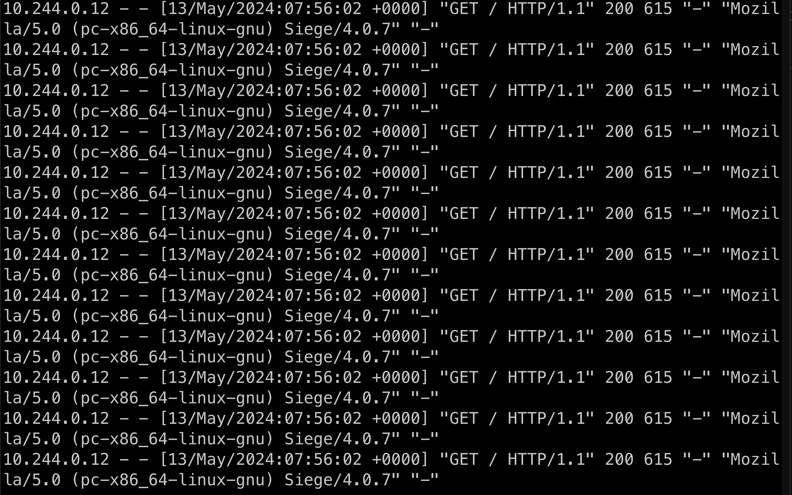
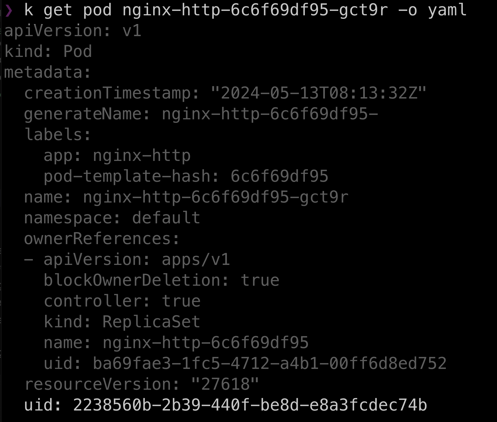
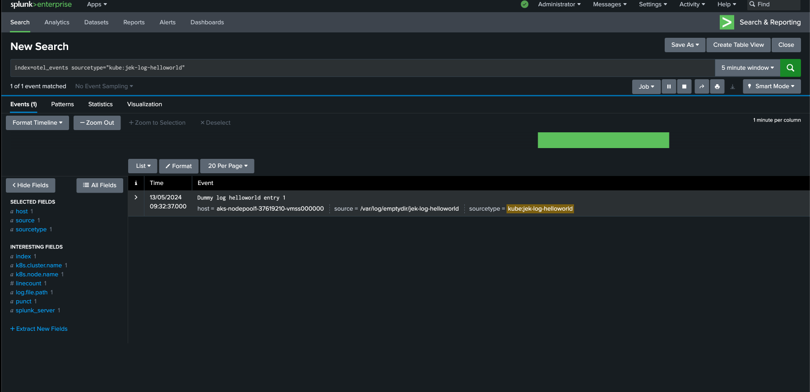

# Create a Splunk Cloud or Splunk Enterprise instance
- Create 1 events index called `otel_events`

- Create a HEC token and save it.

# Setup AKS
- Install Azure CLI on macOS  https://learn.microsoft.com/en-us/cli/azure/install-azure-cli-macos `brew update && brew install azure-cli`
- Login to your azure account `az login`
    - Set the cluster subscription `az account set --subscription XXXXX-XXXX-XXXX-XXXX`
- List all Azure Resource Groups https://learn.microsoft.com/en-us/cli/azure/group?view=azure-cli-latest `az group list`
    - Or create Azure Resource Group `export AZURE_RESOURCE_GROUP="JekAKSResource"`
    - Followed by `az group create --location southeastasia --name "${AZURE_RESOURCE_GROUP}" --tags Criticality=Low Env=Test Owner=email@email.com`

# Create and connect to AKS Cluster
- Check that `ls -a ~/.ssh/` has file named `id_rsa.pub` and `id_rsa`.

    - if not create it using `ssh-keygen -t rsa -b 2048`
- `export AKS_CLUSTER_NAME="JekAKSCluster"`
- Create AKS cluster https://learn.microsoft.com/en-us/cli/azure/aks?view=azure-cli-latest#az-aks-create `az aks create --resource-group "${AZURE_RESOURCE_GROUP}" --name "${AKS_CLUSTER_NAME}" --node-count 3 --ssh-key-value ~/.ssh/id_rsa.pub --enable-node-public-ip`
    - Note: Assigning public IPs to AKS nodes can expose them to the internet, which might pose security risks. It's recommended to use a jump box or VPN for secure access in a production environment.
- `az aks list`
- `az aks get-credentials --resource-group "${AZURE_RESOURCE_GROUP}" --name "${AKS_CLUSTER_NAME}"` 
- Verify that the cluster is running `kubectl get nodes -o wide`
    - Ensure your NSG allows SSH (port 22) traffic. If you need to adjust NSG rules:

        - Go to the Azure portal.
        - Search for "NSG" or "Network Security Group".
        - Select the network security group associated with your AKS nodes.
        - Add an inbound security rule to allow SSH traffic.
        - Alternatively use CLI. Example of Creating an Inbound Security Rule via CLI: `az network nsg rule create --resource-group <MC_myResourceGroup_myAKSCluster_myLocation> --nsg-name <your-the-aks-agentpool-nsg> --name AllowSSH --protocol tcp --priority 1000 --destination-port-ranges 22 --access allow`
        
- SSH into the nodes `ssh -i ~/.ssh/id_rsa azureuser@< the external public id of the node >`


# Install OTel Collector Daemonset
- `helm repo add splunk-otel-collector-chart https://signalfx.github.io/splunk-otel-collector-chart`
- Create a v1-values.yaml
```yml
clusterName: "< your cluster name >"
logsEngine: otel
cloudProvider: "azure"
distribution: "aks"
splunkPlatform:
  endpoint: "https://< your instance id >.splunk.show:8088/services/collector"
  token: "< your hec token >"
  index: "otel_events"
  insecureSkipVerify: true
logsCollection:
  containers: 
    containerRuntime: "containerd"
    excludeAgentLogs: false
```
- `helm install jektestv1 -f v1-values.yaml splunk-otel-collector-chart/splunk-otel-collector`
- `kubectl logs ds/jektestv1-splunk-otel-collector-agent -f`
- Search for the log events using `index=otel_events` in Splunk Enterprise or Splunk Cloud

# Create nginx-http app and load-http app
- View the metrics server that is been setup in kube-system `kubectl get pod -A | grep -i metrics`
- `kubectl apply -f loadtest-v1.yaml`
- `kubectl describe pod nginx-http`
- `kubectl logs deploy/nginx-http -f`
    - Optionally, scale up load test `kubectl scale deploy/load-http --replicas 10`
- `kubectl describe load-http`
- `kubectl logs deploy/load-http`
- Scale down load test `kubectl scale deploy/load-http --replicas 0`
- Search for nginx-http logs using `index=otel_events sourcetype="kube:container:nginx-http" | reverse` in Splunk.



# Collect Logs from Kubernetes Host Machines/Volumes using EmptyDir with `ExtraVolumes`, `ExtraVolumeMounts`, and `ExtraFileLogs`.
- Sometimes there will be a need to collect logs that are not emitted from pods via stdout/stderr, directly from the Kubernetes nodes. Common examples of this are collecting Kubernetes Audit logs off of customer managed Kubernetes nodes running the K8s API server, collecting common “/var/log” linux files for security teams, or grabbing logs that come from pods that dont write to stdouot/stderr and have mounted a hostPath, or emptyDir volume. 

    - The OTel Collector Helm chart provides an easy way to configure custom file paths using the extraFilelogs option.
- Add Volume to loadtest-v1.yaml, making it loadtest-v2.yaml
- `kubectl apply -f loadtest-v2.yaml`
- `kubectl logs deploy/nginx-http -f`
- `kubectl get pods -o wide`

- IMPORTANT pt 1 of 2 --> Volume's EmptyDir mounts a special location on the node reserved for ephemeral storage. You can find this location on the node by navigating to `/var/lib/kubelet/pods` on the node as root. In this folder you will see each Pod’s uid. 


- `kubectl get pod nginx-http-< the complete name > -o yaml`
- Remember that uid and ssh into the specific node and find it in the node folder of `/var/lib/kubelet/pods`


- The folder path on the specific AKS node follows this order `/var/lib/kubelet/pods` > my pod's UID > `volumes` > `kubernetes.io-empty-dir` > my volume name e.g. `jek-log-helloworld` > my log files such as `log1.log`.

- In order to monitor this directory with the OTel collector, we will need to use the extraVolumes and extraVolumeMounts settings in the Helm chart to wire up this path into our agent daemonset. 

- Add `extraVolumes` and `extraVolumeMounts` to v1-values.yaml, making it v2-values.yaml
```yml
agent:
  # Extra volumes to be mounted to the agent daemonset.
  # The volumes will be available for both OTel agent and fluentd containers.
  extraVolumes:
  - name: emptydir
    hostPath:
      path: /var/lib/kubelet/pods/
  extraVolumeMounts: 
  - name: emptydir
    mountPath: /tmp/emptydir
    readOnly: true
```

- IMPORTANT pt 2 of 2 --> This will mount the known emptyDir path from the node to our OTel agent so we can find it under /tmp/emptydir inside our pod filesystem, allowing us to create new filelog receiver inputs using the extraFileLogs section in our helm chart.

- Add `extraFileLogs` to v2-values.yaml
```yml
logsCollection:
  extraFileLogs:
    filelog/jek-log-helloworld:
      include: 
      - /tmp/emptydir/*/volumes/kubernetes.io~empty-dir/jek-log-helloworld/log1.log
      start_at: beginning
      storage: file_storage
      include_file_path: true
      include_file_name: false
      resource:
        com.splunk.index: otel_events
        com.splunk.source: /var/log/emptydir/jek-log-helloworld
        host.name: 'EXPR(env("K8S_NODE_NAME"))'
        com.splunk.sourcetype: kube:jek-log-helloworld
```
- `helm uninstall jektestv1`
- `helm install jektestv2 -f v2-values.yaml splunk-otel-collector-chart/splunk-otel-collector`
- scale up load test `kubectl scale deploy/load-http --replicas 1`



# Further enhancement
- This provides us with a way for Kubernetes Platform admins to monitor ephemeral volumes (emptyDir) without the need for mounting the hostPath to the developer containers. It also allows the developers to avoid the need to mount persistent volumes which can add complexity or cost money for their deploy. 
- While we have our logs coming in now, there is one thing to notice. We are missing some key metadata in these logs. We have the k8s.cluster.name and the k8s.node.name but you’ll notice, there is no k8s.namespace.name or  k8s.pod.name. There is no pod metadata at all, in fact. This is because when we pick up the log from the ephemeral path, we lose some of the info we would normally have gotten from the stdout/stderr path location. One thing we do have though, is the k8s.pod.uid. So let’s try and use this in conjunction with the k8sattributes processor we have in OTel!
- First we will update our custom filelog receiver to use operators to extract metadata from the log.file.path

< insert screenshot >

- Here we have used the regex_parser to extract the fields called uid and volume_name. We then use the move operator to set them as resources called k8s.pod.uid and k8s.volume.name. 

< insert screenshot >

- Now let’s attempt to further customize our pipeline to use the k8s.pod.uid to enrich the event further with the k8sattributes processor. To accomplish this we will need to override the default logs/host pipeline to route our emptyDir sourced logs through the existing k8sattributes processor. 
- And once we update our helm chart, you should now see extra metadata in the events. The only thing you won't see is container level info as we do not get the container name or id in the record to allow k8sattributes to enrich the container info, but this should provide enough key metadata for users to identify where the log came from.

# Getting logs from Persistent Volume (PV) and Persistent Volume Claims (PVC)
- ...


# Clean Up
- `kubectl delete deployment.apps/nginx-http`
- `kubectl delete service/nginx-http-service`
- `kubectl delete deployment.apps/load-http`
- Delete the AKS cluster `az aks delete --resource-group "${AZURE_RESOURCE_GROUP}" --name "${AKS_CLUSTER_NAME}"`
- Delete the created Azure Resource Group https://learn.microsoft.com/en-us/cli/azure/group?view=azure-cli-latest#az-group-delete `az group delete --name "${AZURE_RESOURCE_GROUP}"`


