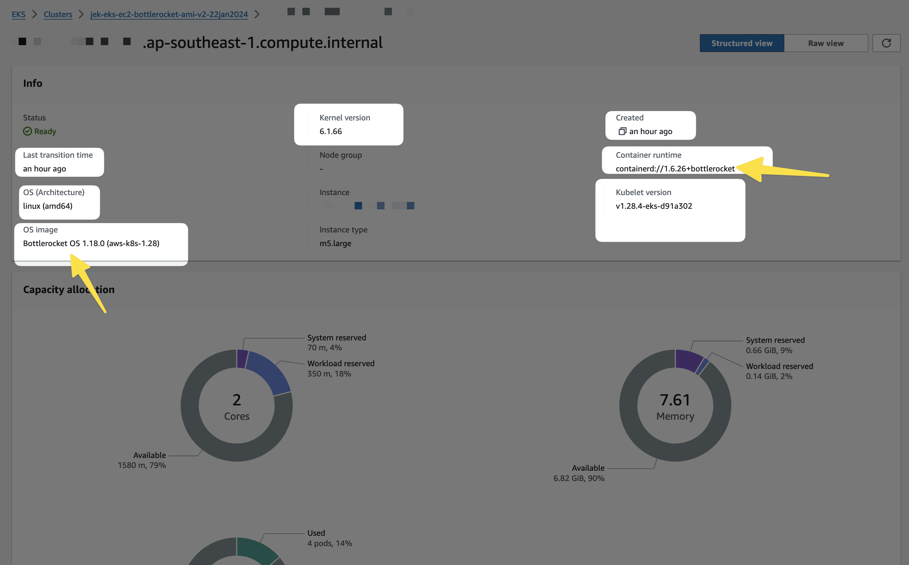
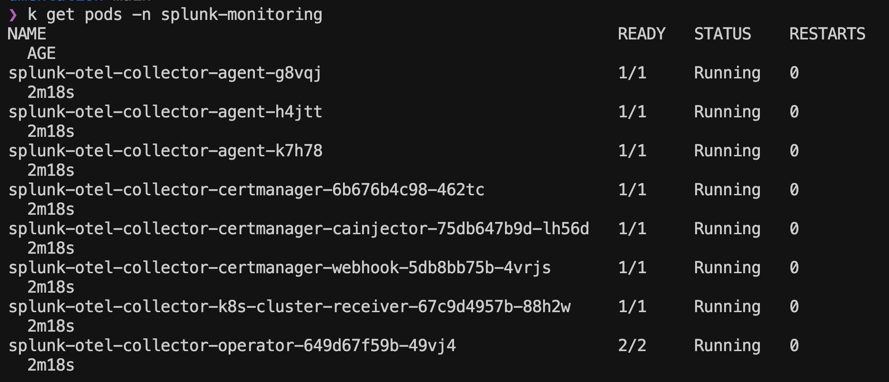
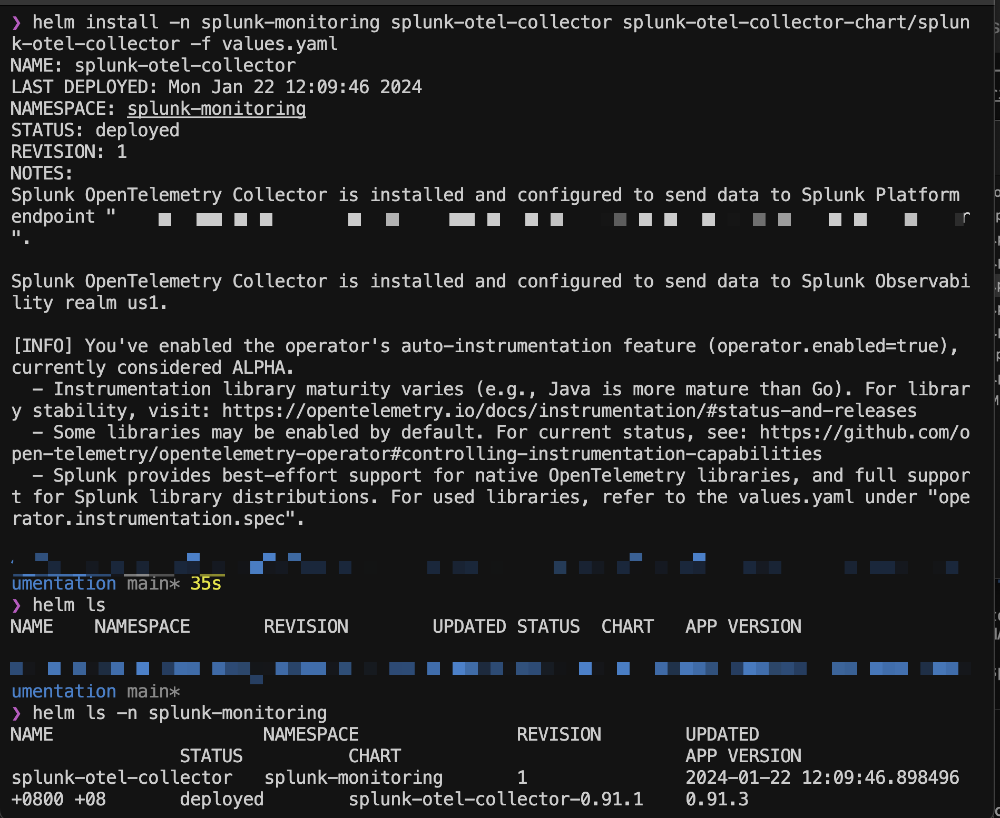
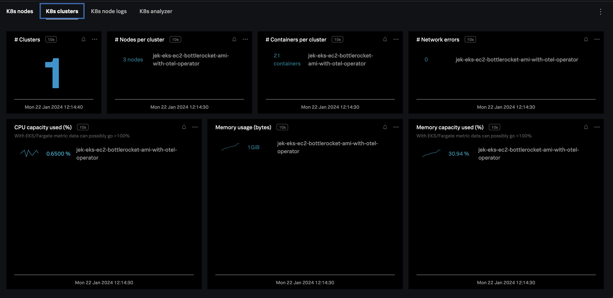
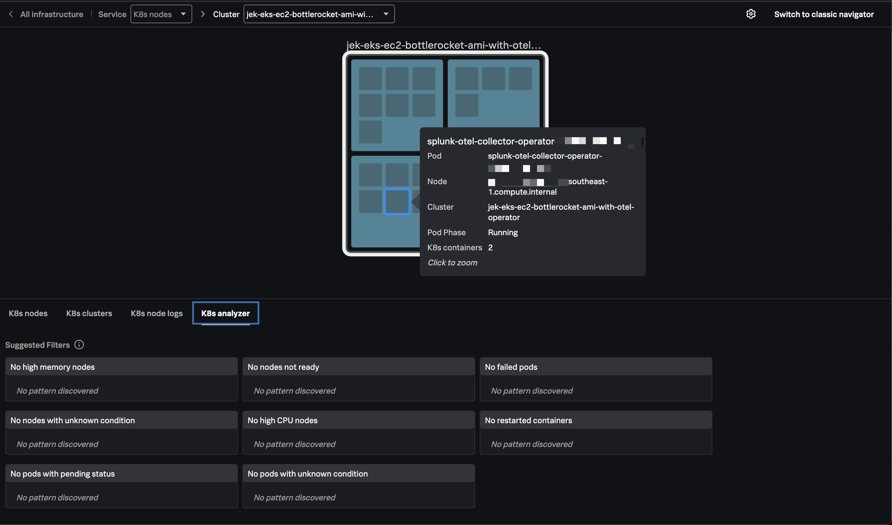
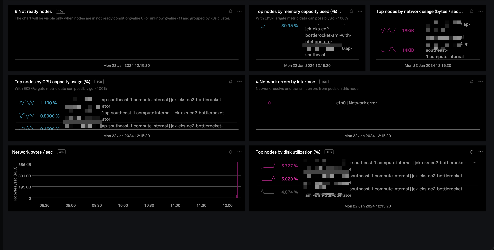

The purpose of this is to validate that Splunk OTel Collector works with EKS EC2 Bottlerocket AMI.

# Ref
- https://docs.aws.amazon.com/eks/latest/userguide/launch-node-bottlerocket.html
- https://github.com/bottlerocket-os/bottlerocket/blob/develop/QUICKSTART-EKS.md
- https://repost.aws/knowledge-center/eks-bottlerocket-node-group


# Steps
``` bash
# This procedure requires eksctl version 0.167.0 or later. You can check your version with the following command:
eksctl version

# update the file bottlerocket.yaml with the relevant info

eksctl create cluster -f ./bottlerocket.yaml --dry-run

eksctl create cluster -f ./bottlerocket.yaml

```

# Proof


---
# Deploy a few apps without instrumentation agents

## Java
- `kubectl apply -f java-deployment.yaml`
- `kubectl get deployment spring-maven-k8s-eks-ec2-v2 -o yaml`
- `kubectl port-forward deployment/spring-maven-k8s-eks-ec2-v2 3009:8080`
- `curl http://localhost:3009/greeting` Invoke success
- `curl http://localhost:3009` Invoke failure


## Node.js
... WIP ...

---

# Deploy OTel Collector Operator

- Ensure that you have installed and configured the Helm 3.6 client.
- `helm repo add splunk-otel-collector-chart https://signalfx.github.io/splunk-otel-collector-chart`
- `helm repo update`
- `kubectl get pods -l app=cert-manager --all-namespaces` Check if a cert-manager is already installed by looking for cert-manager pods.
- Create values.yaml and if cert-manager is deployed, make sure to remove certmanager.enabled=true to the list of values to set.
- `kubectl create ns splunk-monitoring`
- `helm install -n splunk-monitoring splunk-otel-collector splunk-otel-collector-chart/splunk-otel-collector -f values.yaml`
- `helm ls -n splunk-monitoring`
- `kubectl get pods -n splunk-monitoring`
- `kubectl get mutatingwebhookconfiguration.admissionregistration.k8s.io`
- `kubectl get otelinst -n splunk-monitoring -o yaml`
    - `kubectl get otelinst {instrumentation_name} -n splunk-monitoring -o yaml`

# Proof






