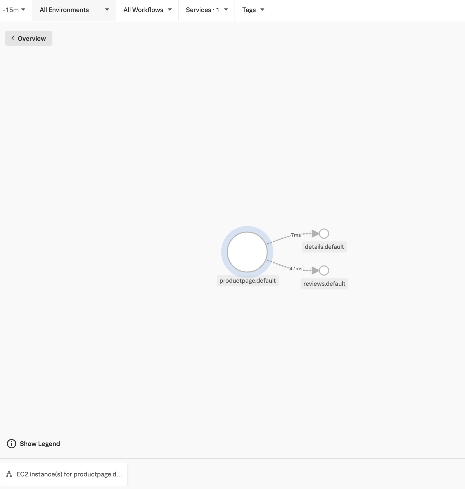

#My setup


#N Steps
1. Create EKS EC2 cluster using eksctl
Because eksctl tool will create K8s Control Plane (master nodes, etcd, API server, etc), worker nodes, VPC, Security Groups, Subnets, Routes, Internet Gateway, etc.
```bash
eksctl create cluster \
--name=jek-eks-ec2-cluster-<add a date> \
--nodegroup-name=jek-eks-ec2-workers \
--version=1.21 \
--node-type=t3.xlarge \
--nodes 2 \
--region=ap-southeast-1 \
--tags=environment=jek-sandbox \
--tags=jek-environment=sandbox \
--managed \
--dry-run
```


2. Check that the cluster is created
```bash
eksctl get cluster

aws eks describe-cluster --name jek-eks-ec2-cluster-<add a date> --region ap-southeast-1
```


3. Display the list of Istio profile and look at demo profile
This link explains the differences https://istio.io/latest/docs/setup/additional-setup/config-profiles/ 
```bash
istioctl profile list

# Check that in spec.meshConfig.accessLogFile=/dev/stdout
# This is to ensure that we have the log files
istioctl profile dump demo
```


4. Install with Istioctl
There are a few options to install i.e. Istioctl, Helm (alpha at the time of writing), Operator, and etc.
https://istio.io/latest/docs/setup/install/helm/ 
```bash
# Set traceSampling to 100 percent before installation otherwise just install and set later
# --set values.pilot.traceSampling=100
istioctl install --set profile=demo

# After installation, see what is installed.
kubectl get all -n istio-system

# Optionally install other Istio integration e.g. Jaegar and Prometheus. These integration will be intalled in istio-system namespace
# https://istio.io/latest/docs/ops/integrations/
# istioctl dashboard prometheus
# istioctl dashboard jaeger
# istioctl dashboard kiali
```


5. Analyze and detect potential issues with your Istio configuration
```bash
istioctl analyze --all-namespaces
```


6. Enable Istio Sidecar Injection 
Add a namespace label to instruct Istio to automatically inject Envoy sidecar proxies when you deploy your application later
```bash
# first describe default namespace
kubectl describe ns default

# enable istio sidecar injection by adding a label
kubectl label namespace default istio-injection=enabled
```
*Note: This must be added before application pods creation because sidecar injection won't happen after this.


7. Install Splunk OTel Collector Chart using Helm Chart
```bash
# Remember to add 
# helm ... --set autodetect.istio='true' ...
```


8. Deploy Kubernetes official example app https://github.com/istio/istio/tree/master/samples/bookinfo
```bash
# 1 Clone the repo in your desired folder / path.
git clone https://github.com/istio/istio.git

# 2 Change directory to istio folder after cloning
cd istio

# 3 Launch the review, rating, productpage, and details
kubectl apply -f samples/bookinfo/platform/kube/bookinfo.yaml

# 4 Launch Istio Gateway and Virtual Service
# We need to make the application accessible from outside of your Kubernetes cluster, e.g., from a browser. 
kubectl apply -f samples/bookinfo/networking/bookinfo-gateway.yaml

# 5 Determine the ingress IP and ports
export INGRESS_HOST=$(kubectl -n istio-system get service istio-ingressgateway -o jsonpath='{.status.loadBalancer.ingress[0].hostname}')
export INGRESS_PORT=$(kubectl -n istio-system get service istio-ingressgateway -o jsonpath='{.spec.ports[?(@.name=="http2")].port}')
export SECURE_INGRESS_PORT=$(kubectl -n istio-system get service istio-ingressgateway -o jsonpath='{.spec.ports[?(@.name=="https")].port}')
export TCP_INGRESS_PORT=$(kubectl -n istio-system get service istio-ingressgateway -o jsonpath='{.spec.ports[?(@.name=="tcp")].port}')


# 6 Set gateway url for use
export GATEWAY_URL=$INGRESS_HOST:$INGRESS_PORT
echo $GATEWAY_URL

# 7 Test access
# The url will look something like http://a8c649f4a0ce14e00b57884307ccf1dc-349131511.ap-southeast-1.elb.amazonaws.com/productpage to access via browser
curl -s "http://${GATEWAY_URL}/productpage" | grep -o "<title>.*</title>"

# 8 Test access using for loop
for i in {1..10}; do echo $(curl -s "http://${GATEWAY_URL}/productpage" | grep -o "<title>.*</title>"); done

# 9 View service mesh animation with Kiali *optional 
#Must have installed Prometheus and Kiali before using Kiali
istioctl dashboard kiali

# 10 Access Istio Envory proxy logs
kubectl logs $(kubectl get pod -l app=productpage -o jsonpath='{.items[0].metadata.name}') -c istio-proxy | tail


# 
```

9. Test tracing with Jaeger
Change trace sampling to 100%. Default is 1% when we install the demo profile
https://istio.io/v1.0/docs/tasks/telemetry/distributed-tracing/ 
```bash
# Ensure that it is 100% 
kubectl get deployment.apps/istiod -n istio-system -o yaml | grep PILOT_TRACE_SAMPLING -A4

# Generate trace data
for i in {1..100}; do echo $(curl -s "http://${GATEWAY_URL}/productpage" | grep -o "<title>.*</title>"); done

# Access jaegar dashboard optionally
# https://istio.io/latest/docs/tasks/observability/distributed-tracing/jaeger/
istioctl dashboard jaeger
```

10. Test tracing with Splunk OTel Collector -> APM
...

11. Clean up Istio official sample Bookinfo app
https://istio.io/latest/docs/examples/bookinfo/#cleanup
```bash
# Delete all

```

12. Clean up Istio using istioctl
https://istio.io/latest/docs/setup/install/istioctl/#uninstall-istio
```bash
istioctl x uninstall --purge
```

13. Clean up EKS EC2 using eksctl
```bash
# View the eks cluster name
eksctl get cluster

# Delete the EKS cluster
eksctl delete cluster jek-eks-ec2-cluster-<the date>
```

#Misc

- Ref: https://github.com/signalfx/splunk-otel-collector-chart
- Proof: 
- Last updated: 17 Feb 2022