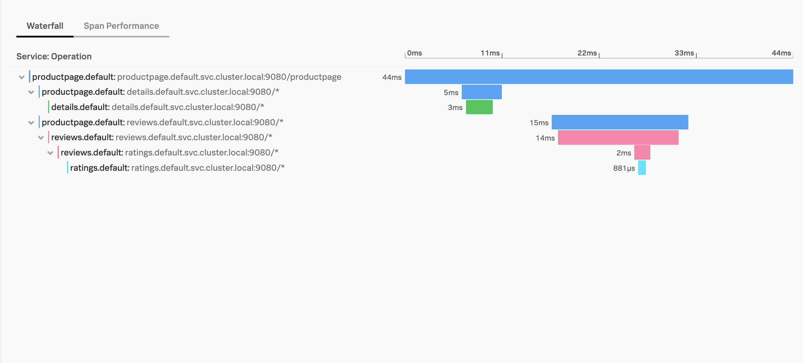
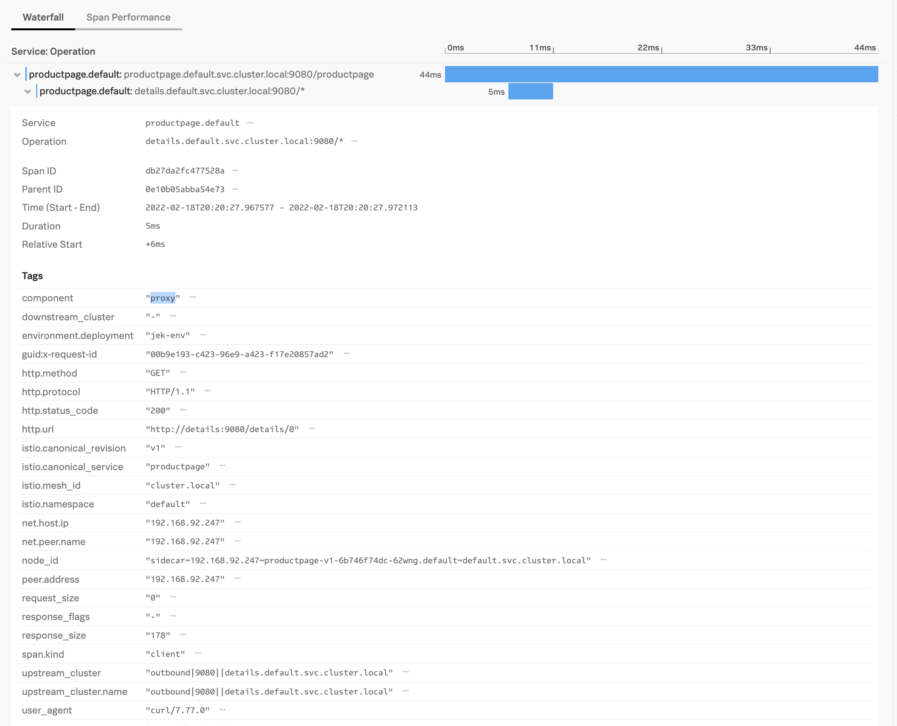

#My setup

```mermaid
  graph TD;
      A-->B;
      A-->C;
      B-->D;
      C-->D;
```


#N Steps
1. Create EKS EC2 cluster using eksctl
Because eksctl tool will create K8s Control Plane (master nodes, etcd, API server, etc), worker nodes, VPC, Security Groups, Subnets, Routes, Internet Gateway, etc.
```bash
eksctl create cluster \
--name=jek-eks-ec2-cluster-<add a date> \
--nodegroup-name=jek-eks-ec2-workers \
--version=1.21 \
--node-type=t3.xlarge \
--nodes 2 \
--region=ap-southeast-1 \
--tags=environment=jek-sandbox \
--tags=jek-environment=sandbox \
--managed \
--dry-run
```


2. Check that the cluster is created
```bash
eksctl get cluster

aws eks describe-cluster --name jek-eks-ec2-cluster-<add a date> --region ap-southeast-1
```

3. Install Splunk OTel Collector Chart using Helm Chart
```bash
# Create namespace otel
kubectl create ns otel

# Remember to add
# helm ... --set autodetect.istio='true' ...
# --set=autodetect.prometheus='true'
# -n otel
helm install -n otel --set cloudProvider='aws' --set distribution='eks' --set splunkObservability.accessToken='<token redacted>' --set clusterName='jek-eks-ec2-istio-18feb2022' --set splunkObservability.realm='<realm redacted>' --set gateway.enabled='false' --set splunkObservability.logsEnabled='true' --set autodetect.istio='true' --set=autodetect.prometheus='true' --generate-name splunk-otel-collector-chart/splunk-otel-collector

# See if installed successfully
helm list -n otel

# See that collectors are deployed
kubectl get all -n otel
```
Note: when Istio sends telemetry to the collector that communication itself needs to not generate telemetry. There are a few ways to ensure this. Run the collector in its own namespace that is not annotated to automatically inject the Istio proxy as above.


4. Display the list of Istio profile and look at demo profile
This link explains the differences https://istio.io/latest/docs/setup/additional-setup/config-profiles/
```bash
istioctl profile list

# Check that in spec.meshConfig.accessLogFile=/dev/stdout
# This is to ensure that we have the log files
istioctl profile dump demo

# Dump the original profile
istioctl profile dump demo > jek-istioprofile-original-demo-profile-dump.yaml
```


4. Install with Istioctl
There are a few options to install i.e. Istioctl, Helm (alpha at the time of writing), Operator, and etc.
https://istio.io/latest/docs/setup/install
```bash
# Set traceSampling to 100 percent before installation otherwise just install and set later
# --set values.pilot.traceSampling=100
# istioctl install --set values.global.tracer.zipkin.address=otel-collector.default.svc.cluster.local:9411 --set values.pilot.traceSampling=100
# Our auto-instrumentation uses B3 headers and so does Istio. This is very important. This allows propagation to work correctly. If the propagation headers are not compatible, then stitching spans between auto-instrumentation + istio will not work.
istioctl install --set profile=demo

# After installation, see what is installed.
kubectl get all -n istio-system

# After installation, see the config installed
kubectl get IstioOperator/installed-state -n istio-system -o yaml > jek-istioprofile-installed-profile-dump.yaml

# Install other Istio integration e.g. Jaegar and Prometheus. These integration will be intalled in istio-system namespace
# https://istio.io/latest/docs/ops/integrations/
# istioctl dashboard prometheus
# istioctl dashboard jaeger
# istioctl dashboard kiali
# istioctl dashboard zipkin

# After installation third party tools like Jaegar, see the config installed again
kubectl get IstioOperator/installed-state -n istio-system -o yaml > jek-istioprofile-installed-after-third-party-tools-profile-dump.yaml

# After installation third party tools like Jaegar, see the Istiod config
kubectl get deployment.apps/istiod -n istio-system -o yaml > jek_istiod-after-third-party-tools-installed.yaml
```


5. Analyze and detect potential issues with your Istio configuration
```bash
istioctl analyze --all-namespaces
```


6. Enable Istio Sidecar Injection
Add a namespace label to instruct Istio to automatically inject Envoy sidecar proxies when you deploy your application later
```bash
# first describe default namespace
kubectl describe ns default

# enable istio sidecar injection by adding a label
kubectl label namespace default istio-injection=enabled
```
*Note: This must be added before application pods creation because sidecar injection won't happen after this.

7. Deploy Istio official example app https://github.com/istio/istio/tree/master/samples/bookinfo
```bash
# 1 Clone the repo in your desired folder / path.
git clone https://github.com/istio/istio.git

# 2 Change directory to istio folder after cloning
cd istio

# 3 Launch the review, rating, productpage, and details
kubectl apply -f samples/bookinfo/platform/kube/bookinfo.yaml

# 4 Launch Istio Gateway and Virtual Service
# We need to make the application accessible from outside of your Kubernetes cluster, e.g., from a browser.
kubectl apply -f samples/bookinfo/networking/bookinfo-gateway.yaml

# 5 Determine the ingress IP and ports
export INGRESS_HOST=$(kubectl -n istio-system get service istio-ingressgateway -o jsonpath='{.status.loadBalancer.ingress[0].hostname}')
export INGRESS_PORT=$(kubectl -n istio-system get service istio-ingressgateway -o jsonpath='{.spec.ports[?(@.name=="http2")].port}')
export SECURE_INGRESS_PORT=$(kubectl -n istio-system get service istio-ingressgateway -o jsonpath='{.spec.ports[?(@.name=="https")].port}')
export TCP_INGRESS_PORT=$(kubectl -n istio-system get service istio-ingressgateway -o jsonpath='{.spec.ports[?(@.name=="tcp")].port}')


# 6 Set gateway url for use
export GATEWAY_URL=$INGRESS_HOST:$INGRESS_PORT
echo $GATEWAY_URL

# 7 Test access
# The url will look something like http://a8c649f4a0ce14e00b57884307ccf1dc-349131511.ap-southeast-1.elb.amazonaws.com/productpage to access via browser
curl -s "http://${GATEWAY_URL}/productpage" | grep -o "<title>.*</title>"

# 8 Test access using for loop
for i in {1..10}; do echo $(curl -s "http://${GATEWAY_URL}/productpage" | grep -o "<title>.*</title>"); done

# 9 View service mesh animation with Kiali *optional
#Must have installed Prometheus and Kiali before using Kiali
istioctl dashboard kiali

# 10 Access Istio Envory proxy logs
kubectl logs $(kubectl get pod -l app=productpage -o jsonpath='{.items[0].metadata.name}') -c istio-proxy | tail
```

8. Test tracing with Jaeger
Change trace sampling to 100%. Default is 1% when we install the demo profile
https://istio.io/v1.0/docs/tasks/telemetry/distributed-tracing/
```bash
# Ensure that it is 100%
kubectl get deployment.apps/istiod -n istio-system -o yaml | grep PILOT_TRACE_SAMPLING -A4

# Generate trace data
for i in {1..100}; do echo $(curl -s "http://${GATEWAY_URL}/productpage" | grep -o "<title>.*</title>"); done

# Access jaegar dashboard optionally
# https://istio.io/latest/docs/tasks/observability/distributed-tracing/jaeger/
istioctl dashboard jaeger
```

9. Install tracing as recommended
Create a file called tracing.yaml
```bash
apiVersion: install.istio.io/v1alpha1
kind: IstioOperator
spec:
  meshConfig:
    # Requires Splunk Log Observer entitlement or can be disabled
    accessLogFile: /dev/stdout
    # Requires Splunk APM entitlement or should be disabled
    enableTracing: true
    defaultConfig:
      tracing:
        max_path_tag_length: 99999
        sampling: 100
        zipkin:
          address: $(HOST_IP):9411
        custom_tags:
          # Optional, but recommended
          environment.deployment:
            literal:
              value: jek-env
```

After which isntall it is via istioctl
```bash
# Do precheck
istioctl x precheck

# In production, you should have your existing manifest and build on top of it
# Put another combine tracing.yaml value into your manifest and upgrade
# https://istio.io/latest/docs/setup/additional-setup/customize-installation/
# Add tracing
istioctl install --set profile=demo --set values.pilot.traceSampling=100 -f tracing.yaml

# After installation of tracing.yaml, see the config installed profile again
kubectl get IstioOperator/installed-state -n istio-system -o yaml > jek-istioprofile-installed-after-tracing5.yaml

# After installation of tracing.yaml, see the Istiod config again
kubectl get deployment.apps/istiod -n istio-system -o yaml > jek_istiod-installed-after-tracing5.yaml

# Remember to rollout deployment of the Istio example sample
kubectl rollout restart deployment

# Check that rollout restart successful
kubectl get all
```

10. Verify that tracing works with Splunk OTel Collector -> APM
```bash
# Generate trace data
for i in {1..100}; do echo $(curl -s "http://${GATEWAY_URL}/productpage" | grep -o "<title>.*</title>"); done
```
Once done we can start clean up process

11. Clean up Istio official sample Bookinfo app
https://istio.io/latest/docs/examples/bookinfo/#cleanup
```bash
# Change directory to the cloned Istio folder
cd istio

# Delete the routing rules and terminate the application pods
samples/bookinfo/platform/kube/cleanup.sh


# Confirm shutdown
kubectl get virtualservices   #-- there should be no virtual services
kubectl get destinationrules  #-- there should be no destination rules
kubectl get gateway           #-- there should be no gateway
kubectl get pods              #-- the Bookinfo pods should be deleted
```

12. Clean up Istio using istioctl
https://istio.io/latest/docs/setup/install/istioctl/#uninstall-istio
```bash
istioctl x uninstall --purge
```

13. Clean up Splunk OTel Collector Chart
```bash
helm list

helm uninstall <name of helm chart release>
```

14. Clean up EKS EC2 using eksctl
```bash
# View the eks cluster name
eksctl get cluster

# Delete the EKS cluster
eksctl delete cluster jek-eks-ec2-cluster-<the date>
```

#Misc

- Ref: https://github.com/signalfx/splunk-otel-collector-chart
- Proof: 
- Proof2: 
- Proof3: 
- Last updated: 17 Feb 2022
