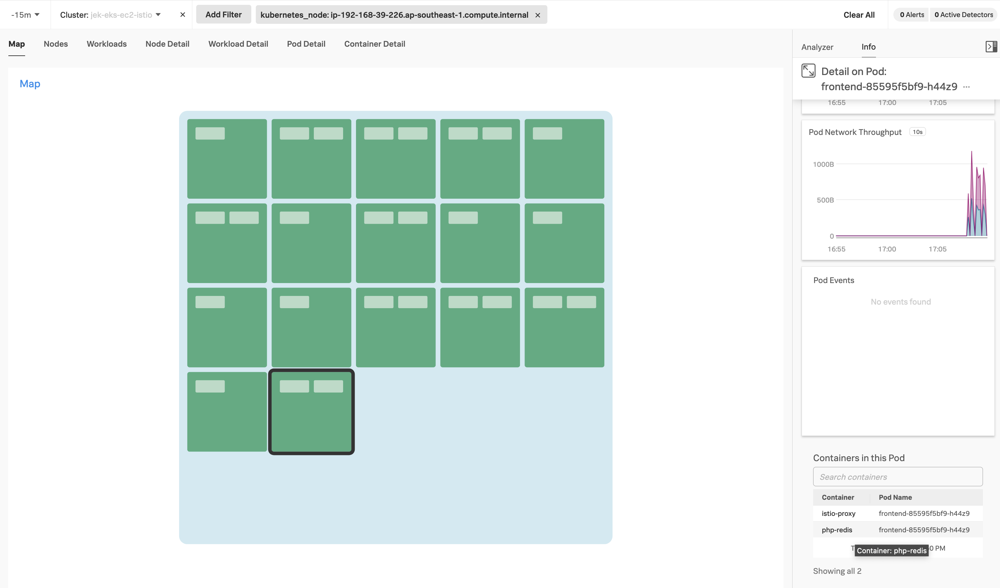

#My setup


#N Steps
1. Create EKS EC2 cluster using eksctl
Because eksctl tool will create K8s Control Plane (master nodes, etcd, API server, etc), worker nodes, VPC, Security Groups, Subnets, Routes, Internet Gateway, etc.
```bash
eksctl create cluster \
--name=jek-eks-ec2-cluster-<add a date> \
--nodegroup-name=jek-eks-ec2-workers \
--version=1.21 \
--node-type=t3.xlarge \
--nodes 2 \
--region=ap-southeast-1 \
--tags=environment=jek-sandbox \
--tags=jek-environment=sandbox \
--managed \
--dry-run
```


2. Check that the cluster is created
```bash
eksctl get cluster

aws eks describe-cluster --name jek-eks-ec2-cluster-<add a date> --region ap-southeast-1
```

3. Install Splunk OTel Collector Chart


4. Deploy Kubernetes official example app https://github.com/kubernetes/examples/tree/master/guestbook
```bash
# 1 Create database (redis) master pods
kubectl apply -f https://k8s.io/examples/application/guestbook/redis-leader-deployment.yaml

# 2 Create database (redis) master service
kubectl apply -f https://k8s.io/examples/application/guestbook/redis-leader-service.yaml

# 3 Create redatabase (redis)dis slave pods
kubectl apply -f https://k8s.io/examples/application/guestbook/redis-follower-deployment.yaml

# 4 Create database (redis) slave service
kubectl apply -f https://k8s.io/examples/application/guestbook/redis-follower-service.yaml

# 5 Create app (guestbook) pods
kubectl apply -f https://k8s.io/examples/application/guestbook/frontend-deployment.yaml

# 6 Create app (guestbook) service
kubectl apply -f https://k8s.io/examples/application/guestbook/frontend-service.yaml

# 7 View the app on browser at http://localhost:8080 using port forwarding
kubectl port-forward svc/frontend 8080:80

# 8 Scale to more pods
kubectl scale deployment frontend --replicas=5
```

5. Clean up Kubernetes official example app
```bash
# Delete all
kubectl delete deployment -l app=redis
kubectl delete service -l app=redis
kubectl delete deployment frontend
kubectl delete service frontend
```

6. Clean up EKS EC2 using eksctl
```bash
# View the eks cluster name
eksctl get cluster

# Delete the EKS cluster
eksctl delete cluster jek-eks-ec2-cluster-<the date>
```

#Misc

- Ref: https://github.com/signalfx/splunk-otel-collector-chart
- Proof: 
- Last updated: 15 Feb 2022