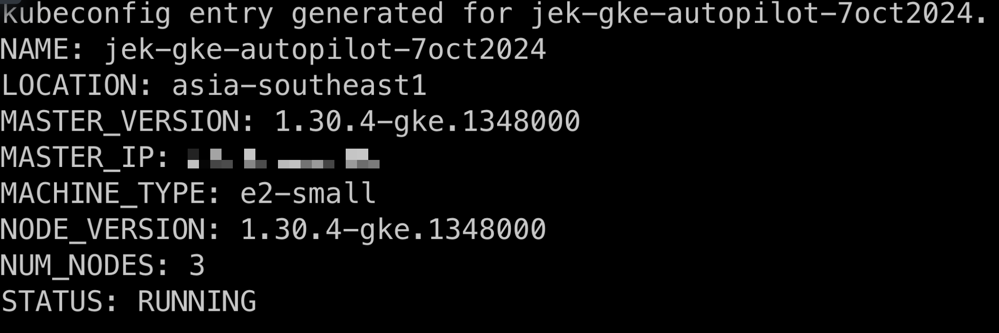

1. Getting started with GCP CLI:

- Install the Google Cloud SDK: https://cloud.google.com/sdk/docs/install
`gcloud init`

- Authenticate: `gcloud auth login`

- List organisation: `gcloud organizations list`

- List project: `gcloud projects list`

- Set project: `gcloud config set project YOUR_PROJECT_ID`

- If no project then reate a project: `gcloud projects create PROJECT_ID`


2. Service Accounts:

- GCP uses service accounts and credentials, not API keys

- Create service account: `gcloud iam service-accounts create jek-service-account`

- List service account: `gcloud iam service-accounts list`

- Generate key: `gcloud iam service-accounts keys create KEY_FILE --iam-account=SA_NAME@PROJECT_ID.iam.gserviceaccount.com`

3. Create GKE autopilot cluster:
```bash
gcloud container clusters create-auto jek-gke-autopilot-<TODAY_DATE> \        ─╯
  --region=asia-southeast1 \
  --project=<PROJECT_ID>
```


- Check if GKE plugin: `gke-gcloud-auth-plugin --version`
- Install the GKE plugin: `gcloud components install gke-gcloud-auth-plugin`
- Verify the installation: `gke-gcloud-auth-plugin --version`
- Update the kubectl configuration to use the plugin:

```bash
gcloud container clusters get-credentials jek-gke-autopilot-<TODAY_DATE> \
    --region=asia-southeast1
```


- View cluster details: `gcloud container clusters describe jek-gke-autopilot-<TODAY_DATE> --region=asia-southeast1`
- Check node pools: `gcloud container node-pools list --cluster=jek-gke-autopilot-<TODAY_DATE> --region=asia-southeast1`

4. Deploy application:

5. Delete GKE autopilot cluster:

- List project: `gcloud projects list`

```bash
gcloud container clusters delete jek-gke-autopilot-<TODAY_DATE> \
  --region=asia-southeast1 \
  --project=<PROJECT_ID>
```

- List clusters: `gcloud container clusters list --project=<PROJECT_ID>`

- List compute resources: `gcloud compute instances list --project=<PROJECT_ID>`

- List network resources: `gcloud compute networks list --project=<PROJECT_ID>`