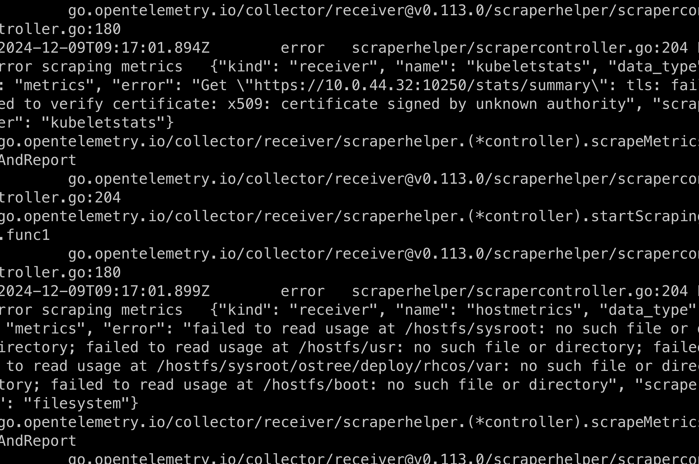

# Setting up Red Hat OpenShift Service on AWS (ROSA) with Splunk OpenTelemetry Collector

## Prerequisites

1. Enable Red Hat OpenShift Service on AWS (ROSA) through AWS console
2. Sign in to https://www.redhat.com

## Installation Steps

### Install and Configure ROSA CLI

1. Install ROSA CLI:
```
brew install rosa-cli
```

2. Manage ROSA credentials and privileges:
```bash
rosa login

# or login directly with token
# The token is from Red Hat account after signing in to redhat.com
rosa login --token="<redacted>"

rosa whoami

rosa verify quota
```

### Create OpenShift Cluster

Follow the instructions at: https://www.rosaworkshop.io/rosa/2-deploy/#automatic-mode

```bash
# Create account roles
rosa create account-roles --mode auto --yes

# Create cluster with a cluster name no more than 15 characters
rosa create cluster --interactive --sts

# Follow instructions to complete installation
rosa create operator-roles --cluster <cluster name>
rosa create oidc-provider --cluster <cluster name>

# See all available clusters
rosa list clusters

# Describe cluster
rosa describe cluster --cluster <cluster-name>

# Wait for console URL and get the console URL
rosa describe cluster -c <cluster-name> | grep Console
```

**Note:** Cluster creation takes approximately 30-40 minutes as stated in the [official documentation](https://docs.openshift.com/rosa/rosa_getting_started/rosa-quickstart.html)

### Install OpenShift CLI

```
brew install openshift-cli
```

### Configure Cluster Access

Choose one of the following paths:

#### Path 1: Quick Admin Setup (Less Secure)
Follow instructions at: https://www.rosaworkshop.io/rosa/3-create_initial_admin/

```
rosa create admin --cluster=<cluster name>
```

**Important:** Save the password securely!

#### Path 2: IDP Setup (Recommended for Production)
Follow these guides:
- [Setup IDP](https://www.rosaworkshop.io/rosa/4-setup_idp/)
- [Grant Admin Rights](https://www.rosaworkshop.io/rosa/5-grant_admin/)
- [Access Cluster](https://www.rosaworkshop.io/rosa/6-access_cluster/)

**Note:** This setup is more secure but requires additional configuration.

### Login Using OpenShift CLI (OC)

```bash
# Get API URL
rosa describe cluster -c <cluster name> | grep API

# Login using OC
oc login <API URL> --username cluster-admin --password <redacted>

# Verify login successful
oc whoami
```

### Verify Namespace Configuration

```bash
# See all projects
oc projects

# See in kubectl
kubectl get namespace
```

## Installing OpenTelemetry Collector in Kubernetes

1. Add the Helm repository:
```
helm repo add splunk-otel-collector-chart https://signalfx.github.io/splunk-otel-collector-chart
```

2. Update the repository:
```
helm repo update
```

**Note:** Current version at time of installation: `splunk-otel-collector-0.113.0`

3. Install the collector using one of these methods:

```bash
# Method 1: Using values file
helm install splunk-otel-collector splunk-otel-collector-chart/splunk-otel-collector --version 0.113.0 --values values-one.yaml

# Method 2: Using declarative approach
helm install splunk-otel-collector --set="cloudProvider=aws,distribution=openshift,splunkObservability.accessToken=<REDACTED_ACCESS_TOKEN>,clusterName=jek-rosa,splunkObservability.realm=us1,gateway.enabled=false,splunkObservability.profilingEnabled=true,environment=jek-sandbox" splunk-otel-collector-chart/splunk-otel-collector --version 0.113.0
```

### Troubleshooting Common Issues

If you encounter the following errors after installation:

```
2024-12-09T09:17:01.894Z	error	scraperhelper/scrapercontroller.go:204	Error scraping metrics	{"kind": "receiver", "name": "kubeletstats", "data_type": "metrics", "error": "Get \"https://10.0.44.32:10250/stats/summary\": tls: failed to verify certificate: x509: certificate signed by unknown authority", "scraper": "kubeletstats"}
```



```
2024-12-09T09:17:01.899Z	error	scraperhelper/scrapercontroller.go:204	Error scraping metrics	{"kind": "receiver", "name": "hostmetrics", "data_type": "metrics", "error": "failed to read usage at /hostfs/sysroot: no such file or directory; failed to read usage at /hostfs/usr: no such file or directory; failed to read usage at /hostfs/sysroot/ostree/deploy/rhcos/var: no such file or directory; failed to read usage at /hostfs/boot: no such file or directory", "scraper": "filesystem"}
```

#### Resolution Steps

1. **Fix TLS Certificate Error**

Add `insecure_skip_verify: true` as shown in the [documentation](https://docs.splunk.com/observability/en/gdi/opentelemetry/collector-kubernetes/kubernetes-config-advanced.html#override-your-tls-configuration):

```yaml
config:
  receivers:
    kubeletstats:
      insecure_skip_verify: true
```

Refer to `values-two.yaml` for implementation details.

**Note:** Disabling secure TLS checks is not recommended for production environments.

2. **Fix Hostfs Error**

Choose one of these solutions:

**Option A:** Use an older, stable version
```bash
helm install splunk-otel-collector splunk-otel-collector-chart/splunk-otel-collector --version 0.111.0 --values values-two.yaml
```

Check available versions at: https://github.com/signalfx/splunk-otel-collector-chart/releases


**Option B:** Configure exclude_mount_points

Update the hostmetrics configuration:

```yaml
receivers:
  hostmetrics:
    collection_interval: 10s
    root_path: /hostfs
    scrapers:
      cpu: null
      disk: null
      filesystem:
        exclude_mount_points:
          match_type: regexp
          mount_points:
          - /var/*
          - /snap/*
          - /boot/*
          - /boot
          - /opt/orbstack/*
          - /mnt/machines/*
          - /Users/*
      load: null
      memory: null
      network: null
      paging: null
      processes: null
```

Source: [Observability Workshop Configuration](https://github.com/splunk/observability-workshop/blob/007debd1e90066b92d7db01f6d9cc9f96d21dd0b/workshop/otel-contrib-splunk-demo/k8s_manifests/configmap-agent.yaml#L288)

## Cleanup

To delete the OpenShift cluster, follow the instructions at: https://www.rosaworkshop.io/rosa/12-delete_cluster/
