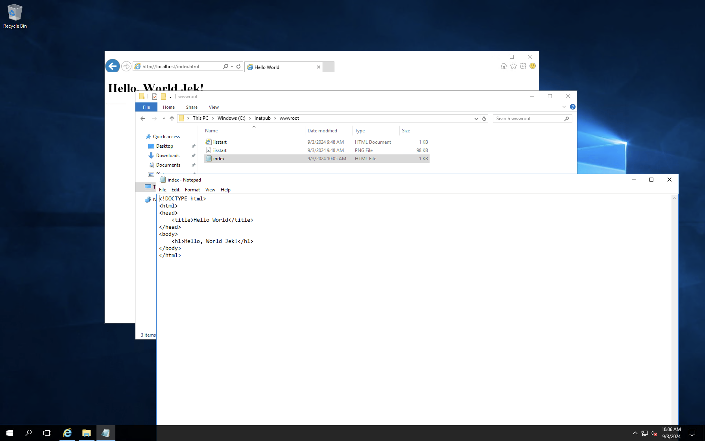

# Setup OTel Collector on Windows 2016

Check if it's admin
`[Security.Principal.WindowsIdentity]::GetCurrent().Groups -contains 'S-1-5-32-544'`
This will return True if you're running as admin, and False if not.

Check the version of PowerShell
`$PSVersionTable`

1. Run this script if the function provided by Splunk didn't work:
```Powershell
function Get-ScriptContent {
    param($Uri)
    try {
        [Net.ServicePointManager]::SecurityProtocol = [Net.SecurityProtocolType]::Tls12
        return Invoke-RestMethod -Uri $Uri -UseBasicParsing
    }
    catch {
        Write-Host "Error downloading script: $_"
        return $null
    }
}
```

2. Now, let's modify your original command to use this function:
```Powershell
& {
    Set-ExecutionPolicy Bypass -Scope Process -Force
    $scriptContent = Get-ScriptContent -Uri 'https://dl.signalfx.com/splunk-otel-collector.ps1'
    if ($null -eq $scriptContent) {
        Write-Host "Failed to download the script. Please check your internet connection and try again."
        return
    }
    $params = @{
        access_token = "< your access token >"
        realm = "us1"
        mode = "agent"
        with_dotnet_instrumentation = 0
    }
    $scriptBlock = [Scriptblock]::Create($scriptContent)
    & $scriptBlock @params
}
```

---

# Setup IIS on Windows Server 2016

1. Install IIS on Windows Server 2016:

- Open Server Manager
- Click "Add roles and features"
- Choose "Role-based or feature-based installation"
- Select your server from the server pool
- In the "Server Roles" section, check "Web Server (IIS)"
- Click "Add Features" when prompted
- Continue through the wizard, leaving default options
- Click "Install" and wait for the process to complete


2. Verify IIS installation:

- Open a web browser on the server
- Navigate to http://localhost
- You should see the default IIS welcome page

3. Create a simple "Hello World" application:

- Open Notepad (or any text editor)
- Enter the following HTML:

```html
<!DOCTYPE html>
<html>
<head>
    <title>Hello World</title>
</head>
<body>
    <h1>Hello, World!</h1>
</body>
</html>
```

Save the file as "index.html" in `C:\inetpub\wwwroot\`

4. Test the application:

- Open a web browser on the server
- Navigate to http://localhost/index.html
- You should see "Hello, World Jek!" displayed




5. Allow incoming traffic (if needed):

- Open Windows Firewall with Advanced Security
- Create a new Inbound Rule
- Choose "Port" and specify TCP port 80
- Allow the connection
- Apply the rule to Domain, Private, and Public profiles
- Name the rule (e.g., "IIS Web Server")


6. Access from another machine (optional):

- Find the server's IP address using ipconfig in Command Prompt
- From another machine on the same network, try accessing http://<server-ip>/index.html


---

# Add OTel Collector Receiver for IIS


