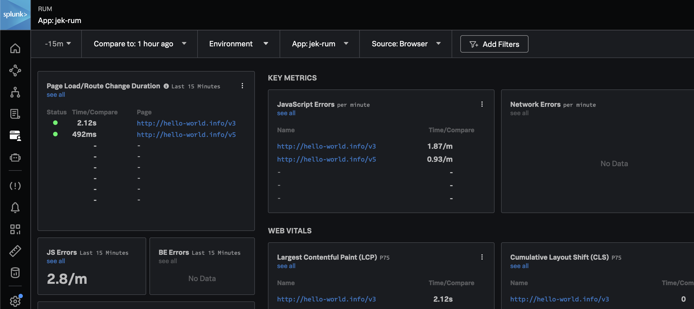
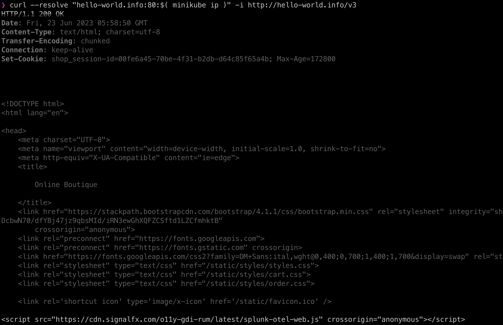

# Reference
I referenced Michael Cheo's guide https://github.com/mcheo/getting-data-in/tree/main/k8s/rum-injection-with-ingress.

# Setup Minikube
- https://minikube.sigs.k8s.io/docs/start/ `brew install minikube`
- https://minikube.sigs.k8s.io/docs/drivers/qemu/#networking `brew install socket_vmnet`
- `brew tap homebrew/services`
- `HOMEBREW=$(which brew) && sudo ${HOMEBREW} services start socket_vmnet`
- `minikube config set cpus 4`
- `minikube config set memory 8192`
- `minikube start --network=socket_vmnet --memory 8192 --cpus 4`
- `kubectl get po -A`

# Enable Nginx Ingress Controller
- Walk through the steps in this guide https://kubernetes.io/docs/tasks/access-application-cluster/ingress-minikube/ `minikube addons enable ingress`
    - Reminder: walk through the steps in this guide https://kubernetes.io/docs/tasks/access-application-cluster/ingress-minikube/
    - By the end of the steps, we would have created example-ingress.yaml file.
- `kubectl get pods -n ingress-nginx`

# Setup Frontend & Backend Services and Deployments
- Deploy Google's Hipster sho https://github.com/GoogleCloudPlatform/microservices-demo/tree/main/release `kubectl apply -f https://raw.githubusercontent.com/GoogleCloudPlatform/microservices-demo/main/release/kubernetes-manifests.yaml`
- Check that all pods are running `kubectl get pods`
- Check that all services are available `kubectl get svc`
- Add Splunk RUM js code snippet via annotations to example-ingress.yaml as v3 to the example-ingress.yaml we created above 
    - The outcome would look like example-ingress-with-splunk-rum-annotations.yaml
- `kubectl apply -f example-ingress.yaml`
- Need to open up browser to trigger traffic or view the page  
    - Not sure why `curl --resolve "hello-world.info:80:$( minikube ip )" -i http://hello-world.info/v3` doesn't work in triggering Splunk RUM to collect metrics and traces.

# Proof
- 
- 

# Cleanup
- `kubectl delete all --all`
- `minikube stop`
- `minikube delete --all`
- `HOMEBREW=$(which brew) && sudo ${HOMEBREW} services stop socket_vmnet`